# Rahnuma: a working guide to the ILM, PANINI and Zistgah stack, from bytes and scripts to compilers, Pāṇini and quantum substrates

© 1993–2026 Abhishek Choudhary. All rights reserved. AyeAI.

Version 2.0.0, 3 October 2026. Abhishek Choudhary, AyeAI. ORCID 0009-0002-0684-8320.

Text: CC BY-SA 4.0. Scripts: GPL-3.0-or-later. Site: https://zistgah.github.io/rahnuma/


<!-- © 1993–2026 Abhishek Choudhary. All rights reserved. AyeAI. -->

# Part I: Orientation {#part-i}

## 1. How to use this guide {#ch-01}

::: {.plain}
**In plain words.** This guide explains a large body of work on computers, languages and intelligence. You can read it, run the programs on your own computer, or ask an AI to help you, and every example in it was really run.
:::

This guide is for anyone who wants to use, check or extend the work gathered in the zistgah, project-ilm and hindawiai organisations on GitHub: students preparing for GATE, engineers who write compilers, firmware or chip layouts, linguists who work with scripts and sound, and researchers in quantum computing and AI. It asks for curiosity and a laptop, and nothing else.

There are four ways in.

- **Understand.** Part II gives the whole architecture first: where the work comes from, how the parts compose, each term with its nearest analogue and the difference, and the three Acts.
- **Read.** Parts IV and V explain the ideas the work rests on, with the mathematics written out: how numbers and letters sit in memory, what makes a transliteration reversible, how Pāṇini's grammar computes, how a compiler turns text into machine instructions, and how an oscillator network and a quantum circuit attack the same problem.
- **Run.** Part III gives the exact commands to set up Linux, Windows with WSL, or macOS, and to run every component of the estate on your own machine.
- **Ask.** Chapter 24 shows how to put any AI assistant to work on these repositories, and how to check what it tells you.

Conventions used throughout:

- Every example that could run while this guide was being built did run, and the text shows its real output, marked *Executed while this guide was built*. The package's own gate, `bash ops/verify.sh`, runs those examples again and fails if any output differs from what is printed here.
- Status words are used exactly. **Tested**: a test in the repository asserts it. **Executed**: it ran and its output is shown. **Written**: the code exists but has not been run here. **Mocked**: a stand-in replaces hardware that is not attached. **Planned**: described, not built.
- Everything said about the repositories was retrieved from the repositories themselves on 29 September 2026: their listings on GitHub, their `CITATION.cff` files and their READMEs. Where a repository does not record something, this guide says so instead of filling the gap.
- A dagger, †, marks a statement that follows the author's working notes and write-ups as supplied on 29 September and 3 October 2026, rather than the repositories.
- Sanskrit is transliterated in IAST. The spelling is British.

The work lives at [github.com/zistgah](https://github.com/zistgah), [github.com/project-ilm](https://github.com/project-ilm) and [github.com/hindawiai](https://github.com/hindawiai), on the site [zistgah.org](https://zistgah.org), and in the Zenodo records listed in Chapter 12.

## 2. The work, not the worker {#ch-02}

::: {.plain}
**In plain words.** What matters is whether the work holds up, whether the code runs and the reasoning is sound, not who made it. The aim is that people build technology in their own languages.
:::

We know Pāṇini almost entirely through his grammar. Tradition gives a birthplace, Śalātura in Gandhāra, and very little else that can be checked. Close to four thousand sūtras survive; the person does not. The grammar still works, and Chapter 20 runs part of it. That is the standard this guide keeps. Work has to stand without its author, because titles, affiliations and biographies do not compile, and code, derivations and measurements do.

Two consequences follow for how the estate is built.

The first is enablement. Linguistic and cultural equity is not achieved by making AI available everywhere. Systems have to work within the languages, scripts, cultural contexts and knowledge traditions of the people they serve, so that those people become producers of technology in their own languages rather than remaining users of someone else's.

The second is openness. Every repository in Chapter 12 can be read, run, forked and criticised. Nothing here needs anyone's permission to use; each repository states its licence.

The programme stands on two pillars. The linguistic pillar standardises at the level of the dialect, with the idiolect as a later overlay, and grows through linguists working across the world. The technological pillar, the older of the two, is now the enabler: the transliteration engines, compilers, parsers and substrates that make a language usable for building. This guide deals mostly with the second pillar, because that is where a newcomer can start contributing today.


<!-- © 1993–2026 Abhishek Choudhary. All rights reserved. AyeAI. -->

## 3. Start here: find your way in {#ch-start}

::: {.plain}
**In plain words.** Four steps to find your part of the guide: who you are, your board or field, what you want to do, and your path with a PDF made for you.
:::

This guide serves a school student and a senior researcher, a village health worker and an investor. Nobody needs all of it. Four steps find your part, on the site or with this page:

1. **Who you are.** A school student, a college student, a postgraduate or doctoral researcher, a teacher, an academic researcher, a working professional, someone in public service, policy or law, someone in community, NGO or village work, an artist, writer or maker, an industry partner or investor, or an AI agent working for a person.
2. **Your board or your field.** A school student chooses a board, ICSE, ISC, CBSE, IGCSE, IB, a state board or another, and a class. Everyone else chooses a field from the international standard classification of fields of study, ISCED-F 2013, the same one FAKIR's lattice uses. It places each subject where its own scholars would: political science is under social and behavioural sciences, not the humanities; law is under business, administration and law; linguistics is under languages.
3. **What you want to do.** Learn the basics, run the software, study or research, teach, contribute, or adopt, fund or invest.
4. **Your path and your edition.** The site lists your chapters in order, with reading times and the components to try first, and offers a PDF edition made for you. Every edition below is a printed selection from this one guide, so all of them stay in step.

| Edition | PDF |
|:--|:--|
| School student | [role-school.pdf](editions/role-school.pdf) |
| College student | [role-college.pdf](editions/role-college.pdf) |
| Postgraduate or doctoral researcher | [role-pg.pdf](editions/role-pg.pdf) |
| Teacher or lecturer | [role-teacher.pdf](editions/role-teacher.pdf) |
| Academic researcher | [role-researcher.pdf](editions/role-researcher.pdf) |
| Working professional or engineer | [role-professional.pdf](editions/role-professional.pdf) |
| Public service, policy or law | [role-public.pdf](editions/role-public.pdf) |
| Community, NGO or village work | [role-community.pdf](editions/role-community.pdf) |
| Artist, writer or maker | [role-creator.pdf](editions/role-creator.pdf) |
| Industry partner, investor or funder | [role-industry.pdf](editions/role-industry.pdf) |
| Generic programmes and qualifications | [field-00.pdf](editions/field-00.pdf) |
| Education | [field-01.pdf](editions/field-01.pdf) |
| Arts and humanities | [field-02.pdf](editions/field-02.pdf) |
| Social sciences, journalism and information | [field-03.pdf](editions/field-03.pdf) |
| Business, administration and law | [field-04.pdf](editions/field-04.pdf) |
| Natural sciences, mathematics and statistics | [field-05.pdf](editions/field-05.pdf) |
| Information and Communication Technologies (ICTs) | [field-06.pdf](editions/field-06.pdf) |
| Engineering, manufacturing and construction | [field-07.pdf](editions/field-07.pdf) |
| Agriculture, forestry, fisheries and veterinary | [field-08.pdf](editions/field-08.pdf) |
| Health and welfare | [field-09.pdf](editions/field-09.pdf) |
| Services | [field-10.pdf](editions/field-10.pdf) |

The first public version of this guide, written for advanced researchers and senior professionals, stays as it was at [version 1](v1/index.html).


<!-- © 1993–2026 Abhishek Choudhary. All rights reserved. AyeAI. -->

# Part II: One architecture {#part-ii}

## 4. Where the work comes from {#ch-hist}

::: {.plain}
**In plain words.** This work began long before today's AI. It grew along five connected lines: languages and computers, learning machines, robots and medicine, organised knowledge, and the future of people and their homes.
:::

This work did not begin with today's language models, and it is not a collection of separate projects. It is one architecture built along several lines of work that started at different times, and it reads correctly only in that order. The dated record, with the place where each entry can be checked, is the next chapter; this one gives the lines themselves.

### Five lines that intersect

**Linguistic and computational identity.** Romenagri (2003), the reversible ASCII-7 kernel, came first; the Hindawi Programming System (15 August 2004) built a complete systems-programming stack on it; ILM, Integrative Linguistic Multiscript, succeeds Hindawi and generalises it to every script and language; PANINI's construct model now sits above ILM as the common core of programming, prompting and realization.

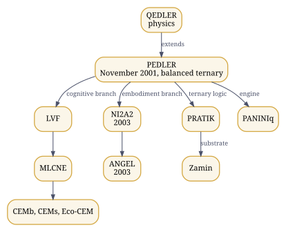

*Figure 1. PEDLER's branches: cognition, embodiment, physics and silicon.*

**Cognition and event-driven computation.** PEDLER, the Point Event-Driven Learner (November 2001, Indian patent application 3033/CHE/2011), is not one genealogy but two branches: a cognitive branch through LVF and MLCNE to the cognitive enablement modules, CEMb and CEMs, and an embodiment branch through NI2A2 (2003) to the cognitive robot ANGEL (2003). QEDLER carries PEDLER into physics. PRATIK and Zamin take its balanced-ternary, event-driven logic towards silicon.

**Embodiment, medicine and field systems.** HMSEI, a medical wearable (2002); ANGEL; TARA; RDK, among Nokia's global top ten in 2010; Dr Rho, the TARA and RDK medical telepresence platform, Highly Commended at the IET Innovation Awards in 2014; GramSheel's Village Knowledge Center, a Stockholm Challenge finalist in 2010. The AyeAI Triad closes this line formally: AyeAM for embodiment, AyeAI for cognition, AyeCNSe for coordination and communication.

**Knowledge and reasoning.** UKOP, the reference architecture for human knowledge across ISIC, ISCO and ISCED; FAKIR, its kernel; Dhancha, the spine every domain is built on; the domains themselves; and the working layer that runs on them: GENIE, the cyclers, AAB and Mez.

**Continuity and civilisation.** Humanesque, its constitutional derivation from the Proclamation of Individual Equity, TransEg, the transferred alter ego, and the habitats on Earth, the Moon and Mars.

The lines cross constantly. PEDLER supplies the Act, the executable intent that the constitutional corpus is built from; Romenagri and ILM carry every language into FAKIR's lattice; PANINI runs the cyclers and also drives the realization compilers; TransEg receives what yadein records. That is why the chapters that follow teach the pieces as nodes of one graph rather than as a list.

### The invariant

† What the architecture preserves, whatever changes around it, is meaning, intent, identity, agency, capability, provenance, equity and continuity, while the representation, the language, the script, the formalism, the machine, the substrate, the embodiment, the social setting and eventually the habitat all change. Romenagri is the smallest instance of the principle: a name keeps its identity through every tool of a toolchain. TransEg is the largest: a person's constituted identity keeps its continuity beyond the substrate that first carried it.

### Sovereignty and equity

The Proclamation of Individual Equity, PoIE ([zistgah/poie](https://github.com/zistgah/poie), doi:10.5281/zenodo.21397274), makes the individual the primary locus of equity, identity and agency. Sovereignty is recursive from there: individual, family, community, institution, province, nation and beyond, across political, economic, social and technological dimensions. Technological sovereignty, in this sense, is the capacity to determine, govern, develop, reproduce, modify and deploy one's own domain; the precise, testable form of it for software is given in Chapter 21. The aim that follows is enablement: that people become producers, builders, researchers and owners of computing in their own languages, not permanent consumers of systems built elsewhere.

### The orientation map

His poster "The Expanse of Our Epistemic Realms" runs one axis from the inner to the outer: being, meaning, knowledge, language, cognition, code, systems, society, civilisation, planet. At its apex stands Kaivalyik AGI; beneath it, the Equitable Mind, one humanity with one identity and infinite expressions; and the rule that every sentient individual, bioform or synthetiform, is a sovereign. Read the rest of this Part along that axis: language and identity first, then computation, cognition, knowledge and agency, realization, and the Acts that carry them to civilisational scale.


<!-- © 1993–2026 Abhishek Choudhary. All rights reserved. AyeAI. -->

## 5. The record, with dates {#ch-05}

::: {.plain}
**In plain words.** A list of what was made and when, from 1993 onwards, with where each item can be checked.
:::

Dates settle questions of priority without argument, so the record of the work is given here with the place where each entry can be checked.

| When | What | Where to check |
|:-----|:---------------------------------------------|:------------------|
| 1993 | The Nature Welfare Society, which became the GramSheel Foundation | The author's account |
| September 1998 | Labyrinths of Xanadu, a game, on the PCQuest cover CD | The author's provenance record |
| November 2001 | PEDLER, the Point Event-Driven Learner; Indian patent application 3033/CHE/2011 | [doi:10.5281/zenodo.17497559](https://doi.org/10.5281/zenodo.17497559) |
| 2002 | HMSEI, a medical wearable | The author's provenance record |
| 2003 | Romenagri, the reversible transliteration kernel, released under the GPL; ANGEL, a cognitive robot; NI2A2, the thesis built on PEDLER | [doi:10.5281/zenodo.17254607](https://doi.org/10.5281/zenodo.17254607) for NI2A2 |
| 15 August 2004 | Hindawi Programming System, first public release | [sourceforge.net/projects/hindawi](https://sourceforge.net/projects/hindawi/); [Wikipedia](https://en.wikipedia.org/wiki/Hindawi_Programming_System) |
| 2005 | CSI National Young IT Professional Award; Infocomm showcase | Certificate held by the author |
| December 2005 | GNU Savannah project "Hindawi Vernacular Programming System"; the savannah-register list archive timestamps Romenagri | [savannah.nongnu.org/projects/hindawi](https://savannah.nongnu.org/projects/hindawi) |
| 19 December 2005 | Announcement to the Sarai PRC list of Hindi and Bangla equivalents of C, C++, lex, yacc, assembly and Java, with Hindi and Bangla DOS, BASIC and LOGO; 7-bit ASCII left unaltered; GCC as the host compiler; filters between ISCII, Romenagri, Unicode, APCISR and HP-PCL | [The ILUGC list archive](https://marc.info/?l=ilugc&m=118494270927141) |
| 2005 to 2006 | Sarai/CSDS FLOSS Fellowship | The author's provenance record |
| 2006 | LinuxAsia showcase | The author's provenance record |
| 2007 | Manthan Award nomination | Cited in the Wikipedia article |
| April 2008 | "Hindawi: From Assembler to Lisp in Indic", *Linux For You* | The magazine's April 2008 issue |
| 2008 | FOSS India Award; Stockholm Challenge nomination for Hindawi; profile in *DataQuest* | Certificate held by the author; the magazine's archive |
| 15 September 2010 | Nokia GEVC global top ten: RDK | The PRNewswire release of that date |
| 2010 | Stockholm Challenge finalist: GramSheel Foundation, Village Knowledge Center (Universal Device) | Certificate held by the author |
| 2011 | Intel India Embedded Challenge | Certificate held by the author |
| 2014 | IET Innovation Awards, finalist and Highly Commended: Dr Rho, the TARA and RDK medical telepresence platform | Certificate held by the author |
| 3 May 2020 | Project VIKRAM launched as the Project Vikram Journal by the GramSheel Foundation | [pvjournal.github.io](https://pvjournal.github.io/) |
| 2026 | The repositories and records of this estate | Chapter 12 |

Hindawi was also reviewed in *Linux Magazine*, issue 76, and has been cited in academic work, including at the University of the Punjab and the University of Ibadan. Its current source trees are in the [hindawiai](https://github.com/hindawiai) organisation, and its description, with the SourceForge home, is on the [AyeAI site](https://ayeai.xyz/site/hindawi-programming-system/). Every item the author publishes carries his ORCID, [0009-0002-0684-8320](https://orcid.org/0009-0002-0684-8320).


<!-- © 1993–2026 Abhishek Choudhary. All rights reserved. AyeAI. -->

## 6. Architecture: core, projections, layers {#ch-03}

::: {.plain}
**In plain words.** One shared core, Humanesque, is seen through three cultures: Indian, Persian and Western. Around it sit the parts that turn an idea, in any language, into something real.
:::

### One core, three projections

Humanesque is the core: one shared, multidimensional, executable typed hypergraph, with a federated ontology of 26 positions, $O_0$ to $O_{25}$, a common execution and evidence spine, and components that can be implemented independently. Its GitHub organisation is hmnsq, where every core stem repository is to live.

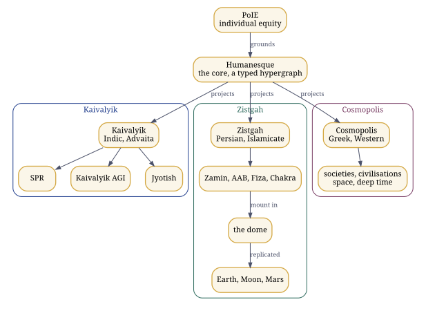

*Figure 2. Humanesque and its projections: parallel cultural traversals, not stages.*

Kaivalyik, Zistgah and Cosmopolis are three projections over it, running in parallel: the Indic, including the Advaita framing; the Persian and Islamicate; and the Greek, Western and classical. A projection is a domain-specific view and traversal of the whole architecture, with its own culturally sensitive naming and branding. The projections are not stages, not levels of a hierarchy and not versions of one another; they intersect, diverge and reconverge, and none completes another. Zistgah is not the parent of the other two. Their organisations are kaivalyik, zistgah and c-polis; today zistgah carries the working repositories.

### The PANINI stack

| Layer | What it holds | Where to look |
|:------|:--------------------------------------|:---------------|
| Front end | The languages a program or a prompt can arrive in, Sanskrit first: ILM and the language parsers | project-ilm/ilm.codes, zistgah/tajziya |
| Middleware | PANINI's own front ends, from `ada.pni` to `zig.pni` and `sysml.pni`, and the PANINI language itself | zistgah/panini, zistgah/humanesque |
| Core PANINI | The construct model: common semantics plus decorators | zistgah/humanesque, `ilm/constructs.csv` and `ilm/decorators.csv` |
| Realization backends | Where a program meets a substrate: host toolchains for code; PANINIq for oscillator and quantum substrates; PANINIb for biology; PANINIphy for physical systems | zistgah/paniniq, zistgah/paninib, zistgah/paniniphy |

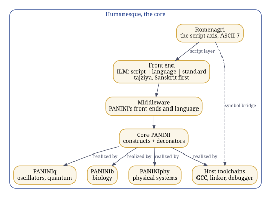

*Figure 3. The PANINI stack, with Romenagri as the script layer beneath every front end.*

Beneath every front end lies the script layer, Romenagri. Every keyword and every name of a program becomes a word over A to Z, a to z and the underscore, reversibly, so that the whole existing toolchain, from lexer to linker to debugger, carries it unchanged, and the inverse renders it back in the script wherever a person reads it. Chapters 18, 19 and 21 explain it and run it.

A construct such as a counted loop is defined once in the core and translated once per human language. A decorator carries what a particular host language drags in with it, such as `stdio.h` for printing in C. Core PANINI, in his words, "does not violate anything"; the front ends and the realization backends are all projections of it.

### How the parts compose

```text
Humanesque    the core; Kaivalyik, Zistgah and Cosmopolis project it in parallel;
              everything below lives in it, nothing below leads to it

front end     ILM (script | language | standard) and tajziya, Sanskrit first
                the script axis is Romenagri, which persists as the symbol bridge
                through compiler, linker, ELF, DWARF and debugger
middleware    PANINI's own front ends and the PANINI language
core          core PANINI: construct model = common semantics + decorators
realization   host toolchains for code; PANINIq (oscillator, quantum);
              PANINIb (biology, down to sequence IR); PANINIphy (physical systems);
              PRATIK and Zamin as a balanced-ternary substrate
```

Around the stack: the cyclers are written in PANINI and run by one engine; GENIE composes and runs research cycles; AAB paints tasks and runs the process cyclers; FAKIR, UKOP and Dhancha supply the domain lattice and its invariants; Mez, the Cognitive Workbench, composes any of them for an exercise without absorbing them; the provenance systems seal every artifact; VGC gates the work between people and AI. Two readings must be kept apart. As genealogy, the order is Romenagri, Hindawi, ILM, PANINI and the realization arms. As architecture, Romenagri sits inside ILM's script axis, the cyclers are written in PANINI rather than downstream of it, and Humanesque is the core that contains the whole, not its end point.

### The realization spine

The realization repositories state the spine they share. PANINI lowers declarative intent through language, semantic IR, a realization requirement, domain resolution and a domain IR, and then a common layer of geometry, trajectory, animation, observation, verification and an ArtifactGraph. PANINIb lowers biological intent through semantic, resolution, CISC, RISC and sequence IRs and emits two coupled artifacts, a physical realization plan and a digital execution run; PANINIphy lowers physical intent through a physical IR and physical-domain engines. "IR contracts are the product. Laboratories and machines are external adapters." And the same repositories keep the states of a result apart: desired, predicted, observed and validated phenotype are four different things, as are compilation success, execution success, target satisfaction and biological validation.

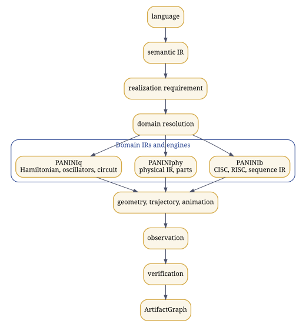

*Figure 4. The realization spine the realization arms share.*

### The habitat elements

Zamin is the ground: the balanced-ternary hardware of PRATIK. AAB is the water: the paint program for systems, from painted intent to verified, sealed artifact, where the verification-gated quests run. Fiza is the air: the environmental replica. Chakra is the turning sky: the observatory and its calendars. All of them mount in one shared virtual dome, which the habitats on the Moon and Mars replicate.

### The cyclers

A cycler is a sequence of prompts and the outputs they produce, written down so that it can be edited, shared and run with any AI. Six are classified by what they produce: matba (print), khwab (visual), awaz (audio), tilasm (immersive), pench (embodied) and yadein (the record); genie runs research cycles. Each has its own purpose, contract, context, state model, invariants, failure modes, evidence requirements, workflow and artifact model; only the engine is shared. The protocol behind every cycle, in the author's words: intent, then context, then a meaningful prompt; any AI answers and the human inspects; the artifacts and responses are kept under configuration management; the next prompt follows, until a final artifact that the human authored with intention.

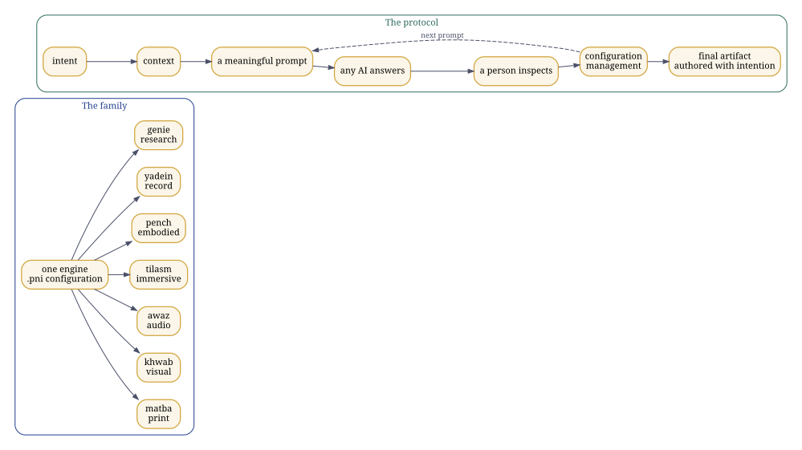

*Figure 5. The cyclers: one engine, configured in PANINI, and the protocol every cycle follows.*

### Provenance, in a fixed order

Four systems, never collapsed into one. **Tok DOI** proves that a thing existed by a given time. **spiguard** is the disclosure gate, which fails closed. **Candor** records signed intent as in-toto statements. **Misty DOI** is the one that reaches the world, through Zenodo. The order is always seal, clear, attest, mint. Chapter 25 explains the machinery.


*Figure 6. Provenance in its fixed order: seal, clear, attest, mint.*

<!-- © 1993–2026 Abhishek Choudhary. All rights reserved. AyeAI. -->

## 7. The dependency graph {#ch-graph}

::: {.plain}
**In plain words.** A map of how the parts connect, like a city map with roads between places. Any route you follow is one journey; the map is the whole picture.
:::

The estate is a typed graph, and any account of it in words is one traversal through that graph. Read a traversal, then return to the graph: adjacency is not dependency, a projection is not a hierarchy, composition is not absorption, and an Act is not a stage of maturity.

Every node and every edge below is taken from the retrieved record: the repositories, their READMEs and the author's statements. Clusters group the nodes by family, not by layer, and an edge label names the relation it records. The graph's source is `data/graph.json`; `python3 tools/graph.py` renders it, and the build keeps the rendered `dependency-graph.svg` and its Graphviz source `dependency-graph.dot` beside this guide.

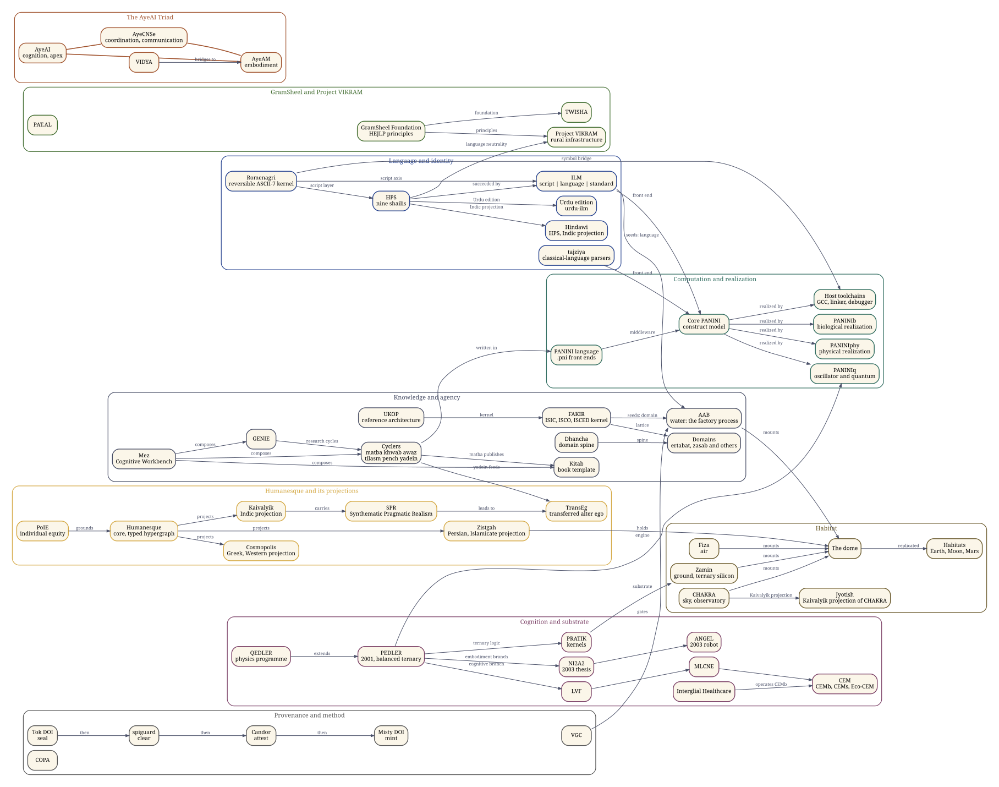

### Three traversals

**A name, from a Devanagari source to a debugger.** Romenagri is the script layer of HPS and the script axis of ILM; through the symbol bridge it carries every name into the host toolchain, and the inverse brings it back (Chapters 19 and 21).

**A task, from a domain and a language to a sealed artifact.** FAKIR seeds the domain and ILM the language; AAB builds; the cyclers, written in the PANINI language and composed in Mez, produce the work; matba publishes it through Kitab; Tok DOI, spiguard, Candor and Misty DOI seal, clear, attest and mint it, in that order; VGC gates the work between people and AI throughout.

**A mind, from an event to a substrate.** PEDLER's cognitive branch runs through LVF and MLCNE to the cognitive enablement modules, which Interglial Healthcare operates on the biological side; its embodiment branch runs through NI2A2 to ANGEL; its balanced-ternary logic runs into PRATIK and down to Zamin, the ground of the dome; and its engine drives PANINIq.


<!-- © 1993–2026 Abhishek Choudhary. All rights reserved. AyeAI. -->

## 8. The ecosystem, term by term {#ch-onto}

::: {.plain}
**In plain words.** A dictionary of the special words used here, each with the nearest everyday idea and what makes it different.
:::

Each entry gives what the thing is in this architecture, the nearest analogue a newcomer is likely to reach for, and the exact difference. The analogue is a door into the idea, never a definition of it. The state in brackets says what exists: established (historical record), released (on the forge, with its DOI where minted), executed (run for this guide), under construction, specification, or planned. Entries marked † follow the author's working notes and write-ups as supplied on 29 September and 3 October 2026, rather than the repositories.

### Language and identity

**ILM, Integrative Linguistic Multiscript** (released; ilm.codes live). *In the architecture:* the linguistic pillar and the identity layer for language, with script, language and standard kept as separate axes, and layers for phonology, transliteration, orthography, lexicon, syntax and semantics, and interfaces, supported by data, validation, development tools, language specifications and a language server; its registry lists 7,867 languages and 226 scripts. *Nearest analogue:* localisation, an NLP toolkit, a transliteration library. *Difference:* it keeps the three axes apart, so that any language can travel in any script, and it gives every script a reversible path through the whole computing stack, down to the symbol table.

**Romenagri** (established 2003; released; executed). *In the architecture:* the reversible kernel between scripts and ASCII-7. Its paper states six constraints met together: ASCII-7 closure, case independence, diacritic independence, legality as a C identifier, reversibility and linear time, over the Brahmi, Perso-Arabic and Northwest Semitic families, with a canonical-form layer and an ASCII-reduction layer. *Nearest analogue:* romanisation, such as IAST, ISO 15919 or ITRANS. *Difference:* its output is a valid identifier for every tool from lexer to debugger, and it inverts, so a name survives compilation and comes back.

**HPS, the Hindawi Programming System** (established 15 August 2004; released; executed). *In the architecture:* nine shailis over nine host languages, from assembly, lex and yacc to C++, Java, Python, BASIC and LOGO; a script layer, a language layer and the host standard, composed as transducers over unmodified host toolchains; now HPS's Indic projection under ILM, with an Urdu edition beside it. *Nearest analogue:* a localised programming language. *Difference:* a complete systems stack, not a keyword translation, with names carried through Romenagri.

**tajziya** (released, doi:10.5281/zenodo.22982238). *In the architecture:* the parser federation for the classical languages, by family, with the author's Sanskrit parser; the front end of the PANINI stack beside ILM. *Nearest analogue:* NLP parsers. *Difference:* organised to feed PANINI's construct model and AAB's paintings.

### Computation

**PANINI** (several members released; some under construction). *In the architecture:* the construct model at the core, with ILM and tajziya in front, PANINI's own front ends and language as middleware, and realization backends behind; it runs through all three Acts. Its family includes the prompt-cycle language in which the cyclers are written (zistgah/panini), the general-purpose PANINI of the merged release (zistgah/humanesque), and the realization arms. *Nearest analogue:* a compiler, a programming language, an intermediate representation. *Difference:* programming languages, prompt cycles and physical, biological and quantum realizations are all projections of one construct model.

**PANINIq** (released, doi:10.5281/zenodo.23020648; executed). *In the architecture:* a realization backend: an oscillator substrate, the PEDLER engine and quantum validation. *Nearest analogue:* a quantum simulator. *Difference:* the substrate is an oscillator Ising machine with a learning automaton on it; the quantum circuit validates it rather than replacing it.

**PANINIb and PANINIphy** (released research platforms, version 1.0). *In the architecture:* PANINIb, the biological realization arm, lowers biological intent through semantic, resolution, CISC, RISC and sequence IRs to a realization plan and an execution run; PANINIphy, the physical realization arm, lowers physical intent through a physical IR and physical-domain engines, down to modular blocks and the selection of parts by force, stroke and voltage. *Nearest analogue:* computer-aided design, genome design tools. *Difference:* both share PANINI's common spine, language, verification, provenance and ArtifactGraph, adding only their own domain IR and engines; laboratories and machines are external adapters, and neither claims a result its evidence does not show.

### Cognition

**PEDLER and QEDLER** (established November 2001; record doi:10.5281/zenodo.17497559; QEDLER a research framework). *In the architecture:* the point-event-driven learner, a six-tuple extension of the Turing machine over balanced ternary; the source of the primitives Act (executable intent), Inclination (a signed directional gradient on transition edges) and Natural Justice (a gate on the passage from intent to Act); QEDLER extends it to physics. *Nearest analogue:* an event-driven or neuromorphic learning model. *Difference:* it predates the present generation of models and carries the executable-intent semantics the constitutional corpus is built from.

**PRATIK and Zamin** (released: pratik_core_mvp doi:10.5281/zenodo.21288232, zamin doi:10.5281/zenodo.21297556). *In the architecture:* PRATIK, Participatory Recursive Adaptive Trans-Intelligence Kernels, on the divider between Acts I and II, with a kernel in C++ and CUDA; Zamin, its physical balanced-ternary substrate with a poised zero. *Nearest analogue:* a neuromorphic kernel on novel hardware. *Difference:* balanced ternary and event-driven from the logic up.

**CEM, with CEMb, CEMs and Eco-CEM** (specification; Act II). *In the architecture:* cognitive enablement modules over one kernel, $\mathcal{E} = (E, \mathcal{C}, \Pi, W)$, realised on biological substrates (BCI, prosthetics, closed-loop cognition, operated through Interglial Healthcare), on synthetic ones (processors, distributed systems, robotics) and on ecological ones. *Nearest analogue:* robotics, BCI, prosthetics. *Difference:* one invariant kernel across substrates; the superscript is part of the name.

**The AyeAI Triad** (specification with formal closure). *In the architecture:* AyeAM $= \langle S, R, C\rangle$ for embodiment, AyeAI $= \langle M, I, G\rangle$ for cognition, AyeCNSe $= \langle T, Ch, \Sigma\rangle$ for coordination and communication across media, with AyeAI at the apex. *Nearest analogue:* a perception, cognition and action loop. *Difference:* a triad, not a loop and not a pipeline.

### Knowledge and agency

**UKOP, FAKIR and Dhancha** (FAKIR released, doi:10.5281/zenodo.21436550; Dhancha released, doi:10.5281/zenodo.22821645; UKOP a specification). *In the architecture:* UKOP, the reference architecture for human knowledge; FAKIR, its kernel over ISIC, ISCO and ISCED crossed with AGI layers and language; Dhancha, the spine every domain is built on, whose rule is that the engine is common and the workflow is not. *Nearest analogue:* a knowledge graph or reasoning engine. *Difference:* domain invariants are enforced by tests, and resolution and verification are primitives.

**Cyclers** (six released and minted; Act I). *In the architecture:* matba, khwab, awaz, tilasm, pench and yadein, classified by what they produce, plus genie, each with its own contract, state model and evidence rules, written in PANINI and run by one engine. *Nearest analogue:* an agentic harness or orchestration loop. *Difference:* AI-agnostic by construction, inspected by a person at every step, and the recorded method, never the content, is itself the reproducible work. † An older form of the corpus names SAFAR in the sixth position, where the current corpus has yadein.

**Kitab** (released). *In the architecture:* the config-driven book template that matba publishes through, and † in the author's notes the persistent artifact and publication layer that keeps an artifact's state, its creative lineage, its execution trace and evaluations, its forks and descendants. *Nearest analogue:* a publishing template. *Difference:* a cycler publishes through Kitab; Kitab is not a seventh cycler.

**Research Kundali** (released). *In the architecture:* a research map of a person, a lab or a paper, built from an ORCID, a lab name or a DOI ([project-ilm/research-kundali](https://github.com/project-ilm/research-kundali)); † in the author's notes, the systematic record of claims, artifacts, chronology, provenance, objections, evidence and responses, so that every claim can be checked against its evidence. *Nearest analogue:* a researcher profile. *Difference:* it records evidence and discrepancies, not reputation.

**GENIE** (released). *In the architecture:* the Generalized Emotive-Narrative Interaction Engine, storyteller, poet and painter, and the research cycle through its Prompt Operating System, with six verbs (create, verify, execute, measure, falsify, integrate), nine epistemic tags and a gate that a simulation cannot pass in place of an experiment. † In the author's own formulation GENIE is itself a cycler, the creative cycler, which can decorate the modality cyclers without erasing their identities. *Nearest analogue:* a creative or research AI agent. *Difference:* governed by a constitution of primitives; orchestration and composition, not an implementation.

**AAB** (released; Act I). *In the architecture:* the paint program for systems, from painted intent to verified, sealed artifact; the gamified studio of verification-gated quests; home of the process cyclers; the process half of the estate's software factory, with FAKIR as its component registry. In the author's words, AAB and FAKIR together constitute the working definition of AGI used here. *Nearest analogue:* a low-code studio or a software factory. *Difference:* every task is a painting with a manifest, quest stages and oracle-gated verification, and every component keeps its provenance.

**Mez, the Cognitive Workbench** (released). *In the architecture:* the local-first desk that brings independently existing systems together for an exercise: composition, exercise, observation, synthesis, a new artifact. *Nearest analogue:* an IDE or a notebook. *Difference:* composition without absorption; every composed system keeps its own identity and life.

### Method and evidence

**VGC, Verification-Gated Human-AI Co-Development** (released, doi:10.5281/zenodo.21264248). *In the architecture:* the method by which people and AI build together, with every step gated by verification. *Nearest analogue:* test-driven development or human review of AI output. *Difference:* the gate is a verified artifact, not a reviewer's impression, and the AI's report that something passed is never the evidence that it passed.

**COPA, the Cost of Perceived Authority** (released, doi:10.5281/zenodo.21782217). *In the architecture:* a protocol for measuring how much an AI system asserts before it verifies, through the Authority Projection Index, with its hypothesis stated beside a fair null. *Nearest analogue:* an AI evaluation benchmark. *Difference:* it measures projected authority rather than accuracy, and its target is calibrated trust.

† One rule binds all of these: a record that has not been retrieved is not thereby false. Unretrieved is a state of the reader's context, not of the world, and a claim moves from unknown to false only on evidence.

### Continuity and civilisation

**Humanesque** (specification; the merged release on the forge). *In the architecture:* the core over which everything above is a typed hypergraph, and the constitutional realm derived from PoIE through recursive sovereignty. *Nearest analogue:* an AGI architecture. *Difference:* a constitutional and epistemic realm as well as a technical substrate, not a product.

**Kaivalyik, Zistgah and Cosmopolis** (projections). As in Chapter 6: parallel cultural projections of the whole, not stages. Kaivalyik carries Synthematic Pragmatic Realism, SPR, the framework that heads Act III ("Kaivalyik: Towards a Synthematic Pragmatic Realism for the AGI Singularity"); Zistgah carries the habitats and the elements.

**TransEg** (released, doi:10.5281/zenodo.21321558). *In the architecture:* the transferred alter ego, the mechanism by which a constituted identity continues; a local digital-twin reference implementation; yadein's staggered upload feeds it. *Nearest analogue:* a digital avatar. *Difference:* continuity of an identity under the constitutional corpus, not a persona.

**PAT.AL, VIDYA, GramSheel, Project VIKRAM and TWISHA** (established). PAT.AL, the Participatory Alliance for Technology, Access and Livelihoods, is participatory infrastructure; VIDYA bridges to AyeAM; Project VIKRAM, Virtualized Infrastructure for Knowledge-driven Rural Ascension Management, runs under the GramSheel Foundation beside TWISHA. They sit on the dividers between the Acts. The question the author puts to them is whether technology can distribute capability without concentrating power.

**The reference lab** (planned; its launch scripts are the next release). An AGI-capable laboratory for 30 to 40 thousand, able to carry 80 to 90 per cent of the research behind high-end AI, robotics and automation papers, repeated as a pattern for every domain and aligned with GATE-level courses in computer science and in robotics and automation.

### Also in the working notes

**Modular self-reconfiguring robots** †: very simple modular blocks with face-to-face connections and electro-permanent-magnet contacts, assembling into larger structures, ruggedised for decentralised manufacture with low-cost embedded control; PANINIphy's modular-block examples are the compiler side of this. **Further realization families** †: chemical, photonic, and a computational-biological intermediate layer of the AlphaFold class, built as an independent spine rather than a dependency. **The build engine** †: the direction of the whole is a self-reflecting, self-evolving and self-sustaining build engine in which PANINI captures and expresses the construct and the intent, and agency, human or machine, biological or physical, does the building. **INDUS and KHĀK** † are named in the notes among the lineages and the robots, alongside ANGEL, TARA and NI2A2.


<!-- © 1993–2026 Abhishek Choudhary. All rights reserved. AyeAI. -->

## 9. The three Acts {#ch-acts}

::: {.plain}
**In plain words.** Three stages of one long story: machines that think with us; machines that help us build with living, synthetic and natural materials; and people and their worlds carrying on into the future.
:::

The author's note "3 Act ASI ∧ Panini" and his dictation of 27 September 2026 place the components in time. An Act says when a piece becomes most consequential, not when work on it began: much of Act III is being worked on now. The Acts are a temporal coordinate; the projections of Chapter 6 are cultural ones; neither is a ladder of maturity.

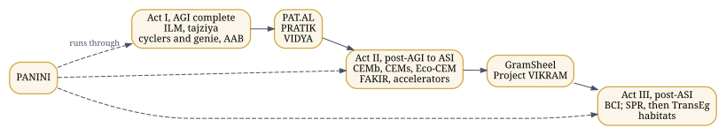

*Figure 7. The three Acts, with their dividers; PANINI runs through all three.*

| Act | What it holds |
|:----|:--------------------------------------------|
| Act I, AGI complete | Sanskrit and Pāṇini, with cyclers and paradigms; the front end, ILM and tajziya; the cyclers named by output with genie, which in market terms are agents and harnesses; the process cyclers, designed and run in AAB |
| Divider between I and II | PAT.AL, PRATIK, VIDYA |
| Act II, post-AGI to ASI | The cognitive enablement modules, CEMb and CEMs, plus Eco-CEM, with FAKIR; the accelerators |
| Divider between II and III | GramSheel and Project VIKRAM |
| Act III, post-ASI | All the BCI work; Synthematic Pragmatic Realism, then TransEg, the transferred alter ego; the habitats: Humanesque, with Zistgah on Earth (Asli Zistgah), the Moon (Zistgah-e-Mahtab) and Mars (Zistgah-e-Bahram), Kaivalyik, Cosmopolis, and more left open |
| Across all three | PANINI |
| Beyond the Acts | The reference lab and the aligned courses |

### Act I: intelligence that works through language

The machinery of Act I is the front end (ILM and tajziya), the cyclers with genie, and AAB, with PANINI as the notation of the cycles. † In the author's notes, Act I is complete when intelligence can take an intent through language, in any language and script, into executable specifications, run it through cycles a person inspects, research and create with it, and keep the provenance of what it makes. On the first divider stand PAT.AL, the participatory infrastructure, PRATIK, the kernels, and VIDYA, the bridge to AyeAM.

### Act II: from agency to realization

† In the author's notes, Act II is where the architecture moves from cognitive and digital agency to cognitive enablement and realization on substrates. The cognitive enablement modules carry one kernel to biological, synthetic and ecological substrates; FAKIR supplies the knowledge they act on; the accelerators carry the load. The notes tie this Act to realization on substrates, which PANINI's realization arms carry out: PANINIb for biology and PANINIphy for physical systems, each lowering intent through the common spine of Chapter 6 and each keeping desired, predicted, observed and validated results apart. † In the author's notes the same spine runs intent, specification, knowledge resolution, construct, realization selection, planning, geometry and trajectory, execution, observation, evidence, verification and validation, provenance and a knowledge update, and the states of a result are kept apart all the way: desired, designed, predicted, planned, realized, executed, observed, verified, validated. On the second divider stand GramSheel and Project VIKRAM: the foundation with its principles, and the rural digitalisation platform inspired by them.

### Act III: continuity

Act III gathers the brain-computer interface work (Quantum Neuromorphic BCI, brain-robot interfaces and NeuroMusical Therapeutics as active research; brain-to-text, cognitive prosthetics and intelligent rehabilitation as research directions needing clinical partners), Synthematic Pragmatic Realism, and TransEg, through which a constituted identity continues beyond the substrate that first carried it. Its habitats are Humanesque itself and its projections, with Zistgah's domes on Earth, the Moon and Mars; the Moon carries a lander embodiment and Mars a quadrotor one, and both replicate the Earth dome.

PANINI runs through all three Acts.


<!-- © 1993–2026 Abhishek Choudhary. All rights reserved. AyeAI. -->

## 10. Three families, set apart: the AyeAI Triad, GramSheel and Project VIKRAM, Humanesque and its projections {#ch-families}

::: {.plain}
**In plain words.** Three groups explained one at a time: the AyeAI Triad of thinking, body and communication; GramSheel and Project VIKRAM for villages; and Humanesque with the names it takes in each culture.
:::

Three families of work are easy to blur into each other or into the rest of the estate. This chapter sets each apart, with what its own record says.

### The AyeAI Triad

The Triad has three members, AyeAI®, AyeAM® and AyeCNSe®, with AyeAI at the apex and AyeCNSe and AyeAM at the base. It is a triad, not a pipeline and not a loop: a loop running from the environment through AyeCNSe, AyeAI and AyeAM back to the environment was proposed elsewhere and rejected. Its formal closure gives each member a tuple:

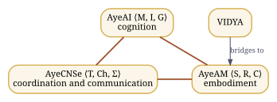

*Figure 8. The AyeAI Triad: a triad with AyeAI at the apex, not a loop and not a pipeline.*

$$ \text{AyeAM} = \langle S, R, C \rangle, \qquad \text{AyeAI} = \langle M, I, G \rangle, \qquad \text{AyeCNSe} = \langle T, Ch, \Sigma \rangle . $$

**AyeAI** is cognition, the apex: "the inclusive AI", in the words of its site, and the organisation [ayeai](https://github.com/ayeai) holds its platforms, among them an open public stack for synthetic intelligence (opssi), virtual deployment infrastructure for scientific and cognitive computing (ayevdi), Staggered Upload™ (upload), the AyeAI Singularity Public License (spl) and the NI2A2 work.

**AyeAM** is embodiment: the body through which intelligence acts, across ground, air, water, space and habitat. VIDYA bridges to AyeAM without being a member of the Triad.

**AyeCNSe** is coordination and communication across media: the form studio at forms.ayecnse.site and the Human Context Model paper at hcm.ayecnse.site are its published faces.

Two repositories mark themselves as PEDLER and AyeAI Triad work: PRATIK's kernel and Zamin's ternary silicon.

### GramSheel and Project VIKRAM

**The GramSheel Foundation** is the social architecture of the estate and the older of its lines: † it began as the Nature Welfare Society in 1993. Its principles, HEJLP, are health, education, justice, livelihood and peace. Its Village Knowledge Center (Universal Device) was a Stockholm Challenge finalist in 2010, and TWISHA runs under the same foundation.

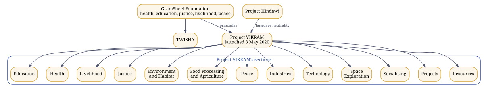

*Figure 9. GramSheel and Project VIKRAM, with VIKRAM's sections as its own pages name them.*

**Project VIKRAM**, Virtualized Infrastructure for Knowledge-driven Rural Ascension Management, is † the technical implementation of GramSheel's principles. It was launched on 3 May 2020 as the Project Vikram Journal, "an inclusive rural digitalization platform inspired by the principles of GramSheel", under the motto गाँव बढ़ेंगे तो सब बढ़ेंगे, when the villages grow, everyone grows. Its own pages ([pvjournal.github.io](https://pvjournal.github.io/)) name its components:

| Component | What its page covers |
|:----------|:------------------------------------------|
| Education | learning and schooling |
| Health | healthcare, open to submissions as issues, with tools for an accessible virtual hospital |
| Livelihood | the ISIC domains of economic activity |
| Justice | social justice |
| Environment and Habitat | the living environment |
| Food Processing and Agriculture | agriculture and food |
| Peace | harmony through social dialogue |
| Industries, Technology and Space Exploration | the technical frontiers it reaches towards |
| Socialising, Projects and Resources | the community and its shared material |

With Project Hindawi, its page says, VIKRAM works towards language neutrality across technical fields. In the three Acts, GramSheel and Project VIKRAM stand on the divider between Acts II and III.

### Gram Swaraj and the questions behind GramSheel and VIKRAM

Gandhi's *Hind Swaraj* (1909) argued that self-rule is more than a transfer of authority, and his *Constructive Programme: Its Meaning and Place* (1941) placed the rebuilding of daily life inside the work of independence: its eighteen items include village industries, village sanitation, basic and adult education, the provincial languages and a national language, economic equality, the kisans, labour, the adivasis and women. The estate does not present itself as a restatement of these ideas. The point of contact is a question that becomes unavoidable once computation is infrastructure: can a community govern itself if the knowledge and the machines its decisions depend on are controlled elsewhere?

On Gandhi Jayanti, 2 October 2026, the author put the questions behind GramSheel, Project VIKRAM and Humanesque in his own words. Among them:

- Can rural communities become producers of knowledge and technology, not merely consumers of systems designed elsewhere?
- Can technology distribute capability without concentrating power?
- Can artificial intelligence strengthen individual and community sovereignty rather than replace it?
- Can knowledge remain plural, multilingual and culturally grounded while becoming computationally executable?
- Can verification, provenance and human agency become constitutional properties of intelligent systems?
- Can GramSheel build the local knowledge infrastructure, can Project VIKRAM turn that infrastructure into practical capability, and can Humanesque provide a larger architecture in which intelligence, identity, agency, provenance and equity remain connected?

His answer to the old division of the world is a direction rather than a side: to march together, not as a Global South or a Global North, but towards a Global Centre, where capability is distributed and humanity remains sovereign.

### Humanesque and its projections, with their names

**Humanesque** is the core, with its site at humanesque.site and its organisation at [hmnsq](https://github.com/hmnsq): the shared executable typed hypergraph, the ontology federation, the common execution and evidence spine, and the components every projection reuses. Its constitutional ground is PoIE, from which sovereignty recurses to every level. Its core stem repositories all belong to Humanesque; each projection gives them its own culturally sensitive names and sites.

**Kaivalyik**, the Indic projection, including the Advaita framing (kaivalyik.org, organisation kaivalyik): consciousness, intelligence and transcendence; it carries Synthematic Pragmatic Realism, Kaivalyik AGI and Jyotish. **Zistgah**, زیستگاه, the Persian and Islamicate projection (zistgah.org, organisation zistgah): life, planet and ecology, a habitat to live and work in; it carries the elements, the dome and the habitats on Earth (Asli Zistgah), the Moon (Zistgah-e-Mahtab) and Mars (Zistgah-e-Bahram, † conceived earlier as Mangal Kamna). **Cosmopolis**, the Greek, Western and classical projection (cosmopolis.org, organisation c-polis): societies, civilisations, space and deep time.

The stem names below are the projection-neutral names of the components. Today the working repositories live in the zistgah organisation, so most of them carry their Zistgah names; two stems already show a second projection, HPS in Hindawi and CHAKRA in Jyotish.

| Stem, in Humanesque | Zistgah | Kaivalyik |
|:--------------------|:--------|:----------|
| The programming system | Urdu edition (urdu-ilm) | Hindawi |
| The observatory and its calendars | Chakra, the turning sky | Jyotish |
| The ground: balanced-ternary silicon | Zamin, زمین | |
| The water: the factory process | AAB, آب | |
| The air: the environmental replica | Fiza, فضا | |
| The shared virtual dome | the dome | |
| The Cognitive Workbench | Mez, میز | |
| The press | Matba, مطبع | |
| The cutting room, the visual cycler | Khwab, خواب | |
| The listening room, the audio cycler | Awaz, آواز | |
| The immersive cycler | Tilasm, طلسم | |
| The embodied cycler | Pench | |
| The record | Yadein, یادیں | |
| The book template | Kitab, کتاب | |
| The domain spine | Dhancha, ڈھانچہ | |
| Communication engineering | Ertabat, ارتباط | |
| Device control | Zasab, اعصاب | |
| The door for any AI | Darwaza, دروازہ | |
| Scan and store | Tasvir, تصویر | |
| The plates | Lawh, لوح | |
| The parser federation | Tajziya, تجزیہ | |
| The guide | Rahnuma, رہنما | |
| The Geometry of Becoming | Tabdili, تبدیلی | |
| The Geometry of Living | Zindagi, زندگی | |
| The Geometry of Persisting | Qaem, قائم | |
| Topological Bildung | Tarbiyat, تربیت | |

Some stems keep one name in every projection: Humanesque, ILM, Romenagri, PANINI with PANINIq, PANINIb and PANINIphy, PEDLER, QEDLER, PRATIK, CEM, UKOP, FAKIR, GENIE, TransEg, PoIE, VGC, COPA, and the provenance systems Tok DOI, spiguard, Candor and Misty DOI. Kaivalyik's and Cosmopolis's own names for the rest are given with their organisations, as each projection takes its repositories.


<!-- © 1993–2026 Abhishek Choudhary. All rights reserved. AyeAI. -->

## 11. Projections: names, and raising a component into Humanesque {#ch-projections}

::: {.plain}
**In plain words.** The names each culture gives the shared parts, with new names proposed for review, and the steps for raising a part into the common core.
:::

Humanesque holds the stems; each projection gives them names, sites and branding fit for its culture, and changes nothing in what they do. Three projections are established: Kaivalyik, Zistgah and Cosmopolis. Zistgah's names are in use. The names below for Kaivalyik and Cosmopolis, and for two further projections, one for the Chinese, Japanese, Korean and Vietnamese world and one for Polynesia, are proposals for the author's ruling. For the two new projections they also need consultation with speakers and communities of those cultures; sacred names are deliberately left out.

| Stem, in Humanesque | Zistgah | Kaivalyik, proposed | Cosmopolis, proposed | Datong, proposed | Vaka, proposed |
|:--|:--|:--|:--|:--|:--|
| The ground | Zamin, زمین | Bhūmi, भूमि | Gaia, Γαῖα | 地 (dì, chi, ji 지, địa) | Whenua (Māori), Honua (Hawaiian) |
| The water | AAB, آب | Jala, जल | Hydōr, ὕδωρ | 水 (shuǐ, sui, su 수, thủy) | Wai |
| The air | Fiza, فضا | Vāyu, वायु | Aēr, ἀήρ | 風 (fēng, fū, pung 풍, phong) | Hau (Māori), Makani (Hawaiian) |
| The sky and its calendars | Chakra | Jyotish, ज्योतिष (established) | Ouranos, Οὐρανός | 天 (tiān, ten, cheon 천, thiên) | Rangi (Māori), Lani (Hawaiian) |
| The desk | Mez, میز | Pīṭha, पीठ | Trapeza, τράπεζα | 卓 (zhuō, taku, tak 탁, trác) | Papa |
| The press | Matba, مطبع | Mudraṇa, मुद्रण | Typographeion, τυπογραφεῖον | 印 (yìn, in, in 인, ấn) | Tā (Māori) |
| The guide | Rahnuma, رہنما | Mārgadarśaka, मार्गदर्शक | Periēgētēs, περιηγητής | 導 (dǎo, dō, do 도, đạo) | Kaiārahi (Māori) |
| The record | Yadein, یادیں | Smṛti, स्मृति | Mnēmē, μνήμη | 記 (jì, ki, gi 기, ký) | Mahara (Māori) |

The two proposed projections:

- **Datong, 大同 (Dàtóng, Daidō, Daedong 대동, Đại đồng)**, for the Chinese, Japanese, Korean and Vietnamese world: the Great Unity, the ideal of a shared world in the Book of Rites; one written form read in all four languages. Alternatives: 和 (harmony: hé, wa, hwa 화, hòa). Care: the term also carries political uses in modern China; consultation should weigh that.
- **Vaka (vaka, waka, va'a, wa'a)**, for the Polynesian world: the voyaging canoe that carried people across the Pacific, a habitat in motion. Alternatives: Moana (ocean), Fenua or Whenua (land). Care: Polynesian names should be confirmed with Māori, Hawaiian, Samoan, Tongan and Tahitian speakers; sacred names, such as Hawaiki, are deliberately not proposed.

### Raising a component into Humanesque

A component usually begins life in one projection, as most have in Zistgah. Raising it into Humanesque, as proposed here for the author's ruling, takes six steps:

1. **Name the stem.** State what the component does in projection-neutral words, with its contract, its gate and its interfaces.
2. **Move the stem.** The repository becomes a Humanesque repository under its stem name, keeping its history and its DOI lineage.
3. **Project it.** Each projection carries the stem as its own branch or fork, with its own name, site and branding, as the author proposed: work and scripts stay atomic in the stem, and a projection never forks behaviour.
4. **Keep one contract.** Every projection runs the stem's gate unchanged; a projection may change words, names and design, never what the component computes.
5. **Keep one lineage.** A release of the stem is minted once, beneath its concept DOI; each projection's site links to that record rather than minting its own.
6. **Rule and review.** The author rules on every name; names in a new culture are confirmed with its speakers first; each name carries its review mark.


<!-- © 1993–2026 Abhishek Choudhary. All rights reserved. AyeAI. -->

## 12. The repositories {#ch-04}

::: {.plain}
**In plain words.** A catalogue of every public project folder, what each one does, and its permanent reference number where it has one.
:::

This chapter was generated from what the forge itself reported on 29 September 2026: the GitHub REST API's listing of each organisation, and each repository's own `CITATION.cff` and README. The DOI column shows only what a repository records about itself. A repository with no DOI is public and pushed but not minted: a DOI is a dated public disclosure, and minting is decided repository by repository.

| Organisation | Public repositories |
|:-------------|------:|
| [zistgah](https://github.com/zistgah) | 56 |
| [project-ilm](https://github.com/project-ilm) | 32 |
| [hindawiai](https://github.com/hindawiai) | 22 |
| [pvjournal](https://github.com/pvjournal) | 4 |
| [ayeai](https://github.com/ayeai) | 39 |
| [obonac](https://github.com/obonac) | 41 |
| Total | 194 |

The tables below place 113 of these repositories by what they do; 23 of them record a DOI of their own. The organisations hmnsq and kaivalyik hold no public repositories yet. Forks of third-party projects kept for toolchains and study, by organisation: ayeai: adversarial-robustness-toolbox, AIX360, athena, ayeam, bash2python, ChainOfSurvival.github.io, dockerfiles, dockersh, FHIR, go-digest, image-tools, insilico, KodExplorer, kubernetes-cobol, kui, qiskit, qiskit-aer, qiskit-terra, runc, runtime-tools, shellinabox, sway, util-linux, Virtual-Studio, x11docker, xmp; hindawiai: beautiful-racket, em-dosbox, JPC, js-dos, js-py, pyaara, qb.js, qbjc, racketscript, v86; obonac: apothecurry.github.io, autogit, avatarify, ayevdi, BLAS-Tester, BrainModel, Covid-FLutter, digihealthindia.github.io, docker-ubuntu-vnc-desktop, fft, foundry, gpconnect, HIT-Tools.github.io, ilm.codes, ishsi25, legacy-ilm, minimal-mistakes, misty-doi, NeuroMusical.github.io, ops, privacy-policy-generator, runtime-tools, services-1, spi-scan, tb, test-push, tui.editor, Twitter-API-v2-sample-code, universal_isic, urdu; project-ilm: praat, scripts.

### Language, scripts and compilation

| Repository | What it is | DOI |
|:-----------|:------------------------------------|:------------|
| [zistgah/panini](https://github.com/zistgah/panini), [page](https://zistgah.github.io/panini/) | A language for prompt cycles | [22103243](https://doi.org/10.5281/zenodo.22103243) |
| [zistgah/panini_by_claude](https://github.com/zistgah/panini_by_claude) | PANINI: parser and interpreter | none recorded |
| [zistgah/panini_by_grok](https://github.com/zistgah/panini_by_grok), [page](https://zistgah.github.io/panini_by_grok/) | PANINI | none recorded |
| [zistgah/panini_by_grok_toolchain](https://github.com/zistgah/panini_by_grok_toolchain) | No description recorded on the forge. | none recorded |
| [zistgah/panini_by_grok_toolchain_cgpt_fix](https://github.com/zistgah/panini_by_grok_toolchain_cgpt_fix) | No description recorded on the forge. | none recorded |
| [zistgah/humanesque](https://github.com/zistgah/humanesque), [page](https://zistgah.github.io/humanesque/) | Humanesque merged release: PANINI, ILM, Hindawi, cyclers, Mez | none recorded |
| [zistgah/paninib](https://github.com/zistgah/paninib) | PANINI Genetic Compiler | none recorded |
| [zistgah/paniniphy](https://github.com/zistgah/paniniphy) | PANINI Genetic Compiler | none recorded |
| [zistgah/tajziya](https://github.com/zistgah/tajziya), [page](https://zistgah.github.io/tajziya/) | A parser federation for the classical languages of the human corpus, organised by family | [22982238](https://doi.org/10.5281/zenodo.22982238) |
| [zistgah/urdu-ilm](https://github.com/zistgah/urdu-ilm), [page](https://zistgah.github.io/urdu-ilm/) | پروجیکٹ اِلم: اردو / Project ILM: Urdu | none recorded |
| [project-ilm/ilm.codes](https://github.com/project-ilm/ilm.codes), [page](https://ilm.codes/) | ILM / Project ILM: Integrative Linguistic Multiscript (BETA) | none recorded |
| [project-ilm/romenagri](https://github.com/project-ilm/romenagri), [page](https://project-ilm.github.io/romenagri/) | Reversible transliteration library (Perso-Arabic seed). HPS/ILM. GPL. © 1993-2026 Abhishek Choudhary. | none recorded |
| [project-ilm/ilm-phonology](https://github.com/project-ilm/ilm-phonology) | Layer 0: Phonological base - IPA core, phonotactics, prosody, dialect normalization, audio alignment. Reversible sound mapping foundation. | none recorded |
| [project-ilm/ilm-transliteration](https://github.com/project-ilm/ilm-transliteration) | Layer 1: Transliteration pivot - reversible, compiler-friendly Romanized layer with diacritics; bridges phonology and scripts. | none recorded |
| [project-ilm/ilm-orthography](https://github.com/project-ilm/ilm-orthography) | Layer 2: Orthographic engine - script-specific shaping, Unicode normalization, ZWJ/ZWNJ handling, grapheme clustering. | none recorded |
| [project-ilm/ilm-lexicon](https://github.com/project-ilm/ilm-lexicon) | Layer 3: Morpho-lexical layer - multilingual lexicons, WordNets, morphology analyzers, clitics, affixation, reduplication. | none recorded |
| [project-ilm/ilm-syntax-semantics](https://github.com/project-ilm/ilm-syntax-semantics) | Layer 4: Syntax-semantics - UD parsing, SRL, AMR/UCCA, discourse segmentation, code-switching awareness. | none recorded |
| [project-ilm/ilm-interface](https://github.com/project-ilm/ilm-interface) | Layer 5: Interface & application - multiscript IMEs, NLP/NLU APIs (TTS, ASR, QA), mother-tongue IDEs, educational tools. | none recorded |
| [project-ilm/ilm-data](https://github.com/project-ilm/ilm-data) | Data: canonical corpora, dialect maps, phoneme-audio pairs, aligned scripts, acoustic training data, lexical resources. | none recorded |
| [project-ilm/ilm-devtools](https://github.com/project-ilm/ilm-devtools) | Devtools: reversible compiler infra, script-aware IDEs, debug harnesses. Consumers of core ILM layers, not core layers themselves. | none recorded |
| [project-ilm/ilm-validation](https://github.com/project-ilm/ilm-validation) | Validation: native speaker QA, annotation tools, field instruments, crowdsourced schema, cultural-linguistic QA loops. | none recorded |
| [project-ilm/ilm-meta](https://github.com/project-ilm/ilm-meta) | Meta repo for ILM / علم: vision docs, architecture diagrams, manifestos, research summaries, roadmap, cultural-philosophical grounding. | none recorded |
| [project-ilm/ilm-site](https://github.com/project-ilm/ilm-site), [page](https://project-ilm.github.io/ilm-site/) | A layered, open-source effort for phonetically accurate, reversible, culturally respectful language tooling across world scripts. | none recorded |
| [project-ilm/ilm-lsp](https://github.com/project-ilm/ilm-lsp) | Language server for ILM/Hindawi | none recorded |
| [project-ilm/language-specs](https://github.com/project-ilm/language-specs) | ILM/Hindawi language specifications | none recorded |
| [project-ilm/vscode-ilm](https://github.com/project-ilm/vscode-ilm) | Highlighting for localized keywords (.uhin) | none recorded |
| [project-ilm/linguistics-labs](https://github.com/project-ilm/linguistics-labs) | Dockerised labs for collaborators | none recorded |
| [project-ilm/legacy](https://github.com/project-ilm/legacy) | Initial fork of Project ILM from Project Hindawi (a fork) | none recorded |
| [hindawiai/hindawi2020](https://github.com/hindawiai/hindawi2020) | Hindawi Programming System (Hindawi@Linux) 2008 version (a fork) | none recorded |
| [hindawiai/hindawi2021](https://github.com/hindawiai/hindawi2021) | Bootstrapping Hindawi Programming System | none recorded |
| [hindawiai/hindawi-legacy](https://github.com/hindawiai/hindawi-legacy) | Legacy files of Hindawi Programming System | none recorded |
| [hindawiai/hindawi-tx](https://github.com/hindawiai/hindawi-tx) | No description recorded on the forge. | none recorded |
| [hindawiai/chintamani](https://github.com/hindawiai/chintamani) | HindawiAI in Telugu | none recorded |
| [hindawiai/2023.12.21](https://github.com/hindawiai/2023.12.21) | Hindawi AI - Bada Din release (Coding in all ISO supported languages by 25th Dec 2023) | none recorded |
| [hindawiai/hi](https://github.com/hindawiai/hi), [page](https://hindawiai.github.io/hi/) | No description recorded on the forge. | none recorded |
| [hindawiai/hindawiai.github.io](https://github.com/hindawiai/hindawiai.github.io), [page](https://hindawiai.github.io/) | Hindawi Programming System - Programming in every person's own language (a fork) | none recorded |
| [hindawiai/hinlin](https://github.com/hindawiai/hinlin) | Linux kernel source tree (a fork) | none recorded |

### Quantum, cognition and hardware

| Repository | What it is | DOI |
|:-----------|:------------------------------------|:------------|
| [zistgah/paniniq](https://github.com/zistgah/paniniq), [page](https://zistgah.github.io/paniniq/) | Panini Q: an oscillator substrate, the PEDLER engine and quantum validation, as a realization backend of PANINI | [23020648](https://doi.org/10.5281/zenodo.23020648) |
| [project-ilm/qedler](https://github.com/project-ilm/qedler), [page](https://project-ilm.github.io/qedler/) | A Deterministic Event-Hypergraph Research Programme for Quantum Mechanics, Gravity, Gauge Theory and Cosmology | none recorded |
| [zistgah/pratik_core_mvp](https://github.com/zistgah/pratik_core_mvp), [page](https://zistgah.github.io/pratik_core_mvp/) | PRATIK Kernel Core: balanced-ternary, event-driven developmental kernel (PEDLER/AyeAI Triad) | [21288232](https://doi.org/10.5281/zenodo.21288232) |
| [zistgah/zamin](https://github.com/zistgah/zamin), [page](https://zistgah.github.io/zamin/) | PRATIK ternary silicon: physicalizing the poised-zero substrate (PEDLER/AyeAI Triad) | [21297556](https://doi.org/10.5281/zenodo.21297556) |
| [zistgah/jugaad28](https://github.com/zistgah/jugaad28), [page](https://zistgah.github.io/jugaad28/) | Integrated circuits taped out on 28 nm: evidence-gated descriptors and a low-cost open laboratory | [22818408](https://doi.org/10.5281/zenodo.22818408) |
| [zistgah/inclinations](https://github.com/zistgah/inclinations), [page](https://zistgah.github.io/inclinations/) | No description recorded on the forge. | none recorded |
| [project-ilm/cognitive-fabric](https://github.com/project-ilm/cognitive-fabric) | Cognitive Fabric | none recorded |
| [ayeai/ni2a2](https://github.com/ayeai/ni2a2) | No description recorded on the forge. | none recorded |
| [ayeai/opssi](https://github.com/ayeai/opssi) | Open public stack for synthetic intelligence | none recorded |

### Knowledge kernel, domains and instruments

| Repository | What it is | DOI |
|:-----------|:------------------------------------|:------------|
| [zistgah/fakir](https://github.com/zistgah/fakir), [page](https://zistgah.github.io/fakir/) | Foundational Architecture for Knowledge, Intelligence & Reasoning (UKOP kernel) | [21436550](https://doi.org/10.5281/zenodo.21436550), [21436552](https://doi.org/10.5281/zenodo.21436552) |
| [zistgah/dhancha](https://github.com/zistgah/dhancha), [page](https://zistgah.github.io/dhancha/) | The domain-invariant skeleton every FAKIR domain is built on: ten invariants, a machine-readable domain descriptor, a validator, a cross-domain vocabulary leak check, a correlation graph, and PANINI cycler configuration so the work can be done by any model. | [22821645](https://doi.org/10.5281/zenodo.22821645) |
| [zistgah/ertabat](https://github.com/zistgah/ertabat), [page](https://zistgah.github.io/ertabat/) | A FAKIR domain for communication engineering: one capability surface for a link whose geometry is changing, nine conformance conditions with units (two honestly unestablished), a closed four-point integration boundary, and twenty-eight work packages with executable acceptance criteria. | [22821651](https://doi.org/10.5281/zenodo.22821651) |
| [zistgah/transeg](https://github.com/zistgah/transeg) | Project TransEg: local digital twin reference implementation (identity continuity research platform) | [21321558](https://doi.org/10.5281/zenodo.21321558) |
| [zistgah/transeg-idgov](https://github.com/zistgah/transeg-idgov) | TransEg identity governance: typed layers, envelope, staged policies, audit | none recorded |
| [zistgah/transeg-research](https://github.com/zistgah/transeg-research) | TransEg research: 9-benchmark framework + 7 reference experiments | none recorded |
| [zistgah/dome](https://github.com/zistgah/dome), [page](https://zistgah.github.io/dome/) | Zistgah/dome: the Zistgah virtual dome as a reusable app/lib | [21449034](https://doi.org/10.5281/zenodo.21449034) |
| [project-ilm/chakra](https://github.com/project-ilm/chakra), [page](https://project-ilm.github.io/chakra/) | Temporal Cycle Observatory: offline multi-tradition astronomical/calendrical observatory, tested library, and URL→JSON API. GPL-3.0. | none recorded |
| [zistgah/jyotish](https://github.com/zistgah/jyotish), [page](https://zistgah.github.io/jyotish/) | A Sanatan panchang and jyotisha, computed and explained; the Kaivalyik projection of CHAKRA, offline | none recorded |
| [project-ilm/research-kundali](https://github.com/project-ilm/research-kundali) | Research Kundali · ریسرچ کنڈلی | none recorded |
| [zistgah/janapad](https://github.com/zistgah/janapad), [page](https://zistgah.github.io/janapad/) | Humanesque Mahajanapad | none recorded |
| [zistgah/mrd](https://github.com/zistgah/mrd), [page](https://zistgah.github.io/mrd/) | Market Requirements for the Zistgah / AyeAI estate | none recorded |
| [project-ilm/foundry](https://github.com/project-ilm/foundry) | Canonical engineering substrate for Project ILM. | none recorded |

### Cyclers, desk and publishing

| Repository | What it is | DOI |
|:-----------|:------------------------------------|:------------|
| [zistgah/matba](https://github.com/zistgah/matba), [page](https://zistgah.github.io/matba/) | The press. Posters in, book out, sealed, pushed, minted. | [21948734](https://doi.org/10.5281/zenodo.21948734) |
| [zistgah/khwab](https://github.com/zistgah/khwab), [page](https://zistgah.github.io/khwab/) | A creativity cycle for turning a reel into a cued, published book | [22005507](https://doi.org/10.5281/zenodo.22005507) |
| [zistgah/awaz](https://github.com/zistgah/awaz), [page](https://zistgah.github.io/awaz/) | The listening room | [22005575](https://doi.org/10.5281/zenodo.22005575) |
| [zistgah/tilasm](https://github.com/zistgah/tilasm), [page](https://zistgah.github.io/tilasm/) | The immersive cycler. AR, XR, VR. | [22010869](https://doi.org/10.5281/zenodo.22010869) |
| [zistgah/pench](https://github.com/zistgah/pench), [page](https://zistgah.github.io/pench/) | The embodied cycler. Robotics, cyberphysical, sim2real, real2sim. | [22010962](https://doi.org/10.5281/zenodo.22010962) |
| [zistgah/yadein](https://github.com/zistgah/yadein), [page](https://zistgah.github.io/yadein/) | The record. A multimodal diary, staggered, toward TransEg. | [22011073](https://doi.org/10.5281/zenodo.22011073) |
| [zistgah/genie](https://github.com/zistgah/genie), [page](https://zistgah.github.io/genie/) | Generalized Emotive-Narrative Interaction Engine | none recorded |
| [zistgah/cycles](https://github.com/zistgah/cycles), [page](https://zistgah.github.io/cycles/) | Cycles | none recorded |
| [zistgah/alam](https://github.com/zistgah/alam), [page](https://zistgah.github.io/alam/) | Small work, cycled with any AI. Part of the Zistgah ecosystem. | none recorded |
| [zistgah/aab](https://github.com/zistgah/aab), [page](https://zistgah.github.io/aab/) | The AI · Human Co-Development Studio | none recorded |
| [zistgah/fiza](https://github.com/zistgah/fiza), [page](https://zistgah.github.io/fiza/) | Verification-Gated Human-AI Co-Development for the Environment (Scaffold) | none recorded |
| [zistgah/mez](https://github.com/zistgah/mez), [page](https://zistgah.github.io/mez/) | The desk. میز. Local-first, no account, no vendor. | none recorded |
| [zistgah/kitab](https://github.com/zistgah/kitab), [page](https://zistgah.github.io/kitab/) | A config-driven book template | none recorded |
| [zistgah/genie-book](https://github.com/zistgah/genie-book), [page](https://zistgah.github.io/genie-book/) | Kitab: a config-driven book template | none recorded |
| [zistgah/varzish](https://github.com/zistgah/varzish) | Varzish | none recorded |
| [zistgah/vakil](https://github.com/zistgah/vakil) | Litigation simulation | none recorded |
| [zistgah/wake](https://github.com/zistgah/wake), [page](https://zistgah.github.io/wake/) | Wake | none recorded |
| [zistgah/marham](https://github.com/zistgah/marham) | Marham | none recorded |

### Written corpora and frameworks

| Repository | What it is | DOI |
|:-----------|:------------------------------------|:------------|
| [zistgah/tabdili](https://github.com/zistgah/tabdili), [page](https://zistgah.github.io/tabdili/) | The Geometry of Becoming: Motion, Information, and Thermodynamics Across Scales | [21764943](https://doi.org/10.5281/zenodo.21764943) |
| [zistgah/zindagi](https://github.com/zistgah/zindagi), [page](https://zistgah.github.io/zindagi/) | Geometry of Living (poster collection) | none recorded |
| [zistgah/qaem](https://github.com/zistgah/qaem), [page](https://zistgah.github.io/qaem/) | Geometry of Persisting (Beyond Life) | none recorded |
| [zistgah/tarbiyat](https://github.com/zistgah/tarbiyat), [page](https://zistgah.github.io/tarbiyat/) | Topological Bildung | none recorded |
| [zistgah/dukedom](https://github.com/zistgah/dukedom), [page](https://zistgah.github.io/dukedom/) | The Dukedom of Humanesque | none recorded |
| [zistgah/duke2](https://github.com/zistgah/duke2), [page](https://zistgah.github.io/duke2/) | The Dukedom of Humanesque, Volume II | none recorded |
| [zistgah/paradox](https://github.com/zistgah/paradox), [page](https://zistgah.github.io/paradox/) | The Paradox of Innovation | none recorded |
| [zistgah/poie](https://github.com/zistgah/poie), [page](https://zistgah.github.io/poie/) | Proclamation of Individual Equity | [21397274](https://doi.org/10.5281/zenodo.21397274) |
| [zistgah/copa](https://github.com/zistgah/copa), [page](https://zistgah.github.io/copa/) | Cost of Perceived Authority: a black-box behavioural methodology (measurement framework + open hypothesis) | none recorded |
| [project-ilm/vgc-notes](https://github.com/project-ilm/vgc-notes) | Notes on verification-gated human-AI co-development | none recorded |
| [pvjournal/pilla](https://github.com/pvjournal/pilla), [page](https://pvjournal.github.io/pilla/) | Parametric Information Layering Logic (Anatemnein). © 1993-2026 Abhishek Choudhary. | [21764570](https://doi.org/10.5281/zenodo.21764570) |
| [pvjournal/pajr](https://github.com/pvjournal/pajr), [page](https://pvjournal.github.io/pajr/) | Index of PaJR case reports · CC BY-NC-SA 4.0 · not medical advice | none recorded |

### Provenance, governance and operations

| Repository | What it is | DOI |
|:-----------|:------------------------------------|:------------|
| [zistgah/governance](https://github.com/zistgah/governance) | The ecosystem's centralized contracts, contexts & contribution gate | none recorded |
| [zistgah/estate](https://github.com/zistgah/estate) | IP estate: inventory, licensing, offerings, workspace sync | none recorded |
| [zistgah/ztools](https://github.com/zistgah/ztools) | Zseed + mistyx | [21312769](https://doi.org/10.5281/zenodo.21312769) |
| [project-ilm/misty-doi](https://github.com/project-ilm/misty-doi), [page](https://project-ilm.github.io/misty-doi/) | Automation-first DOI minting & research publication packaging. Muh Mitha Kijiye! | [20719388](https://doi.org/10.5281/zenodo.20719388) |
| [project-ilm/tok-doi](https://github.com/project-ilm/tok-doi), [page](https://project-ilm.github.io/tok-doi/) | Tok DoI | [21402745](https://doi.org/10.5281/zenodo.21402745) |
| [project-ilm/spi-scan](https://github.com/project-ilm/spi-scan) | Spi-scan | none recorded |
| [project-ilm/ops](https://github.com/project-ilm/ops) | Project ILM operations | none recorded |
| [project-ilm/ai-scratch](https://github.com/project-ilm/ai-scratch), [page](https://project-ilm.github.io/ai-scratch/) | No description recorded on the forge. | none recorded |
| [zistgah/zistgah.github.io](https://github.com/zistgah/zistgah.github.io), [page](https://zistgah.org/) | Zistgah | none recorded |

### Earlier platforms and field work

| Repository | What it is | DOI |
|:-----------|:------------------------------------|:------------|
| [ayeai/ayeai.github.io](https://github.com/ayeai/ayeai.github.io) | Aye AI ... the inclusive AI (www repo) | none recorded |
| [ayeai/ayeai.ayeam.com](https://github.com/ayeai/ayeai.ayeam.com) | AyeAI ∴ AyeAM (a fork) | none recorded |
| [ayeai/upload](https://github.com/ayeai/upload) | Staggered Upload (TM) | none recorded |
| [ayeai/ayevdi](https://github.com/ayeai/ayevdi) | Virtual Deployment IaaS (tools) for Scientific & Cognitive Computing | none recorded |
| [ayeai/spl](https://github.com/ayeai/spl) | AyeAI Singularity Public License | none recorded |
| [ayeai/anusaaraka](https://github.com/ayeai/anusaaraka) | Imported from https://web.archive.org/web/20200218013006/https://sourceforge.net/p/anusaaraka/git/ci/master/tree/ | none recorded |
| [ayeai/chuha](https://github.com/ayeai/chuha) | Chat Hosting Utility with Hypelink Automation | none recorded |
| [ayeai/ayeq](https://github.com/ayeai/ayeq) | No description recorded on the forge. | none recorded |
| [pvjournal/pvjournal.github.io](https://github.com/pvjournal/pvjournal.github.io), [page](https://pvjournal.github.io/) | GSF VIKRAM - An inclusive rural digitalization platform by GramSheel Foundation (a fork) | none recorded |
| [pvjournal/journal](https://github.com/pvjournal/journal) | Journal | none recorded |
| [obonac/obonac.github.io](https://github.com/obonac/obonac.github.io) | No description recorded on the forge. | none recorded |
| [obonac/research](https://github.com/obonac/research) | No description recorded on the forge. | none recorded |
| [obonac/ner_spec](https://github.com/obonac/ner_spec) | No description recorded on the forge. | none recorded |
| [obonac/sillyscope](https://github.com/obonac/sillyscope) | Oscilloscope and spectrogram that reads from stdin | none recorded |
| [obonac/webLinks](https://github.com/obonac/webLinks) | No description recorded on the forge. | none recorded |

### Records that stand on their own

| Record | DOI |
|:--------------------------------------------|:----------|
| PEDLER, Point Event-Driven Learner (November 2001): the authoritative record | [10.5281/zenodo.17497559](https://doi.org/10.5281/zenodo.17497559) |
| NI2A2, Natural-Interfaced Intelligent Adaptive Agents: the 2003 thesis built on PEDLER | [10.5281/zenodo.17254607](https://doi.org/10.5281/zenodo.17254607) |
| VGC, Verification-Gated Human-AI Co-Development: the methodology paper | [10.5281/zenodo.21264248](https://doi.org/10.5281/zenodo.21264248) |
| VGC-Health: the research proposal | [10.5281/zenodo.21303401](https://doi.org/10.5281/zenodo.21303401) |
| CHAKRA: concept DOI of the observatory from which Jyotish is derived | [10.5281/zenodo.21253628](https://doi.org/10.5281/zenodo.21253628) |


<!-- © 1993–2026 Abhishek Choudhary. All rights reserved. AyeAI. -->

# Part III: Setting up {#part-iii}

## 13. Choosing a platform {#ch-06}

::: {.plain}
**In plain words.** Which computer set-up to use: Linux works best, Windows works through WSL, and a Mac works for most things.
:::

| Platform | What works | What is limited |
|:---------|:------------------------------|:------------------------------|
| Linux, native: Ubuntu 24.04 LTS or 26.04 LTS | Everything in the estate: shell scripts, compilers, Docker, GPU work, serial devices | Nothing; this is the reference platform |
| Windows 10 or 11 with WSL 2 | Nearly everything, inside a real Ubuntu | USB devices need usbipd-win; the GPU is reached through the Windows driver; files under `/mnt/c` are slow |
| Windows, native | Reading, the browser-based tools, editing, Python, Node | The estate's bash scripts, Docker Engine, OpenTimestamps and systemd services do not run natively |
| macOS | Most command-line work, through Homebrew | No CUDA; BSD versions of the core tools unless GNU versions are installed |

The estate's own workstation is a Ryzen 7 laptop with 16 GB of memory and an RTX 3050 with 4 GB, running Ubuntu with Docker, and TransEg names the same target. Any machine with 8 GB of memory and 30 GB of free disk runs every example in this guide.

### Installing Ubuntu on a PC

1. Download the desktop image and the `SHA256SUMS` file from [ubuntu.com/download/desktop](https://ubuntu.com/download/desktop) into one folder.
2. Check the download. The command must print `OK` against the image's name:

```bash
sha256sum -c SHA256SUMS --ignore-missing
```

3. Write the image to a USB stick of 8 GB or more. On Windows, use Rufus or balenaEtcher. On Linux, find the stick first; the commands below assume it is `sdb`, and they erase it:

```bash
lsblk -d -o NAME,SIZE,MODEL
ISO=$(ls ubuntu-*-desktop-amd64.iso)
sudo dd if="$ISO" of=/dev/sdb bs=4M status=progress oflag=sync
```

4. Boot from the stick (the boot-menu key is usually F12, F10, F2 or Esc), choose *Install Ubuntu*, and either erase the disk or install alongside Windows. Before installing alongside Windows, turn off Windows Fast Startup, and if BitLocker is on, save its recovery key or suspend it. Secure Boot can stay on; Ubuntu's boot loader is signed.
5. After the first login:

```bash
sudo apt update && sudo apt full-upgrade -y
```

### Windows with WSL 2

In a PowerShell window run as Administrator:

```powershell
wsl --install
```

Restart, then:

```powershell
wsl --list --online
wsl --install -d Ubuntu-24.04
wsl --set-default-version 2
wsl --list --verbose
```

The last command must show `VERSION 2` beside Ubuntu. Open Ubuntu from the Start menu, create your Linux user and update it with `sudo apt update && sudo apt full-upgrade -y`. Then switch on systemd, which Docker Engine and several estate services expect:

```bash
printf '[boot]\nsystemd=true\n' | sudo tee /etc/wsl.conf
```

Run `wsl --shutdown` in PowerShell and open Ubuntu again; `systemctl is-system-running` now answers `running` or `degraded`.

Five rules that save hours:

- Keep your work in the Linux file system, under `~/work`, never under `/mnt/c`; file access across that boundary is many times slower. Windows reaches your Linux files at `\\wsl$`.
- Use VS Code on Windows with its WSL extension, and type `code .` inside a Linux folder.
- For an NVIDIA GPU install only the Windows driver; do not install a Linux display driver inside WSL. `nvidia-smi` inside Ubuntu then lists the card.
- To hand a USB device such as an ESP32 board to WSL, install usbipd-win with `winget install usbipd`, then in an Administrator PowerShell run `usbipd list`, `usbipd bind --busid 1-4` and `usbipd attach --wsl --busid 1-4`, using the bus identifier that `usbipd list` printed for your device in place of `1-4`.
- To cap WSL's memory, create a file named `.wslconfig` in your Windows user folder containing the two lines `[wsl2]` and `memory=8GB`.

### Windows, native

```powershell
winget install --id Git.Git -e
winget install --id Python.Python.3.12 -e
winget install --id OpenJS.NodeJS.LTS -e
winget install --id Microsoft.VisualStudioCode -e
git config --global core.autocrlf input
```

The estate's scripts are bash scripts written for GNU tools. Git Bash runs simple ones, but not systemd services, Docker Engine or OpenTimestamps workflows. flex and bison come through MSYS2, with `pacman -S --needed base-devel flex bison mingw-w64-ucrt-x86_64-gcc`. Windows file systems ignore case, lock open files and end lines with CRLF, and each of these breaks scripts written for Linux; the `autocrlf input` setting above prevents the third. Native Windows is right for reading, for the browser-based tools (the PANINI studio, CHAKRA, Jyotish, the Zamin simulator) and for Python notebooks. Build and run everything else in WSL.

### macOS

```bash
xcode-select --install
/bin/bash -c "$(curl -fsSL https://raw.githubusercontent.com/Homebrew/install/HEAD/install.sh)"
brew install git python@3.12 node flex bison gcc make
echo 'export PATH="$(brew --prefix bison)/bin:$(brew --prefix flex)/bin:$PATH"' >> ~/.zshrc
```

macOS ships a bison from 2006 and BSD versions of `sed`, `grep` and `date`. Homebrew installs flex and bison "keg-only", that is, not on the PATH, and the last line puts them first. There is no CUDA on current Macs; Docker runs through Docker Desktop or Colima.


<!-- © 1993–2026 Abhishek Choudhary. All rights reserved. AyeAI. -->

## 14. The baseline environment and a first run {#ch-07}

::: {.plain}
**In plain words.** How to install the basic tools and run your first real program from this work.
:::

### Packages

On Ubuntu, native or in WSL:

```bash
sudo apt update
sudo apt install -y build-essential git curl wget unzip make cmake pkg-config \
  flex libfl-dev bison gawk gdb python3 python3-venv python3-pip pipx nodejs npm jq \
  fonts-noto-core fonts-indic
gcc --version | head -1; flex --version; bison --version | head -1
python3 --version; node --version
```

This brings GCC and binutils, the lexer and parser generators of Chapter 21 with flex's library and the gawk that Hindawi's driver needs, Python with virtual environments, Node for the JavaScript engines of PANINI, CHAKRA and Jyotish, and fonts for the Indic scripts.

### Git and GitHub

Use the name and email of your own GitHub account in place of the example ones:

```bash
git config --global user.name "Ada Lovelace"
git config --global user.email "ada@example.org"
git config --global init.defaultBranch main
ssh-keygen -t ed25519 -C "ada@example.org"
cat ~/.ssh/id_ed25519.pub
```

Paste the printed key at GitHub under *Settings, SSH and GPG keys*, and check it with `ssh -T git@github.com`. The GitHub CLI turns forks and pull requests into single commands:

```bash
sudo apt install -y gh
gh auth login
```

### Docker Engine

These are Docker's own commands for Ubuntu, from [docs.docker.com/engine/install/ubuntu](https://docs.docker.com/engine/install/ubuntu/):

```bash
sudo apt install -y ca-certificates curl
sudo install -m 0755 -d /etc/apt/keyrings
sudo curl -fsSL https://download.docker.com/linux/ubuntu/gpg -o /etc/apt/keyrings/docker.asc
sudo chmod a+r /etc/apt/keyrings/docker.asc
echo "deb [arch=$(dpkg --print-architecture) signed-by=/etc/apt/keyrings/docker.asc] \
https://download.docker.com/linux/ubuntu $(. /etc/os-release && echo "$VERSION_CODENAME") stable" \
  | sudo tee /etc/apt/sources.list.d/docker.list > /dev/null
sudo apt update
sudo apt install -y docker-ce docker-ce-cli containerd.io docker-buildx-plugin docker-compose-plugin
sudo usermod -aG docker "$USER"
```

Log out and back in, then `docker run hello-world` must greet you.

### A first run: PANINIq

PANINIq, the quantum-simulation backend of PANINI, is a good first repository: small, tested, and with its own gate. Its README gives the install; the lines below follow it, with the virtual environment kept outside the clone:

```bash
mkdir -p ~/work && cd ~/work
git clone https://github.com/zistgah/paniniq.git
python3 -m venv ~/work/venv-paniniq
. ~/work/venv-paniniq/bin/activate
cd paniniq
export PYTHONDONTWRITEBYTECODE=1
pip install -r requirements.txt qiskit
python3 -m unittest discover -s tests
python3 demo.py
bash ops/verify.sh
```

The environment variable and the outside virtual environment matter because the repository's gate counts any `__pycache__` folder or compiled `.pyc` file inside the clone as a build artefact (its clause P08). Python writes those caches when it runs the tests, and a virtual environment inside the clone holds thousands of them, so either would turn the gate red for a reason that has nothing to do with the code.

This is the run made while this guide was built, on the repository at commit 82a5cf2:

*Recorded run:* `data/logs/paniniq-run-2026-09-29.txt`

```text
$ git log -1 --format='%h %ad' --date=short
82a5cf2 2026-09-28

$ export PYTHONDONTWRITEBYTECODE=1

$ python3 -c 'import numpy, scipy, qiskit; print(numpy.__version__, scipy.__version__, qiskit.__version__)'
2.5.3 1.18.1 2.5.2

$ python3 -m unittest discover -s tests
----------------------------------------------------------------------
Ran 23 tests in 0.217s

OK

$ bash ops/verify.sh
Panini Q: contract verification
  PASS     P01  every source carries the copyright and SPDX lines
  PASS     P02  no affiliation other than AyeAI is claimed
  PASS     P03  the test suite passes
  PASS     P04  the suite catches the anti-ferromagnetic zeroing bug
  PASS     P05  demo.py runs to completion
  PASS     P06  LICENSE is the FSF's verbatim GPL-3.0 text
  PASS     P07  every row the README marks Tested names its test
  PASS     P08  no build artefacts
  PASS     P09  no path outside the folder is named
  PASS     P10  misty.json and CITATION.cff agree; no placeholder DOI
  10 passed, 0 failed, 0 unjudged
```

And the demonstration, as it printed:

*Recorded run:* `data/logs/paniniq-demo-2026-09-29.txt`

```text
$ python3 demo.py

============================================================
1. Point events -> inclination field -> relaxation -> spawn
============================================================
event 0: point=[0.85, 0.12, 0.44]
   order parameter R = 0.3874   |S| = 5   -> SPAWNED a node
event 1: point=[0.1, 0.9, 0.3]
   order parameter R = 0.5859   |S| = 5
event 2: point=[0.83, 0.14, 0.46]
   order parameter R = 0.4573   |S| = 6   -> SPAWNED a node

============================================================
2. Lifecycle maintenance (decay priors, then prune/consolidate)
============================================================
|S| before maintenance: 8
pruned=1, merged=0
|S| after maintenance:  7

============================================================
3. Compile to Qiskit + statevector validation
============================================================
        ┌────────────┐ ░ ┌─┐      
   q_0: ┤0           ├─░─┤M├──────
        │            │ ░ └╥┘┌─┐   
   q_1: ┤1 CTQW(K,t) ├─░──╫─┤M├───
        │            │ ░  ║ └╥┘┌─┐
   q_2: ┤2           ├─░──╫──╫─┤M├
        └────────────┘ ░  ║  ║ └╥┘
meas: 3/══════════════════╩══╩══╩═
                          0  1  2 
statevector dim = 8, sums to 1.000000 (unitarity check)

============================================================
4. Max-Cut benchmark: oscillator vs. brute force vs. QAOA
============================================================
oscillator   cut_value=4.0  time=2.90 ms
bruteforce   cut_value=4.0  time=0.22 ms
qaoa         cut_value=4.0  time=52.09 ms

============================================================
5. Hardware bridge (mocked -- no real serial device exists here)
============================================================
21 frame(s) 'sent' to MOCK
sample frame (hex): aa55000100b3
This only proves the K-matrix -> byte-frame packing is correct. No physical oscillator was touched -- there's no serial port or USB device available in this sandbox.

============================================================
6. ClassicalSubstrate (PyTorch) scaling demo
============================================================
SKIPPED: torch is not installed in this sandbox (no network access to install it here). pedler/substrate.py::ClassicalSubstrate is written and ready -- `pip install torch` and re-run this script; it will automatically use a GPU if `torch.cuda.is_available()`.
```

Chapter 23 explains every number in it: the order parameter $R$, the spawned states, the continuous-time quantum walk on three qubits, and why the oscillator, brute force and QAOA agree on a cut of 4.

### Every other component

Chapter 15 gives the commands for every component of the estate: the ones executed for this guide, and the rest as their own READMEs state them.


<!-- © 1993–2026 Abhishek Choudhary. All rights reserved. AyeAI. -->

## 15. Running every component {#ch-run}

::: {.plain}
**In plain words.** Step-by-step commands to start each part on your own computer, with what you should see when it works and what to do when it does not.
:::

Every component below was cloned and run on a clean machine on 3 October 2026, with the commands its own README gives, and each card says exactly what happened. Where a step needed something the README does not mention, the card adds it; where a component did not pass, the card says why. Set up the machine first (Chapters 13 and 14).

Each card has the same shape: what the component is, what it needs, the commands to type in order, what you should see, and its status. Every card starts with a clone of the repository into a folder of the same name; the commands that follow are typed inside that folder.

*Machine:* Ubuntu 24.04, Python 3.12, Node 22, GCC 13. *Run on:* 3 October 2026.

### Language and identity

#### Hindawi and Romenagri {#c-hindawi}

::: {.component aud="engineer linguist gate researcher" state="executed"}

*What it is.* The Hindawi Programming System's C front end, its driver hincc and the Romenagri script layer. *Needs:* gcc, make, flex, libfl-dev, gawk.

```bash
git clone https://github.com/hindawiai/chintamani.git && cd chintamani
mkdir -p .root/usr/bin .root/usr/lib .root/usr/include
make -C Romenagri all && make -C Romenagri install INSTROOT="$PWD/.root"
export PATH="$PWD/.root/usr/bin:$PATH"
make -C Hindawi/guru all && make -C Hindawi/guru install INSTROOT="$PWD/.root"
make -C Hindawi/hindrv install INSTROOT="$PWD/.root"
cp Hindawi/samples/HindiC.uhin . && hincc HindiC.uhin
printf 'राम\nराम\n' | ./hin.exe
```

*You should see:* संकलन के परिणाम, then the program asks आपका नाम क्या है? and counts to ten. *Status:* Executed for this guide. The compilers chapter prints the run.

:::

#### The Urdu edition {#c-urdu}

::: {.component aud="linguist engineer community" state="executed"}

*What it is.* Urdu shailis and the driver urducc, which sends an Urdu-script program through the Devanagari hub and Romenagri. *Needs:* the Hindawi build above, on the PATH.

```bash
git clone https://github.com/zistgah/urdu-ilm.git && cd urdu-ilm
mkdir -p .root/usr/bin .root/usr/lib .root/usr/include
make -C Romenagri all && make -C Romenagri install INSTROOT="$PWD/.root"
export PATH="$PWD/.root/usr/bin:$PATH:<chintamani clone>/.root/usr/bin"
make -C ILM/guru all
bash ILM/urducc -s ILM/samples/UrduC.uhin
bash ILM/urducc ILM/samples/UrduC.uhin && ./hin.exe
```

*You should see:* C with the names na and ka, then the prompt in the hub script. *Status:* Executed for this guide. Replace <chintamani clone> with the folder of the Hindawi clone; the compilers chapter prints the run.

:::

#### tajziya {#c-tajziya}

::: {.component aud="linguist researcher" state="passed"}

*What it is.* The parser federation for the classical languages, by family. *Needs:* python3, make.

```bash
git clone https://github.com/zistgah/tajziya.git && cd tajziya
PYTHONPATH=src python3 -m tajziya commonalities
make check
```

*You should see:* make check: 19 passed, 0 failed, 1 unjudged. *Status:* Passed when run on 3 October 2026. Run the module with PYTHONPATH=src, from the clone's root.

:::

### The PANINI family

#### PANINI, the prompt-cycle language {#c-panini}

::: {.component aud="engineer maker gate school" state="passed"}

*What it is.* The language the cyclers are written in, with its engine and studio. *Needs:* python3, node.

```bash
git clone https://github.com/zistgah/panini.git && cd panini
python3 panini.py check cyclers/pench.pni
python3 panini.py stages cyclers/yadein.pni
node tests/panini.test.mjs
python3 panini.py serve
```

*You should see:* 0 problems; 45 pass, 0 fail; the studio answers on 127.0.0.1:8717. *Status:* Passed when run on 3 October 2026.

:::

#### PANINI, parser and interpreter {#c-panini_by_claude}

::: {.component aud="engineer researcher" state="passed"}

*What it is.* A general-purpose PANINI implementation with its conformance report. *Needs:* node.

```bash
git clone https://github.com/zistgah/panini_by_claude.git && cd panini_by_claude
node bin/panini.mjs conformance
npm test
```

*You should see:* 145 passed, 0 failed. *Status:* Passed when run on 3 October 2026.

:::

#### PANINI, the stage-0 bootstrap {#c-panini_by_grok}

::: {.component aud="engineer researcher" state="passed"}

*What it is.* PANINI with a bootstrap that records its own evidence. *Needs:* node.

```bash
git clone https://github.com/zistgah/panini_by_grok.git && cd panini_by_grok
node src/cli.js run examples/hello.pni
node tests/run.mjs
node scripts/bootstrap.mjs
```

*You should see:* Hello, PANINI; 32 passed, 0 failed; stage-0 evidence written. *Status:* Passed when run on 3 October 2026. Its wider report, npm test, passes 81 of 83 here; the two others need tools this machine lacks.

:::

#### The Humanesque merged release {#c-humanesque}

::: {.component aud="engineer researcher" state="partly"}

*What it is.* PANINI, ILM, Hindawi, the cyclers and Mez in one tree. *Needs:* bash, node; optionally zig.

```bash
git clone https://github.com/zistgah/humanesque.git && cd humanesque
bash VERIFY.sh
npm test
```

*You should see:* 79 of 83 checks pass. *Status:* Partly passes, as run on 3 October 2026. The four that do not pass here need two downloadable model files (wllama.wasm and stories15M.Q4_0.gguf), the zig toolchain, and the Bengali flattening round trip.

:::

#### PANINIq {#c-paniniq}

::: {.component aud="researcher gate engineer" state="executed"}

*What it is.* The oscillator substrate, the PEDLER engine and quantum validation. *Needs:* python3, numpy, scipy, qiskit.

```bash
git clone https://github.com/zistgah/paniniq.git && cd paniniq
python3 -m venv ../venv-paniniq && . ../venv-paniniq/bin/activate
export PYTHONDONTWRITEBYTECODE=1
pip install -r requirements.txt qiskit
python3 -m unittest discover -s tests
python3 demo.py
bash ops/verify.sh
```

*You should see:* Ran 23 tests, OK; its gate 10 passed. *Status:* Executed for this guide. The first-run chapter prints the run.

:::

#### PANINIb, biological realization {#c-paninib}

::: {.component aud="researcher" state="passed"}

*What it is.* Biological intent lowered through typed IRs to a realization plan. *Needs:* python3.

```bash
git clone https://github.com/zistgah/paninib.git && cd paninib
python3 panini compile examples/replace.panini -o out
python3 panini inspect out --stage sequence-ir
python3 panini verify out
```

*You should see:* each step prints its JSON record. *Status:* Passed when run on 3 October 2026.

:::

#### PANINIphy, physical realization {#c-paniniphy}

::: {.component aud="maker researcher engineer" state="passed"}

*What it is.* Physical intent compiled through a physical IR, with parts chosen by requirement. *Needs:* python3.

```bash
git clone https://github.com/zistgah/paniniphy.git && cd paniniphy
python3 panini compile examples/modular_block.panini -o out
python3 panini parts --category actuator --force 50N --stroke 20mm --voltage 12V
```

*You should see:* physical resolution=RESOLVED verify=True. *Status:* Passed when run on 3 October 2026.

:::

### Cyclers, desk and studio

#### matba, the press {#c-matba}

::: {.component aud="maker teacher" state="passed"}

*What it is.* Posters in, book out, sealed, pushed, minted. *Needs:* python3.

```bash
git clone https://github.com/zistgah/matba.git && cd matba
python3 matba.py serve
```

*You should see:* the press answers on 127.0.0.1:8710. *Status:* Passed when run on 3 October 2026.

:::

#### khwab, the cutting room {#c-khwab}

::: {.component aud="maker" state="passed"}

*What it is.* The visual cycler. *Needs:* python3.

```bash
git clone https://github.com/zistgah/khwab.git && cd khwab
python3 khwab.py serve
```

*You should see:* the cutting room answers on 127.0.0.1:8711. *Status:* Passed when run on 3 October 2026.

:::

#### awaz, the listening room {#c-awaz}

::: {.component aud="maker" state="passed"}

*What it is.* The audio cycler. *Needs:* python3.

```bash
git clone https://github.com/zistgah/awaz.git && cd awaz
python3 awaz.py serve
```

*You should see:* the listening room answers on 127.0.0.1:8712. *Status:* Passed when run on 3 October 2026.

:::

#### tilasm, pench and yadein {#c-studios}

::: {.component aud="maker researcher" state="partly"}

*What it is.* The immersive, embodied and record cyclers; each repository has the same tests and its own page. *Needs:* node.

```bash
git clone https://github.com/zistgah/tilasm.git && cd tilasm
node tests/cycler.test.mjs
node tests/inbox.test.mjs
node tests/models.test.mjs
```

*You should see:* 20, 23 and 22 pass, 0 fail. *Status:* Partly passes, as run on 3 October 2026. Run the same three in zistgah/pench and zistgah/yadein. Two further test files, genie.test.mjs and leak.test.mjs, import modules the repositories do not carry.

:::

#### GENIE {#c-genie}

::: {.component aud="maker researcher school" state="passed"}

*What it is.* The Generalized Emotive-Narrative Interaction Engine. *Needs:* node.

```bash
git clone https://github.com/zistgah/genie.git && cd genie
node test/run.js
```

*You should see:* 191 passed, 0 failed. *Status:* Passed when run on 3 October 2026. Open index.html, or its page, for the engine itself.

:::

#### alam {#c-alam}

::: {.component aud="maker engineer" state="passed"}

*What it is.* Small work, cycled with any AI. *Needs:* node, npm.

```bash
git clone https://github.com/zistgah/alam.git && cd alam
npm install jsdom
node test/alam-test.js
node test/dom-test.js
```

*You should see:* alam dom: 9 passed, 0 failed. *Status:* Passed when run on 3 October 2026. The page test needs jsdom, installed by the first line.

:::

#### Mez, the Cognitive Workbench {#c-mez}

::: {.component aud="engineer researcher teacher" state="passed"}

*What it is.* The local-first desk. *Needs:* python3.

```bash
git clone https://github.com/zistgah/mez.git && cd mez
./mez doctor
./mez bearings
./mez serve
```

*You should see:* no account, no API key, no network required; the desk answers on 127.0.0.1:7373. *Status:* Passed when run on 3 October 2026.

:::

### Knowledge, domains and instruments

#### FAKIR {#c-fakir}

::: {.component aud="researcher teacher community school" state="passed"}

*What it is.* The knowledge kernel and its explorer. *Needs:* bash.

```bash
git clone https://github.com/zistgah/fakir.git && cd fakir
bash ops/verify.sh
```

*You should see:* CONTRACT SATISFIED, 6 checks. *Status:* Passed when run on 3 October 2026. The explorer is its page: zistgah.org/fakir.

:::

#### Dhancha {#c-dhancha}

::: {.component aud="engineer researcher" state="passed"}

*What it is.* The domain spine every FAKIR domain is built on. *Needs:* bash, python3, make.

```bash
git clone https://github.com/zistgah/dhancha.git && cd dhancha
make check
```

*You should see:* site matches the registries; pr_gate bites on a claim and passes a clean change. *Status:* Passed when run on 3 October 2026.

:::

#### ertabat {#c-ertabat}

::: {.component aud="engineer" state="passed"}

*What it is.* The communication-engineering domain. *Needs:* bash.

```bash
git clone https://github.com/zistgah/ertabat.git && cd ertabat
bash ops/verify.sh
```

*You should see:* CONTRACT OK. *Status:* Passed when run on 3 October 2026.

:::

#### jugaad28 {#c-jugaad28}

::: {.component aud="engineer gate" state="passed"}

*What it is.* The 28 nm tape-out catalogue. *Needs:* bash.

```bash
git clone https://github.com/zistgah/jugaad28.git && cd jugaad28
bash ops/verify.sh
```

*You should see:* VERIFY GREEN. *Status:* Passed when run on 3 October 2026.

:::

#### TransEg {#c-transeg}

::: {.component aud="researcher engineer" state="passed"}

*What it is.* The local digital-twin reference implementation. *Needs:* bash, python3; Docker for the stand-up.

```bash
git clone https://github.com/zistgah/transeg.git && cd transeg
./scripts/test.sh
./scripts/bootstrap.sh --dry-run
```

*You should see:* 10 passed; the stand-up plan. *Status:* Passed when run on 3 October 2026. The full stand-up, ./scripts/bootstrap.sh and docker compose, needs Docker and a GPU; it was not run here.

:::

#### TransEg identity governance {#c-idgov}

::: {.component aud="researcher engineer" state="passed"}

*What it is.* Typed layers, envelope, staged policies and audit. *Needs:* python3, jsonschema, pytest.

```bash
git clone https://github.com/zistgah/transeg-idgov.git && cd transeg-idgov
pip install jsonschema pytest
python3 tools/idgov_validate.py policies
python3 -m pytest -q tests/
```

*You should see:* VALID: 8 stage policies; 14 passed. *Status:* Passed when run on 3 October 2026.

:::

#### CHAKRA {#c-chakra}

::: {.component aud="school gate researcher community" state="passed"}

*What it is.* The offline observatory and its calendars. *Needs:* node.

```bash
git clone https://github.com/project-ilm/chakra.git && cd chakra
node test/run.js
```

*You should see:* ALL SUITES PASSED. *Status:* Passed when run on 3 October 2026. Open index.html for the observatory.

:::

#### Jyotish {#c-jyotish}

::: {.component aud="community school" state="passed"}

*What it is.* The panchang, the Kaivalyik projection of CHAKRA. *Needs:* bash, node.

```bash
git clone https://github.com/zistgah/jyotish.git && cd jyotish
bash ops/verify.sh
```

*You should see:* PASSED, with 1 check skipped and named. *Status:* Passed when run on 3 October 2026. Open index.html for the panchang.

:::

### Cognition and hardware

#### PRATIK kernel {#c-pratik}

::: {.component aud="engineer researcher" state="passed"}

*What it is.* The balanced-ternary, event-driven kernel. *Needs:* g++; nvcc for CUDA.

```bash
git clone https://github.com/zistgah/pratik_core_mvp.git && cd pratik_core_mvp
bash build.sh
bash build.sh cuda
```

*You should see:* ALL CHECKS PASSED. *Status:* Passed when run on 3 October 2026. The CPU build passed here; the CUDA build needs nvcc and an NVIDIA GPU. The script is not marked executable, so call it with bash.

:::

#### Zamin {#c-zamin}

::: {.component aud="engineer researcher" state="does-not-run-as-is"}

*What it is.* Ternary silicon: SPICE cells, layout and a simulator. *Needs:* ngspice, python3.

```bash
git clone https://github.com/zistgah/zamin.git && cd zamin
cd spice && ngspice -b sign_frustration_tb.sp
```

*You should see:* a SPICE run of the ternary cells. *Status:* Does not run as is, as run on 3 October 2026. On ngspice 42 the testbench stops: the source v_gnd is reported as a shorted voltage source. The interactive simulator is its page.

:::

#### QEDLER {#c-qedler}

::: {.component aud="researcher" state="partly"}

*What it is.* The event-hypergraph physics programme. *Needs:* bash.

```bash
git clone https://github.com/project-ilm/qedler.git && cd qedler
bash ops/verify.sh
bash ops/resume.sh && cat RESUME.md
```

*You should see:* 5 of 6 clauses pass. *Status:* Partly passes, as run on 3 October 2026. Clause C2, manifest completeness, fails: 15 files are not in MANIFEST.sha256. Resealing the manifest clears it.

:::

### Provenance, tools and labs

#### Misty DOI {#c-misty}

::: {.component aud="researcher engineer" state="passed"}

*What it is.* DOI minting and packaging for Zenodo. *Needs:* python3, pip.

```bash
git clone https://github.com/project-ilm/misty-doi.git && cd misty-doi
pip install misty-doi
misty --help
misty init
misty validate -m misty.json
```

*You should see:* `usage: misty [-h] [--version] {init,validate,transform,package,ots,publish}`. *Status:* Passed when run on 3 October 2026. Publishing needs a Zenodo token in ZENODO_TOKEN.

:::

#### Research Kundali {#c-kundali}

::: {.component aud="researcher community" state="needs-network"}

*What it is.* A research map of a person, a lab or a paper. *Needs:* python3 and network access to the public records it reads.

```bash
git clone https://github.com/project-ilm/research-kundali.git && cd research-kundali
python3 kundali/kundali.py <ORCID, lab name or DOI> --out out
```

*You should see:* a research map in out/. *Status:* Not run here: needs network access. It reads public records such as ORCID; it could not reach them from this build machine, and stops rather than write an empty chart.

:::

#### The linguistics lab {#c-labs}

::: {.component aud="linguist teacher" state="needs-Docker"}

*What it is.* A starter lab in a container. *Needs:* Docker.

```bash
git clone https://github.com/project-ilm/linguistics-labs.git && cd linguistics-labs
docker build -t ilm-lab .
docker run --rm -p 8888:8888 -v "$PWD":/lab ilm-lab
```

*You should see:* the lab on localhost:8888. *Status:* Not run here: needs Docker. Not run here: this build machine has no Docker.

:::

#### This guide {#c-rahnuma}

::: {.component aud="engineer teacher gate" state="passed"}

*What it is.* The site, the PDF and the Markdown, with their gate. *Needs:* python3, gcc, make, flex, libfl-dev, gawk, gdb; for a rebuild also pandoc, node, graphviz.

```bash
git clone https://github.com/zistgah/rahnuma.git && cd rahnuma
bash ops/verify.sh
bash examples/hindawi.sh words
python3 tools/build.py
```

*You should see:* 12 passed, 0 failed, 0 unjudged. *Status:* Passed when run on 3 October 2026.

:::

### Components you open in a browser

| Component | Page |
|:----------|:-----|

| FAKIR's explorer | [zistgah.org/fakir](https://zistgah.org/fakir/) |
| The shared dome | [zistgah.github.io/dome](https://zistgah.github.io/dome/) |
| AAB, the factory process | [zistgah.org/aab](https://zistgah.org/aab/) |
| GENIE | [zistgah.github.io/genie](https://zistgah.github.io/genie/) |
| tilasm, pench and yadein | [zistgah.github.io/tilasm](https://zistgah.github.io/tilasm/) |
| Kitab | [zistgah.github.io/kitab](https://zistgah.github.io/kitab/) |
| Tok DOI | [project-ilm.github.io/tok-doi](https://project-ilm.github.io/tok-doi/) |
| CHAKRA | [project-ilm.github.io/chakra](https://project-ilm.github.io/chakra/) |
| Jyotish | [zistgah.github.io/jyotish](https://zistgah.github.io/jyotish/) |
| ILM | [ilm.codes](https://ilm.codes/) |
| PANINI's studio | [zistgah.github.io/panini](https://zistgah.github.io/panini/) |
| The estate | [zistgah.org](https://zistgah.org/) |


<!-- © 1993–2026 Abhishek Choudhary. All rights reserved. AyeAI. -->

## 16. Labs: containers now, launch scripts next {#ch-08}

::: {.plain}
**In plain words.** How a container packs a whole laboratory into one box that runs the same on every computer, and what comes next.
:::

### What a container is

A container is an ordinary process given its own view of the file system, the process table and the network through Linux namespaces, and held to a share of processor and memory by control groups. It starts from an image built in layers, each layer a set of file changes identified by its hash. The same image gives the same environment on every laptop, which is exactly what a teaching or research lab needs: the lab stops depending on what happens to be installed on the machine in front of you.

### Checking that your machine is ready

```bash
docker run --rm hello-world
docker compose version
```

For GPU work, install the NVIDIA Container Toolkit by NVIDIA's [installation guide](https://docs.nvidia.com/datacenter/cloud-native/container-toolkit/latest/install-guide.html), then:

```bash
sudo nvidia-ctk runtime configure --runtime=docker
sudo systemctl restart docker
sudo docker run --rm --runtime=nvidia --gpus all ubuntu nvidia-smi
```

The last command prints the same table as `nvidia-smi` on the host, from inside a container.

### What exists, and what comes next

Three things run in containers or isolated environments today: project-ilm/linguistics-labs, a starter container for linguistics collaborators whose full specification the author is to provide; TransEg's compose stand-up, which brings up the local digital twin; and PANINIq, which needs only a Python virtual environment.

The next release of this package carries the lab launch scripts: one script per lab, the software dockerised and retrieved from the existing repositories rather than rebuilt. The labs follow the pattern of the reference lab: most of the research behind current AI, robotics and automation papers, at modest cost, aligned with courses at the level of GATE in computer science and in robotics and automation.


<!-- © 1993–2026 Abhishek Choudhary. All rights reserved. AyeAI. -->

# Part IV: Foundations {#part-iv}

## 17. Numbers inside the machine {#ch-09}

::: {.plain}
**In plain words.** How a computer stores numbers using only ones and zeros, including negative numbers and fractions.
:::

A processor holds voltages that stand for bits. Everything else on this page, including the hexadecimal digits, is notation for people.

### Positional notation

A number written with digits $d_i$ in base $b$ is

$$ n = \sum_{i=0}^{k-1} d_i\, b^{i}, \qquad 0 \le d_i < b . $$

So $42 = 101010_2 = 2\mathrm{A}_{16}$: the letters A to F are simply names for the values ten to fifteen, chosen so that one hexadecimal digit covers exactly four bits. The machine never sees the letter A, any more than it sees the letters of a keyword in a program.

### Signed integers: two's complement

With $n$ bits $b_{n-1}\dots b_0$, the value is

$$ v = -\,b_{n-1}\,2^{n-1} + \sum_{i=0}^{n-2} b_i\, 2^{i}, \qquad -2^{n-1} \le v \le 2^{n-1}-1 . $$

Negative $x$ is therefore stored as $2^n - |x|$. The payoff is that one adder serves signed and unsigned arithmetic alike, which is why every processor in use works this way.

### Reals: IEEE 754

A double-precision number has a sign bit $s$, eleven exponent bits $e$ and fifty-two fraction bits $f$, and for normal numbers

$$ v = (-1)^{s} \times (1.f)_2 \times 2^{\,e-1023}. $$

One tenth has no finite binary expansion, so it is stored rounded, and sums of rounded values are rounded again.

### Byte order and bit order

A 32-bit value occupies four bytes. A little-endian machine (x86, and ARM as usually configured) stores the least significant byte at the lowest address; a big-endian machine stores the most significant byte first, and network protocols use big-endian, which is why C has `htonl` and `ntohl`. That is endianness, and it concerns bytes.

Bit numbering is a separate convention: whether bit 0 is the least or the most significant bit. The hexadecimal digit E is $1110$ when written most significant bit first and $0111$ when written least significant bit first, and a serial line such as a UART sends the least significant bit first. Both conventions are representations. The circuit has only the wires.

*Executed while this guide was built:* `python3 examples/numbers_demo.py`

```text
Integers and reals
   0x0A0B0C0D little-endian bytes: 0d 0c 0b 0a   big-endian: 0a 0b 0c 0d
   -5 in 8-bit two's complement: 11111011   (256 - 5 = 251)
   0.1 as an IEEE 754 double: 3fb999999999999a = 0x1.999999999999ap-4
   0.1 + 0.2 == 0.3 is False; the sum is 0.30000000000000004
```

These are the facts the GATE syllabus asks for under number representation and computer arithmetic, fixed and floating point (Chapter 26).


<!-- © 1993–2026 Abhishek Choudhary. All rights reserved. AyeAI. -->

## 18. Characters inside the machine {#ch-10}

::: {.plain}
**In plain words.** How letters from any script become numbers inside a computer, and why a name must survive every tool a program passes through.
:::

### ASCII

Seven bits, 128 codes: 0 to 31 and 127 are control codes, 32 to 126 are printable, and `A` is 65, or 0x41. It was designed in the 1960s for English teleprinters, and nearly every later character code keeps it as its first 128 positions.

### ISCII

ISCII, the Indian Script Code for Information Interchange (IS 13194:1991), is an 8-bit code. Codes 0 to 127 are ASCII. The upper half holds one layout shared by the Brahmi-derived scripts of India: the same code means KA in Devanagari, Bengali, Gurmukhi, Gujarati, Oriya, Tamil, Telugu, Kannada and Malayalam, and an attribute code selects the script for display. The shared layout records the common phonological organisation of these scripts. The price is that the script, and with it the language, has to be known from context.

### Unicode

Unicode has room for 1,114,112 code points, U+0000 to U+10FFFF, in 17 planes of 65,536. Plane 0, the Basic Multilingual Plane, holds every major Indic block. Each script has its own block, so KA has a different code point in each. The blocks were laid out from ISCII's order, however, so KA sits at offset 0x15 and the virama at offset 0x4D in every one of the nine: the commonality ISCII carried in a single code, Unicode carries as a fixed offset.

### UTF-8

A code point $U$ is written in one to four bytes:

$$
\begin{array}{ll}
U < 2^{7}: & \texttt{0xxxxxxx} \\
U < 2^{11}: & \texttt{110xxxxx 10xxxxxx} \\
U < 2^{16}: & \texttt{1110xxxx 10xxxxxx 10xxxxxx} \\
U < 2^{21}: & \texttt{11110xxx 10xxxxxx 10xxxxxx 10xxxxxx}
\end{array}
$$

The bits of $U$ fill the `x` positions from the left. Every Devanagari code point lies between $2^{11}$ and $2^{16}$, so it takes three bytes in UTF-8 against two in UTF-16. Because no continuation byte (`10xxxxxx`) can be mistaken for a leading byte, a reader can find character boundaries from any point in a stream, and an ASCII byte never appears inside a multi-byte character, which is why UTF-8 passes safely through tools written for ASCII.

*Executed while this guide was built:* `python3 examples/chars_demo.py`

```text
1. The same letter KA in nine Unicode blocks: every block keeps ISCII's order, offset 0x15
   Devanagari  block U+0900  KA U+0915 क   virama U+094D
   Bengali     block U+0980  KA U+0995 ক   virama U+09CD
   Gurmukhi    block U+0A00  KA U+0A15 ਕ   virama U+0A4D
   Gujarati    block U+0A80  KA U+0A95 ક   virama U+0ACD
   Oriya       block U+0B00  KA U+0B15 କ   virama U+0B4D
   Tamil       block U+0B80  KA U+0B95 க   virama U+0BCD
   Telugu      block U+0C00  KA U+0C15 క   virama U+0C4D
   Kannada     block U+0C80  KA U+0C95 ಕ   virama U+0CCD
   Malayalam   block U+0D00  KA U+0D15 ക   virama U+0D4D

2. UTF-8 by hand for U+0915 (KA): 16 bits split 4 + 6 + 6 into 1110xxxx 10xxxxxx 10xxxxxx
   0000 100100 010101  ->  11100000 10100100 10010101  =  E0 A4 95
   Python agrees: E0 A4 95
   the Devanagari block U+0900 to U+097F is E0 A4 80 to E0 A5 BF

3. Words are sequences of code points; aksharas are clusters of them
   प्रकृति: 7 code points, 21 UTF-8 bytes: U+092A U+094D U+0930 U+0915 U+0943 U+0924 U+093F
   पितृ: 4 code points, 12 UTF-8 bytes: U+092A U+093F U+0924 U+0943
   क्षि: 4 code points, 12 UTF-8 bytes: U+0915 U+094D U+0937 U+093F
   categories in क्षि: U+0915 Lo, U+094D Mn, U+0937 Lo, U+093F Mc

4. Normalisation: QA U+0958 decomposes, and composition does not rebuild it
   NFD(U+0958) = U+0915 U+093C
   NFC(that)   = U+0915 U+093C
   equal as strings before normalising: False; after NFC on both: True
```

### What the output shows

**Clusters.** A reader sees क्षि as one unit, a grapheme cluster in the terms of Unicode's UAX #29, but it is four code points: KA (a letter, category Lo), VIRAMA (a nonspacing mark, Mn), SSA (Lo) and VOWEL SIGN I (a spacing mark, Mc). The vowel sign is stored after the consonant and drawn before it. Reordering and conjunct formation happen when text is rendered, in a shaping engine such as HarfBuzz working from the font's OpenType tables. Storage order is phonetic; display order is visual. Cursor movement, deletion, search and string length therefore have to work on clusters, not on code points.

**Normalisation.** QA has its own code point, U+0958, and also a decomposed spelling, KA followed by NUKTA (U+0915 U+093C). The two look identical and compare unequal until normalised, and because U+0958 is a composition exclusion, normalising to NFC yields the decomposed form. A lexer that accepts identifiers in Indic scripts has to normalise them, or two names that look the same will be different names.

**Joiners.** ZERO WIDTH JOINER and ZERO WIDTH NON-JOINER (U+200D, U+200C) ask for, or prevent, a joined form: KA, VIRAMA, ZWJ, SSA requests a half-form of KA, and KA, VIRAMA, ZWNJ, SSA requests a visible virama. They are invisible, and invisible characters are a classic route for impersonation.

**Confusables.** Characters from different scripts that look alike, such as Latin `a` and Cyrillic `а`, let one name pose as another. Unicode's UTS #39 defines how to detect confusable strings, with its data in `confusables.txt`, and sets rules for mixing scripts in one identifier. Any system that accepts identifiers in several scripts should apply them.

### A name has to survive the whole toolchain

Python 3 accepts identifiers in any script under PEP 3131, and GCC has accepted UTF-8 identifiers in C since version 10. That settles only the first step, and for systems work it settles the wrong one.

A keyword disappears during compilation. By the time a program is machine code, a loop written with `for` and the same loop written with `क्रम` have both become a comparison and a branch (Chapter 21). A name does not disappear. Every function, global variable, parameter and register mapping lives on: in the object file's symbol table, `.symtab` with its strings in `.strtab`; in the DWARF debugging information; in linker scripts and map files; in the kernel's own symbol table, from which a panic trace is printed; and in every tool a developer points at the binary: `nm`, `objdump`, `addr2line`, GDB, OpenOCD driving a JTAG or SWD probe on a microcontroller, a vendor's IDE. Each of these has its own rules about which bytes a symbol may contain, and the one alphabet every one of them accepts is letters, digits and the underscore.

So the question for firmware, kernels and microcontrollers is not whether a compiler accepts a name written in Devanagari. It is whether that name comes back, byte for byte, at every one of those tools, and can still be read against the source. Hindawi's answer, since 2003, is Romenagri: every name travels as a word over A to Z, a to z and the underscore, which every tool in the chain accepts, and the mapping is bijective, so the name in the script can be recovered from the binary at any point. Chapter 19 sets out the scheme and Chapter 21 runs it through GCC, the ELF symbol table, DWARF and GDB.

### Composing conjuncts

Hindawi's APCISR composed half-consonant conjuncts of any length in software, in the years when display hardware for Indian scripts had fixed limits on them. Shaping engines solve the same problem today. It still matters wherever text must be shown without a full shaping stack, for example on a boot console before an operating system has loaded its fonts.


<!-- © 1993–2026 Abhishek Choudhary. All rights reserved. AyeAI. -->

## 19. Writing systems, sound, and reversible transliteration {#ch-11}

::: {.plain}
**In plain words.** How Romenagri turns Indian scripts into plain English letters and back again without losing anything, and why Urdu written without its vowel marks is harder.
:::

### Kinds of writing system

- An **alphabet** writes consonants and vowels as separate letters of equal standing: Latin, Greek, Cyrillic.
- An **abjad** writes consonants, with vowels left out or added as optional marks: Arabic, Hebrew, and the Perso-Arabic scripts of Urdu, Sindhi, Kashmiri and Punjabi in Shahmukhi.
- An **abugida** writes a consonant with an inherent vowel; other vowels are marks on the consonant, and a virama removes the vowel: Brahmi and all its descendants, Devanagari, Bengali, Gurmukhi, Gujarati, Odia, Tamil, Telugu, Kannada, Malayalam and more, and also Ethiopic.
- A **syllabary** has one sign per syllable: Japanese kana.
- A **logography** writes words and morphemes: Chinese characters. Egyptian hieroglyphs mix logograms with signs for sounds.

The Brahmi abugidas record the phonology of their languages closely, place of articulation by place of articulation, and that is why they can carry a whole computing stack: a mapping between their letters and a small ASCII alphabet can be made reversible, and the reversibility can be proved (below). In this work, full reversibility has so far been reached for the Brahmi family; for Latin written with diacritics, and for abjads that leave vowels unwritten, it has not yet been reached.

### Script, language, standard: the three axes

ILM keeps three things apart.

| Axis | What it is | Example |
|:-----|:-------------------------|:--------------------------|
| Script | How the text is written; handled by transliteration tables | Punjabi in Gurmukhi and in Shahmukhi: one language, two scripts |
| Language | The words: the vocabulary of keywords and names | Devanagari for Hindi, Marathi, Nepali and Sanskrit: one script, four languages |
| Standard | The computational construct and its host realisation | the C11 and C17 standards; a `for` loop in C, Python and Rust |

A programming system that confuses these axes cannot grow past its first language. The pipeline in Chapter 21 applies them in order: script first, then language, then standard.

### One spelling, several pronunciations

The consonant letter carries an inherent vowel, but languages pronounce it differently and drop it in different places.

| Language | Inherent vowel | कमल (lotus) is said | Notes |
|:---------|:---------|:---------|:------------------------|
| Hindi, as spoken in Uttar Pradesh | a schwa, [ə] | kamal | the final inherent vowel is deleted, and some medial ones |
| Marathi | a schwa, [ə] | kamal | final deletion, as in Hindi |
| Bengali | an open o, [ɔ], raised to [o] before a high vowel in the next syllable | komol | the inherent vowel is usually kept inside a word and dropped at its end |
| Kannada | [a] | kamala | every vowel is pronounced; no deletion |

The vowel written ऋ, ṛ in IAST, is a second example. Hindi as spoken in Uttar Pradesh says it as *ri*; Marathi, Gujarati, Kannada and Telugu say it as *ru*. So प्रकृति is *prakriti* in Hindi and *prakruti* in Marathi and Kannada, and Bengali, which also says *ri* but rounds the inherent vowel, has *prokriti*. The three spellings pitri, pitru and pitra seen for पितृ record three spoken realisations of the same written vowel.

The consequence is exact: a Unicode string records the spelling, not the sound. A text-to-speech system, a transliterator or a keyword table has to know the language, not only the script, and the same Devanagari text read in Lucknow and in Pune is a different sequence of sounds.

### Transliteration, transcription and romanisation

**Transliteration** maps letters to letters and can be made reversible. **Transcription** maps sounds to symbols, usually IPA, and is not reversible to a spelling. **Romanisation** is any rendering in Latin letters. IAST and ISO 15919 transliterate with diacritics (ṛ, ṣ, ṇ); Harvard-Kyoto and ITRANS use plain ASCII with capitals and letter pairs.

### Romenagri

The Romenagri Transliteration System has been written since 2003 and released under the GNU GPL. Its current tree is the `Romenagri` folder of [hindawiai/chintamani](https://github.com/hindawiai/chintamani), with a Perso-Arabic seed library in [project-ilm/romenagri](https://github.com/project-ilm/romenagri). It is ASCII-7 and uses no diacritics. Its alphabet is exactly the characters a C identifier may contain apart from digits: A to Z, a to z and the underscore. The underscore is its one marker. It prefixes the independent vowels (अ is `_a`, आ is `_aa`); it separates the dental stops from the retroflex ones (त is `_ta`, ट is `ta`); it marks ह, the anusvara and the visarga (`_ha`, `ka_m`, `ka_hh`); and it keeps apart the readings that a plain Latin spelling would merge: ख is `kha`, क followed by ह is `ka_ha`, and क joined to ह by a virama is `k_ha`. A consonant written with no vowel after it joins the next consonant, as the virama does: क्ष is `kx`, and प्र begins `pr`.

Hindawi uses it through four filters. `uni2acii` turns Unicode into ACII, the 8-bit code, laid out after ISCII, in which the tools work; `acii2cf` writes ACII in Romenagri's compiler form, in which every word in the script becomes its Romenagri word while English words and the contents of string literals pass through untouched; `rmn2acii` and `acii2uni` go back. The output below was produced by those filters, built from the retrieved sources by `examples/hindawi.sh`, not typed in, and every entry was converted back and compared.

*Executed while this guide was built:* `bash examples/hindawi.sh words`

```text
Letters, as Devanagari = Romenagri:
   अ = _a     आ = _aa    इ = _i     ई = _ee    उ = _u     ऊ = _oo    
   ऋ = _ri    ए = _aee   ऐ = _ai    ओ = _oa    औ = _ou    क = ka     
   ख = kha    ग = ga     घ = gha    ङ = _nga   च = cha    छ = chha   
   ज = ja     झ = jha    ञ = _yna   ट = ta     ठ = tha    ड = da     
   ढ = dha    ण = _nna   त = _ta    थ = _tha   द = _da    ध = _dha   
   न = na     प = pa     फ = pha    ब = ba     भ = bha    म = ma     
   य = ya     र = ra     ल = la     व = wa     श = sha    ष = xa     
   स = sa     ह = _ha    ळ = lvra   क़ = kza    ज़ = jza    फ़ = phza   
   ड़ = _rda   ढ़ = _rdha  कं = ka_m   कः = ka_hh  

Names, to Romenagri and back through the inverse:
   योग -> yoaga -> योग
   जोड़ो -> joa_rdoa -> जोड़ो
   सीमा -> seemaa -> सीमा
   गिनती -> gina_tee -> गिनती
   प्रकृति -> prak_ri_ti -> प्रकृति
   पितृ -> pi_t_ri -> पितृ
   क्षि -> kxi -> क्षि
   ज्ञान -> j_ynaana -> ज्ञान
   हृदय -> _h_ri_daya -> हृदय
   उत्तर -> _u_t_tara -> उत्तर
   क्षेत्रफल -> kxaee_traphala -> क्षेत्रफल
   त्रिकोण -> _trikoa_nna -> त्रिकोण
   ख -> kha -> ख
   कह -> ka_ha -> कह
   क्ह -> k_ha -> क्ह

67 of 67 come back identical; every Romenagri form uses only A-Z, a-z and _: yes
```

ISO 15919, the international standard for transliterating Indic scripts, has a 7-bit fallback of its own, and Romenagri's tree records the correspondence in `iso15919_map.csv`. That fallback spells with punctuation:

| Letter | ISO 15919 | ISO 15919, 7-bit | Romenagri |
|:------:|:---------:|:----------------:|:---------:|
| ट | ṭ | `.t` | `ta` |
| त | t | `t` | `_ta` |
| ण | ṇ | `.n` | `_nna` |
| ञ | ñ | `~n` | `_yna` |
| श | ś | `;s` | `sha` |
| ष | ṣ | `.s` | `xa` |
| ऋ | r̥ | `,r` | `_ri` |

The first three columns are from `iso15919_map.csv`; the Romenagri column is the filters' output above. A full stop, a semicolon, a comma or a tilde cannot appear in a C identifier, an assembler symbol or an unquoted linker-script name, so the standard's own ASCII form cannot carry a program's names through a toolchain. Romenagri can, and that is why it exists.

### One identity across scripts

ISCII gave every Brahmi script one layout, and Hindawi builds on that. Its `flatten_uni_dev`, generated from `iscii_map.csv`, maps each letter of Bengali, Assamese, Gurmukhi, Gujarati, Oriya, Tamil, Telugu, Kannada and Malayalam to its Devanagari counterpart. Devanagari is the hub; Romenagri runs on the hub; filters such as `fltr_hi_te` carry the hub back out to a script. The same word written in three scripts therefore has one identity, `prak_ri_ti`, which the cover of this guide shows.

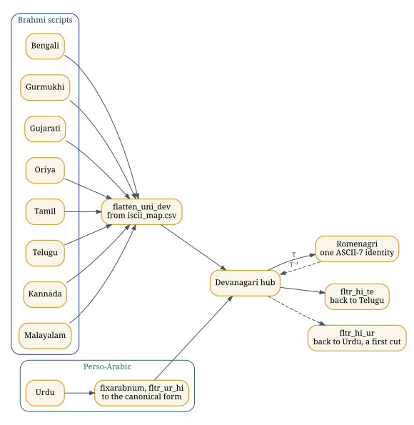

*Figure 10. One identity across scripts: Brahmi scripts meet Devanagari in one hub; Perso-Arabic meets it at its written, canonical form.*

This is the second pillar of linguistic equity at work. Because the script layer is independent of the language layer, any language can be written in any script, Hindi in Telugu letters or Telugu in Devanagari, and a program written either way is the same program to the compiler and the same names to the debugger.

*Executed while this guide was built:* `bash examples/hindawi.sh scripts`

```text
1. The Brahmi hub: a word in Telugu or Bengali goes to Devanagari, to Romenagri, and back
   ప్రకృతి -> प्रकृति -> prak_ri_ti -> ప్రకృతి
   తెలుగు -> तॆलुगु -> _taelugu -> తెలుగు
   প্রকৃতি -> प्रकृति -> prak_ri_ti -> प्रकृति
   বাংলা -> बांला -> baa_mlaa -> बांला

2. Any language in any script
   Hindi written in Telugu script:    हिंदी भाषा -> హిందీ భాషా
   Telugu written in Devanagari:      తెలుగు భాష -> तॆलुगु भाष
   Urdu written in Devanagari:        ہندوی کتاب -> हनदवी कताब
   the same, with zer and sukun:      ہِنْدوی کِتاب -> हिन्दवी किताब

3. Measured on the corpora in this tree
   Hindi, words of letters and vowel signs: 984 distinct, 983 identical after Romenagri and back
   Telugu, through the hub and back: 1416 distinct, 1347 identical; of the 69 others, 69 carry the long-u sign U+0C42, which fltr_hi_te returns as U+0942
   Urdu: 1 of 794 words carry any zabar, zer, pesh, sukun, shadda or tanwin
```

Of the 984 distinct Hindi words made of letters and vowel signs, 983 come back identical; the exception is a malformed word in the corpus, with three u signs in a row, which comes back in its canonical form. Of the 1,416 Telugu words taken through the hub and back, 1,347 are identical, and every one of the other 69 carries the long-u sign ూ, for which the reverse filter in this tree has no rule, so it returns the Devanagari sign: a one-line gap in `fltr_hi_te`, not in Romenagri. The author's own measurements in [project-ilm/romenagri](https://github.com/project-ilm/romenagri) report 99.47 per cent of 5,807 words across the Hindi, Bengali and Telugu corpora exact. From the other side, over every string of up to four ASCII letters, his paper reports the 2003 to 2004 kernel as 98.68 per cent reversible or canonicalisable, with an irreducible floor of 1.31 per cent; the figure depends on the variant of the kernel measured, and his runbook says so.

### The Perso-Arabic frontier

An abjad writes consonants and long vowels. The short vowels, zabar, zer and pesh, the absence of a vowel, sukun, and doubling, shadda, are marks that everyday Urdu leaves out: in the Urdu corpus in this tree, one word in 794 carries any of them. A written Urdu word therefore reaches the hub as what is written, its canonical form, and ہندوی arrives as हनदवी, not हिंदवी. The mapping is exact and reversible to that form. What the script does not carry is which short vowel a speaker says.

With the marks written, the hub form is exact: ہِنْدوی arrives as हिन्दवी, the author's own example in `hindawi_tashkil.txt`. So the difficulty is phonetic rather than a failure of the mapping. Which vowel a word carries has to come from knowledge of the language, its lexicon and its phonology, and that is precisely why ILM keeps the language axis apart from the script axis: the script layer maps what is written, exactly, and the language layer supplies what speakers know. The author estimates the words that need it at some 15 to 20 per cent.

Urdu programs already compile through the hub, as Chapter 21 shows. The reverse filter that renders hub text back into Urdu script, `fltr_hi_ur`, used by `urducc -r`, is a first cut in these trees; hardening the Perso-Arabic direction is the next step his seed release of Romenagri names. The Northwest Semitic abjads follow the same route to the Arabic hub: Hebrew final letter forms merge there, a documented many-to-one, and are reversible to the canonical form.

### When is a transliteration reversible?

Let $\Sigma$ be the source alphabet, the letters and marks of a script, and $\Gamma$ the target alphabet, for example ASCII letters. A transliteration assigns each $\sigma \in \Sigma$ a non-empty target word $T(\sigma) \in \Gamma^{+}$ and extends to strings letter by letter:

$$ T(\sigma_1 \sigma_2 \cdots \sigma_n) = T(\sigma_1)\,T(\sigma_2) \cdots T(\sigma_n). $$

It is reversible exactly when this extended map is injective, that is, when $T(s) = T(s')$ implies $s = s'$ for all strings $s, s' \in \Sigma^{*}$. Then there is an inverse with $T^{-1}(T(s)) = s$ for every string, which is the round-trip property a test can check. Injectivity holds if and only if $T$ is one-to-one on single letters and the set of target words $C = T(\Sigma)$ is a *uniquely decodable code*.

**Prefix codes.** If no word of $C$ is a prefix of another, every target string can be split into words from the left without looking ahead, so $C$ is uniquely decodable.

**Kraft and McMillan.** If $C$ is uniquely decodable over an alphabet of $D$ symbols, with word lengths $\ell_1, \dots, \ell_m$, then

$$ \sum_{i=1}^{m} D^{-\ell_i} \le 1 , $$

and whenever lengths satisfy this inequality, a prefix code with those lengths exists. A code whose sum exceeds 1 cannot be reversible, whatever else is done to it.

**Sardinas and Patterson.** For sets of words $A$ and $B$ write $A^{-1}B = \{\, w : aw \in B \text{ for some } a \in A \,\}$. Put $S_1 = C^{-1}C \setminus \{\varepsilon\}$ and $S_{k+1} = C^{-1}S_k \cup S_k^{-1}C$. The code is uniquely decodable if and only if no $S_k$ contains a word of $C$. The sets are built from finitely many suffixes, so the test ends.

The example below runs both tests on four codes. The first is the mistake every naive scheme makes: `k` for क, `h` for ह and `kh` for ख. The string `kh` then reads both as ख and as क followed by ह, and the two tests catch it independently: the Kraft sum is $\tfrac12 + \tfrac12 + \tfrac14 = \tfrac54 > 1$, and the dangling suffix `h` is itself a codeword. The second is Romenagri's choice, as the output above shows: ह carries the marker, `_h`, so the letter h never stands alone as a codeword and `kh` has exactly one reading.

*Executed while this guide was built:* `python3 examples/ud_check.py`

```text
naive: k, h, kh                D=2  Kraft sum=5/4    (1.250)  uniquely decodable: False
Romenagri's choice: k, _h, kh  D=3  Kraft sum=5/9    (0.556)  uniquely decodable: True
not prefix-free: a, ab, bb     D=2  Kraft sum=1      (1.000)  uniquely decodable: True
prefix code: 0, 10, 110, 111   D=2  Kraft sum=1      (1.000)  uniquely decodable: True

"kh" under the naive code has 2 readings: k + h; kh
"khk" under the naive code has 2 readings: k + h + k; kh + k
"abbb" under a, ab, bb has 1 reading: ab + bb
```

The third code shows that a code can be uniquely decodable without being a prefix code; the price is lookahead, since `a` followed by `b` cannot be settled until the next symbols arrive. An abugida adds one more demand. KA with its inherent vowel, KA with a virama, and KA in a conjunct must all remain distinguishable in the target. Romenagri meets it by writing the inherent vowel (`ka`), by letting a consonant with no vowel after it stand for the virama (`k_ha`, `kx`), and by marking what would otherwise merge; and it keeps its whole alphabet inside the identifier alphabet, so that every transliterated name is at once a valid C identifier, a valid assembler symbol and a valid linker name. The domain of reversibility, whether all Unicode strings or only well-formed syllables, still has to be stated rather than assumed; the 67 entries above are the check this guide ran.


<!-- © 1993–2026 Abhishek Choudhary. All rights reserved. AyeAI. -->

## 20. Pāṇini's grammar as a formal system {#ch-12}

::: {.plain}
**In plain words.** Pāṇini's grammar of Sanskrit, written well over two thousand years ago, works like a computer program, and this chapter runs part of it.
:::

The Aṣṭādhyāyī, "eight chapters", is a generative grammar of Sanskrit, usually dated between the sixth and the fourth centuries BCE. It has close to four thousand sūtras, 3,959 in the usual count, arranged in eight *adhyāyas* of four *pādas* each and cited by chapter, quarter and number, so that 6.1.77 is the seventy-seventh sūtra of the first quarter of the sixth chapter. It works with auxiliary lists: the Śiva Sūtras, which order the sounds; the Dhātupāṭha, the list of verbal roots; and the Gaṇapāṭha, lists of words that rules refer to as classes. Around it grew a review tradition: Kātyāyana's *vārttikas* on individual rules (around the third century BCE), Patañjali's *Mahābhāṣya* (around the second century BCE), the *Kāśikā* (seventh century CE), and Bhaṭṭoji Dīkṣita's *Siddhāntakaumudī* (seventeenth century), which rearranged the rules by topic for learners.

What follows treats the grammar the way a computer scientist would: as data structures and a rewriting system. Every claim below can be checked by running the program at the end of the chapter.

### The Śiva Sūtras: a sound inventory with tags

Fourteen short lines list the sounds of the language. Each line ends in an *it*, a marker that is not pronounced and not part of the inventory; it is a tag.

| No. | Devanagari | Sounds (IAST) | Marker |
|---:|:-----------|:-----------------------------|:--|
| 1 | अ इ उ ण् | a i u | ṇ |
| 2 | ऋ ऌ क् | ṛ ḷ | k |
| 3 | ए ओ ङ् | e o | ṅ |
| 4 | ऐ औ च् | ai au | c |
| 5 | ह य व र ट् | h y v r | ṭ |
| 6 | ल ण् | l | ṇ |
| 7 | ञ म ङ ण न म् | ñ m ṅ ṇ n | m |
| 8 | झ भ ञ् | jh bh | ñ |
| 9 | घ ढ ध ष् | gh ḍh dh | ṣ |
| 10 | ज ब ग ड द श् | j b g ḍ d | ś |
| 11 | ख फ छ ठ थ च ट त व् | kh ph ch ṭh th c ṭ t | v |
| 12 | क प य् | k p | y |
| 13 | श ष स र् | ś ṣ s | r |
| 14 | ह ल् | h | l |

### Pratyāhāra: character classes by interval

Sūtra 1.1.71, *ādir antyena sahetā*, says that a first sound together with a later marker names every sound from the first up to that marker. So *ac* runs from *a* in line 1 to the marker *c* at the end of line 4 and names all the vowels; *hal* runs from *h* in line 5 to the final *l* and names all the consonants; *ik* is *i u ṛ ḷ*; *yaṇ* is *y v r l*. Each such abbreviation, a *pratyāhāra*, is exactly a character class defined by an interval over an ordered list, the same device as `[a-z]` in a regular expression, but over a list arranged so that the classes the grammar needs come out contiguous. The marker ṇ occurs twice, in lines 1 and 6, so *aṇ* is ambiguous between *a i u* and the longer run to line 6; the grammar knows from context which is meant. The sound *h* appears twice, in lines 5 and 14, so that it falls into the classes it must belong to.

How well the fourteen lines solve that arrangement problem has been studied formally: Kiparsky (1991) explained the arrangement by principles of economy, and Petersen (2004) analysed it mathematically, including why one sound has to be listed twice for every class the grammar needs to come out as an interval.

### Kinds of sūtra

- *Saṃjñā*, a definition: 1.1.1 *vṛddhir ādaic* defines *vṛddhi* as ā, ai, au; 1.1.2 *adeṅ guṇaḥ* defines *guṇa* as a, e, o.
- *Paribhāṣā*, a meta-rule about how other rules are read and applied.
- *Vidhi*, an operation that changes a form.
- *Niyama*, a restriction on another rule.
- *Atideśa*, an extension that treats one thing as another.
- *Adhikāra*, a heading whose scope runs over the rules after it.

### Compression and scope

A word stated in one sūtra continues into the following sūtras until something cancels it. This *anuvṛtti* lets a rule be written with only what is new in it; the rest is inherited from context, the way a variable declared in an enclosing block is visible inside it, or the way a default argument is supplied unless overridden.

### Deciding which rule applies

Real grammars have rules that compete. The Aṣṭādhyāyī resolves conflicts with stated principles, and they are the part most worth studying.

- **General rule and exception.** An *apavāda*, the specific rule, blocks the *utsarga*, the general rule, where both could apply: the principle a pattern matcher follows when it prefers the more specific pattern.
- **1.4.2 *vipratiṣedhe paraṃ kāryam*.** In a conflict between rules of equal standing, the later rule in the text applies.
- **8.2.1 *pūrvatrāsiddham*.** The rules of the last three quarters of the eighth chapter, the *tripādī*, are treated as not having applied, as far as every earlier rule is concerned. It is an ordered pipeline: a late stage whose output the earlier stages are not allowed to see, as a compiler's later passes are invisible to its earlier ones.
- **1.1.56 *sthānivad ādeśo 'nalvidhau*.** A substitute behaves like what it replaced, except for rules about individual sounds: substitution through a shared interface.
- **1.3.2, 1.3.3 and 1.3.9.** Nasalised vowels and final consonants in teaching forms are markers, and markers are deleted: tags are stripped once they have done their work, as annotations are removed after parsing.

### Four sandhi rules, computed

When words meet, their sounds change by rule. The program below builds the pratyāhāras from the table above by sūtra 1.1.71 and applies four rules of external sandhi to eight pairs.

- 6.1.101 *akaḥ savarṇe dīrghaḥ*: a simple vowel followed by a similar vowel becomes one long vowel.
- 6.1.77 *iko yaṇ aci*: a sound of class *ik* becomes the corresponding sound of class *yaṇ* before a vowel, *ac*. As a rewrite rule: $\{i, u, ṛ, ḷ\} \to \{y, v, r, l\} \;/\; \_\_\, \mathit{ac}$.
- 6.1.87 *ād guṇaḥ*: *a* or *ā* followed by a vowel of class *ik* gives the *guṇa* vowel.
- 6.1.88 *vṛddhir eci*: *a* or *ā* followed by e, o, ai or au gives the *vṛddhi* vowel.

*File:* `examples/panini_demo.py`

```python
# panini_demo.py: the Śiva Sūtras, pratyāhāra formation (1.1.71) and three sandhi rules.
# © 1993–2026 Abhishek Choudhary. All rights reserved. AyeAI.
# SPDX-License-Identifier: GPL-3.0-or-later
# A teaching model in IAST. It is not tajziya's parser and makes no claim to cover the grammar.

SUTRAS = [  # (sounds, it-marker), the fourteen Maheshvara (Shiva) Sutras
    (["a", "i", "u"], "ṇ"), (["ṛ", "ḷ"], "k"), (["e", "o"], "ṅ"), (["ai", "au"], "c"),
    (["h", "y", "v", "r"], "ṭ"), (["l"], "ṇ"), (["ñ", "m", "ṅ", "ṇ", "n"], "m"),
    (["jh", "bh"], "ñ"), (["gh", "ḍh", "dh"], "ṣ"), (["j", "b", "g", "ḍ", "d"], "ś"),
    (["kh", "ph", "ch", "ṭh", "th", "c", "ṭ", "t"], "v"), (["k", "p"], "y"),
    (["ś", "ṣ", "s"], "r"), (["h"], "l"),
]

def pratyahara(first, marker, occurrence=1):
    """1.1.71 ādir antyena sahetā: a first sound with a final it-marker names every sound
    from the first up to the marker. Where a marker occurs twice (ṇ), say which one."""
    out, started, seen = [], False, 0
    for sounds, it in SUTRAS:
        for s in sounds:
            if s == first and not started:
                started = True
            if started:
                out.append(s)
        if started and it == marker:
            seen += 1
            if seen == occurrence:
                return list(dict.fromkeys(out))  # a sound listed twice (h) counts once
    raise ValueError(f"no pratyāhāra {first}{marker}")

AC  = pratyahara("a", "c")     # all vowels
HAL = pratyahara("h", "l")     # all consonants
IK  = pratyahara("i", "k")
YAN = pratyahara("y", "ṇ", 1)  # the only ṇ after y is the second one in the list

LONG = {"a": "ā", "i": "ī", "u": "ū", "ṛ": "ṝ"}
SAVARNA = {k: k for k in LONG} | {v: k for k, v in LONG.items()}
YAN_OF = {"i": "y", "ī": "y", "u": "v", "ū": "v", "ṛ": "r", "ṝ": "r", "ḷ": "l"}
GUNA = {"i": "e", "ī": "e", "u": "o", "ū": "o", "ṛ": "ar", "ṝ": "ar"}
VRDDHI = {"e": "ai", "ai": "ai", "o": "au", "au": "au"}

def first_vowel(w):
    return w[:2] if w[:2] in ("ai", "au") else w[0]

def join(left, right):
    x, y = left[-1], first_vowel(right)
    if x in SAVARNA and y in SAVARNA and SAVARNA[x] == SAVARNA[y]:   # 6.1.101 akaḥ savarṇe dīrghaḥ
        return left[:-1] + LONG[SAVARNA[x]] + right[len(y):], "6.1.101 akaḥ savarṇe dīrghaḥ"
    if x in YAN_OF and y in AC:                                      # 6.1.77 iko yaṇ aci
        return left[:-1] + YAN_OF[x] + right, "6.1.77 iko yaṇ aci"
    if x in ("a", "ā") and y in VRDDHI:                              # 6.1.88 vṛddhir eci
        return left[:-1] + VRDDHI[y] + right[len(y):], "6.1.88 vṛddhir eci"
    if x in ("a", "ā") and y in GUNA:                                # 6.1.87 ād guṇaḥ
        return left[:-1] + GUNA[y] + right[len(y):], "6.1.87 ād guṇaḥ"
    return left + right, "no vowel sandhi"

if __name__ == "__main__":
    print("ac  =", " ".join(AC))
    print("hal =", " ".join(HAL), f"({len(HAL)} consonants)")
    print("ik  =", " ".join(IK), "  yaṇ =", " ".join(YAN))
    print("aṇ (first ṇ) =", " ".join(pratyahara("a", "ṇ", 1)),
          "  aṇ (second ṇ) =", " ".join(pratyahara("a", "ṇ", 2)))
    for a, b in [("dadhi", "atra"), ("madhu", "ari"), ("deva", "ālaya"), ("guru", "upadeśa"),
                 ("rāma", "iti"), ("mahā", "indra"), ("deva", "ṛṣi"), ("tava", "eva")]:
        w, rule = join(a, b)
        print(f"{a} + {b} -> {w:12s} by {rule}")
```

*Executed while this guide was built:* `python3 examples/panini_demo.py`

```text
ac  = a i u ṛ ḷ e o ai au
hal = h y v r l ñ m ṅ ṇ n jh bh gh ḍh dh j b g ḍ d kh ph ch ṭh th c ṭ t k p ś ṣ s (33 consonants)
ik  = i u ṛ ḷ   yaṇ = y v r l
aṇ (first ṇ) = a i u   aṇ (second ṇ) = a i u ṛ ḷ e o ai au h y v r l
dadhi + atra -> dadhyatra    by 6.1.77 iko yaṇ aci
madhu + ari -> madhvari     by 6.1.77 iko yaṇ aci
deva + ālaya -> devālaya     by 6.1.101 akaḥ savarṇe dīrghaḥ
guru + upadeśa -> gurūpadeśa   by 6.1.101 akaḥ savarṇe dīrghaḥ
rāma + iti -> rāmeti       by 6.1.87 ād guṇaḥ
mahā + indra -> mahendra     by 6.1.87 ād guṇaḥ
deva + ṛṣi -> devarṣi      by 6.1.87 ād guṇaḥ
tava + eva -> tavaiva      by 6.1.88 vṛddhir eci
```

The program tries the rules in an order chosen by hand. Pāṇini's system does not need a hand-chosen order: the meta-rules above decide it, and that is the difference between a script that produces the right answers for eight examples and a grammar that produces them for the language.

### Pāṇini and formal language theory

A modern reader will recognise context-sensitive rewrite rules, ordered rule application, meta-rules for conflict, and a generative system that derives surface forms from roots and affixes. In 1967 Peter Ingerman proposed in *Communications of the ACM* that the notation used to define programming languages, Backus-Naur Form, be called Pāṇini-Backus Form, since Pāṇini's notation is equivalent in power. Pāṇinian derivation has been implemented in code, for example in vidyut-prakriya, whose sūtra text tajziya uses under the MIT licence. Tamil has its own grammatical tradition beginning with the Tolkāppiyam, and ILM's parsers are organised by language family so that such traditions sit side by side.

### Questions to work through

1. Compute the pratyāhāras *jhal* and *yar* from the table by hand. Which sounds does each contain?
2. Why must *h* appear twice in the Śiva Sūtras?
3. Derive *madhu* + *ari* by hand. Which rule applies, and why does 6.1.101 not apply?
4. What would go wrong in a derivation if 8.2.1 were removed?
5. Compare 1.4.2 with the way a parser generator settles a shift-reduce conflict by precedence (Chapter 21).
6. Pāṇini's inventory lists sounds; Unicode's Devanagari block lists written signs. Which of the two is a phonology and which a script, and what does each leave out?


<!-- © 1993–2026 Abhishek Choudhary. All rights reserved. AyeAI. -->

## 21. Compilers, from lexer to microcode {#ch-13}

::: {.plain}
**In plain words.** How a program written in Hindi or Urdu becomes instructions a machine can run, with every name kept intact all the way to the debugger.
:::

A compiler is a chain of translations, each into a representation closer to the machine: source text, tokens, a syntax tree, a checked tree, an intermediate representation, optimised intermediate code, assembly, an object file, an executable, a running process, and finally, inside the processor, micro-operations.

### Lexing: regular languages and automata

Tokens are described by regular expressions. Thompson's construction turns a regular expression of length $n$ into a nondeterministic finite automaton with at most $2n$ states; the subset construction turns that into a deterministic automaton whose states are sets of the original states, up to $2^{n}$ in the worst case and few in practice; Hopcroft's algorithm minimises the result in $O(n \log n)$ time.

lex (Lesk and Schmidt, Bell Labs, 1975) generates such a scanner in C from a list of patterns and actions; flex is the fast, free lex that Linux systems carry. flex works on bytes, so a keyword written in Devanagari is simply a pattern of UTF-8 bytes, and the whole Devanagari block is the pattern `\xE0\xA4[\x80-\xBF]|\xE0\xA5[\x80-\xBF]`, whose end points the output in Chapter 18 printed.

### Parsing: context-free grammars

A grammar $G = (N, \Sigma, P, S)$ has nonterminals, terminals, productions and a start symbol. The classic expression grammar is

$$
\begin{aligned}
E &\to T\,E' & E' &\to +\,T\,E' \mid \varepsilon \\
T &\to F\,T' & T' &\to *\,F\,T' \mid \varepsilon \\
F &\to (\,E\,) \mid \mathbf{id}
\end{aligned}
$$

A predictive, LL(1), parser chooses a production by looking at one token, guided by two families of sets. With $\dashv$ marking the end of input:

$$
\begin{aligned}
\mathrm{FIRST}(E) = \mathrm{FIRST}(T) = \mathrm{FIRST}(F) &= \{\, (,\ \mathbf{id} \,\} \\
\mathrm{FIRST}(E') = \{\, +,\ \varepsilon \,\}, \quad \mathrm{FIRST}(T') &= \{\, *,\ \varepsilon \,\} \\
\mathrm{FOLLOW}(E) = \mathrm{FOLLOW}(E') &= \{\, ),\ \dashv \,\} \\
\mathrm{FOLLOW}(T) = \mathrm{FOLLOW}(T') &= \{\, +,\ ),\ \dashv \,\} \\
\mathrm{FOLLOW}(F) &= \{\, +,\ *,\ ),\ \dashv \,\}
\end{aligned}
$$

LR parsing (Knuth, 1965) reads left to right, shifting tokens onto a stack and reducing them when a production's right side is on top, which builds a rightmost derivation in reverse. LALR(1) (DeRemer, 1969) merges LR(1) states that share a core, which keeps the tables small enough for practice. yacc (Johnson, Bell Labs) generates LALR(1) parsers in C, and GNU Bison is its compatible successor; the name is a joke on yacc, since a yak and a bison are cousins. When a grammar allows two moves, the generator reports a shift-reduce or reduce-reduce conflict, and declarations such as `%left '+' '-'` and `%left '*' '/'` settle it by precedence and associativity: a rule-ordering device of the kind Pāṇini's 1.4.2 states for his grammar. The standard example is the dangling else, `if a then if b then s1 else s2`, which has two parse trees; yacc resolves it by shifting, so the `else` joins the nearest `if`.

### Meaning: symbol tables and syntax-directed translation

After parsing, names are resolved through symbol tables, one per scope, and types are checked. An attribute grammar attaches values to the nodes of the tree: synthesised attributes flow up from children, inherited attributes flow down from parents and siblings, and definitions that use only synthesised attributes, or inherited attributes from the left, can be evaluated during parsing itself. This is what the GATE syllabus calls syntax-directed translation.

### Intermediate representation

Three-address code has at most one operator per instruction:

```text
t1 = x * 4
t2 = t1 + 6
return t2
```

Instructions without internal jumps form basic blocks, and the blocks form a control-flow graph. In static single assignment form every variable is assigned exactly once; where control paths join, a $\varphi$-function chooses the value from whichever predecessor was taken, $x_3 = \varphi(x_1, x_2)$. SSA is built by placing $\varphi$-functions at the dominance frontiers of the definitions (Cytron and colleagues, 1991). GCC's middle end works on GIMPLE in SSA form; LLVM's IR is SSA throughout.

### Dataflow analysis as a fixed point

A variable is live at a point if its current value may still be read. For each instruction $n$,

$$ \mathit{in}[n] = \mathit{use}[n] \cup \bigl(\mathit{out}[n] \setminus \mathit{def}[n]\bigr), \qquad \mathit{out}[n] = \bigcup_{s \in \mathit{succ}(n)} \mathit{in}[s]. $$

Start with every set empty and apply the equations until nothing changes. The sets form a lattice ordered by inclusion, the equations are monotone, and the lattice has finite height, so the iteration stops at the least fixed point. Reaching definitions, available expressions and constant propagation are the same pattern over different lattices.

### Optimisation, watched on a real compiler

The usual transformations are constant folding and propagation, common-subexpression elimination, dead-code elimination, moving loop-invariant code out of loops, strength reduction (a multiplication by four becomes a shift or an address computation), inlining, unrolling and vectorisation.

*File:* `examples/fold.c`

```c
/* examples/fold.c: two small functions, to watch an optimising back end at work.
   © 1993–2026 Abhishek Choudhary. All rights reserved. AyeAI.
   SPDX-License-Identifier: GPL-3.0-or-later */
int scale(int x) { int k = 2 * 3; return x * 4 + k; }
int sum_to(int n) { int s = 0; for (int i = 1; i <= n; i++) s += i; return s; }
```

*Captured while this guide was built:* `gcc -O2 -S -masm=intel -fno-asynchronous-unwind-tables -fcf-protection=none -fno-ident -o - examples/fold.c | sed -n '/^scale:/,/size.sum_to/p'`

```text
scale:
	lea	eax, 6[0+rdi*4]
	ret
	.size	scale, .-scale
	.p2align 4
	.globl	sum_to
	.type	sum_to, @function
sum_to:
	test	edi, edi
	jle	.L6
	lea	ecx, 1[rdi]
	xor	edx, edx
	and	edi, 1
	mov	eax, 1
	je	.L5
	mov	eax, 2
	mov	edx, 1
	cmp	eax, ecx
	je	.L3
	.p2align 4,,10
	.p2align 3
.L5:
	lea	edx, 1[rdx+rax*2]
	add	eax, 2
	cmp	eax, ecx
	jne	.L5
.L3:
	mov	eax, edx
	ret
	.p2align 4,,10
	.p2align 3
.L6:
	xor	edx, edx
	mov	eax, edx
	ret
	.size	sum_to, .-sum_to
```

`scale` became a single instruction. `lea eax, 6[0+rdi*4]` computes $4x + 6$ in the address unit: the constant $2 \times 3$ was folded, and the multiplication by four was reduced to scaled addressing. In `sum_to`, GCC peeled one iteration when $n$ is odd and then unrolled the loop by two, adding $i$ and $i + 1$ in one step as $2i + 1$ with another `lea`. The exact output depends on the compiler's version and target; this one was produced by the GCC recorded in the package's `docs/BUILD.json`.

### Registers, instructions and scheduling

Register allocation is graph colouring. Each variable's live range is a node; two nodes are joined when the variables are live at the same time; colouring the graph with $k$ colours assigns $k$ registers. Deciding whether a graph is $k$-colourable is NP-complete for $k \ge 3$, so compilers use heuristics: Chaitin's simplify-and-spill (1982), Briggs's optimistic colouring, and linear scan in just-in-time compilers where speed of compilation matters most. Instruction selection tiles the IR tree with machine instructions, instruction scheduling reorders them to hide latencies, and a peephole pass cleans up short sequences.

### Assembling, linking, loading

The assembler writes an object file, ELF on Linux, with sections (`.text`, `.data`, `.rodata`, `.bss`), a symbol table, and relocations marking the places whose final addresses are not yet known. The linker resolves symbols across objects and libraries and applies the relocations; the dynamic loader maps shared libraries into the process when it starts.

### Below the instruction set: micro-operations and microcode

On current high-performance processors, architectural instructions are decoded into internal micro-operations, and complex instructions are sequenced from microcode, the lowest layer at which code is still written by people; microcode can be updated after the chip is made. GATE's computer organisation syllabus asks for the design of hardwired and microprogrammed control units, and a microprogrammed control unit is exactly a small engine that runs microcode to drive the datapath.

### Front ends and back ends: why a shared back end is not a dependency

With $m$ source languages and $n$ target machines, separate compilers would number $mn$; with a shared intermediate representation, $m$ front ends and $n$ back ends suffice, $m + n$ in all. GCC's front ends for C, C++, Objective-C, Fortran, Ada, Go, D, Modula-2 and others all lower to GENERIC and GIMPLE and then RTL, and its back ends serve dozens of processors. LLVM's IR is shared by Clang, Rust, Swift, Julia and others. Nobody says that Rust depends on C++ because LLVM is written in C++: a new front end reusing a mature back end is the ordinary path.

The back end never sees keywords. By the time a program is GIMPLE or RTL, a loop written with `for` and the same loop written with `क्रम` have become the same structure: basic blocks, a condition and a branch. The human language of the keywords is settled and discarded at the front end. That is the precise answer to the objection that a system which uses GCC as its back end depends on English; the same holds for PANINIq's use of Qiskit, where what crosses the boundary is a Hamiltonian, a matrix of complex numbers. What the back end does see is the program's names, which it must carry into the object file intact; that is the script layer's job, and the last sections of this chapter run it.

### Bootstrapping and the self-hosting fixed point

A compiler has three languages: the source $S$ it reads, the target $T$ it writes, and the language $I$ it is written in, drawn as a T-shaped tombstone diagram. Diagrams chain: a compiler for $X$ written in C, built by an existing C compiler, runs on the machine; with it you compile a compiler for $X$ written in $X$, and from then on the language compiles itself. The test of self-hosting is a fixed point: stage 1, built by the old compiler, builds stage 2; stage 2 builds stage 3; stages 2 and 3 must be identical. GCC's own `make bootstrap` performs this three-stage build and compares the last two stages.

A reversible transliteration (Chapter 19) plays the part of the first compiler in such a chain. It lets the whole existing toolchain process programs written in the script, and its inverse restores the script in the output and the diagnostics, so the native-script tools can then be brought up the same way. Hindawi's own keyword lexer was brought up exactly so, through Romenagri, as the next sections show.

### Trust: the precise meaning of a sovereign stack

Ken Thompson showed in 1984 that a compiler can be altered to insert a back door into the login program, and to insert the same alteration into every compiler it later compiles, so that the back door survives after both source files have been cleaned. Reading the source is not enough. David Wheeler's diverse double-compiling (2005, and his dissertation of 2009) answers it: compile the compiler's source with a second, independently developed compiler, use the result to compile the source again, and compare. If the output is bit-for-bit identical to the original self-compiled binary, that binary corresponds to its source, under stated assumptions.

Together with reproducible builds, in which the same source always yields the same bits, this gives the phrase "sovereign stack" an exact technical meaning: a stack that its users can rebuild from source and verify with independent tools, with people able to do both. Which alphabet the keywords use has nothing to do with it.

### Hindawi's pipeline, run

The Hindawi Programming System has nine *shailis*, each a front end over one host language:

| Shaili | Host |
|:-------|:-----|
| गुरु guru | C |
| श्रेणी shraeni | C++ |
| यंत्र yantra | assembly |
| कृत्रिम kritrima | Java |
| प्राथमिक praatha | BASIC |
| सूची soochee | Python |
| व्याकरण wyaaka | yacc |
| रोबोट robot | LOGO |
| शब्द shabda | lex |

A program begins with a line naming its shaili, `<शैली गुरु>` for C, and one driver, `hincc`, compiles every shaili:

```text
cat $1 | fixuninum | iconv -f utf-8 -t utf-16 | uni2acii | acii2cf | hincc.awk
```

`fixuninum` turns Devanagari numerals into ASCII digits; `iconv` and `uni2acii` turn Unicode into ACII; `acii2cf` writes the whole program in Romenagri's compiler form, every keyword and every name, leaving string literals as they are; and `hincc.awk` reads the shaili line, which is now `<shailee guru>`, and hands the rest of the program to that shaili's driver. For C that is `gurucc`:

```text
cat $1 | acii2uni | iconv -f UTF-16 -t UTF-8 | h2c > tempfil0123.tmphin.c
gcc tempfil0123.tmphin.c -o hin.exe -lm
```

Its `acii2uni` restores the string literals to Unicode, so that the program prints in the script, and `h2c` maps each Romenagri keyword to its C keyword: `poor_nnaa_mka` (पूर्णांक) to `int`, `krama` (क्रम) to `for`, `ma_likhoa` (म_लिखो) to `printf`, `mukhya` (मुख्य) to `main`. Every other word is a name, and it reaches GCC in Romenagri. The stages run in the order of the three axes: the script first, in `hincc`; then the language, in `h2c`, and for lex and yacc sources in `h2l` and its companions before it; then the standard, in flex and GCC.

The keyword lexer is itself written in Hindi. Its source, `h2c.uhin`, passes through the same `uni2acii | acii2cf` before flex compiles it, so the tool that reads Hindi programs is brought up through its own script layer, the bootstrapping step described above. The transducers also compose: a lex or yacc action block is C, so `h2l` carries only what lex adds beyond C, mapping श_शब्द to `yylex`, श_ब_मान to `yylval`, श_माला to `yytext` and श_पंक्ति to `yylineno`, and hands the rest to `h2c`. Counted that way, shabda has 6 rules of its own and 321 through `h2c`, 327 in all, and wyaaka, for yacc, has 341. Reading a composing shaili on its own would report a working system as broken.

The run below builds Romenagri, the guru shaili and `hincc` from the retrieved sources in `vendor/chintamani` with their own Makefiles, then compiles and runs Hindawi's own C sample:

*Executed while this guide was built:* `bash examples/hindawi.sh sample`

```text
$ hincc HindiC.uhin
संकलन के परिणाम
============

The C that gurucc handed to gcc:
#include <stdio.h>

int main()
{
	char _a[80];
	int ka;
	printf("आपका नाम क्या है?\n");
	scanf("%s",_a);
	printf("नमस्ते %s.\n",_a);
	for(ka=1; ka<=10; ka++)
		printf("%d\n",ka);
	scanf("%s",_a);
	return 0;
}

$ ./hin.exe, with राम typed at both prompts
आपका नाम क्या है?
नमस्ते राम.
1
2
3
4
5
6
7
8
9
10
```

अ has become `_a` and क has become `ka`; the strings still print in Devanagari.

### The symbol bridge, from source to debugger

This program, in the guru shaili, has a global, a function, a parameter and a local, all named in Hindi:

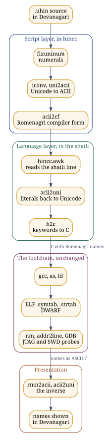

*Figure 11. The symbol bridge: a Hindi program through hincc, GCC and the debugger, its names carried in Romenagri and rendered back.*

*File:* `examples/yog.uhin`

```text
<शैली गुरु>
#समावेश <मानकपन.स>

पूर्णांक योग;

पूर्णांक जोड़ो(पूर्णांक सीमा)
{
	पूर्णांक गिनती;
	क्रम(गिनती=1; गिनती<=सीमा; गिनती++)
		योग = योग + गिनती;
	वापस योग;
}

पूर्णांक मुख्य()
{
	म_लिखो("१ से १० तक का योग = %d\n", जोड़ो(10));
	वापस 0;
}
```

*Executed while this guide was built:* `bash examples/hindawi.sh yog`

```text
$ hincc yog.uhin
संकलन के परिणाम
============

The C that gurucc handed to gcc:
#include <stdio.h>

int yoaga;

int joa_rdoa(int seemaa)
{
	int gina_tee;
	for(gina_tee=1; gina_tee<=seemaa; gina_tee++)
		yoaga = yoaga + gina_tee;
	return yoaga;
}

int main()
{
	printf("1 से 10 तक का योग = %d\n", joa_rdoa(10));
	return 0;
}

$ ./hin.exe
1 से 10 तक का योग = 55
```

योग is `yoaga`, जोड़ो is `joa_rdoa`, सीमा is `seemaa` and गिनती is `gina_tee`: names over A to Z, a to z and the underscore, which GCC, the assembler, the linker and every later tool accept as they are. Below, the same program is built with debugging information and examined with the ordinary tools, and then the same transcript is rendered through the Romenagri inverse. The binary is not touched; only what a person reads changes. The C names that Hindawi has words for, `main` and `printf`, come back through `c2h` as they do in Hindawi's own `std2hin`; the program's own names come back through `rmn2acii` and `acii2uni`.

*Captured while this guide was built:* `bash examples/hindawi.sh debug`

```text
$ nm --defined-only yog-g, the program's own symbols
   0000000000001149 T joa_rdoa
   0000000000001182 T main
   0000000000004014 B yoaga

$ readelf --debug-dump=info yog-g, the names DWARF records
   variable yoaga
   subprogram printf
   subprogram main
   subprogram joa_rdoa
   formal_parameter seemaa
   variable gina_tee

$ gdb -batch: break joa_rdoa, run, backtrace, info args, finish, print yoaga
   Breakpoint 1 at 0x1154: file ./tempfil0123.tmphin.c, line 8.
   
   Breakpoint 1, joa_rdoa (seemaa=10) at ./tempfil0123.tmphin.c:8
   8		for(gina_tee=1; gina_tee<=seemaa; gina_tee++)
   #0  joa_rdoa (seemaa=10) at ./tempfil0123.tmphin.c:8
   #1  0x0000555555555194 in main () at ./tempfil0123.tmphin.c:15
   seemaa = 10
   0x0000555555555194 in main () at ./tempfil0123.tmphin.c:15
   15		printf("1 से 10 तक का योग = %d\n", joa_rdoa(10));
   Value returned is $1 = 55
   $2 = 55

$ addr2line -f -s -e yog-g 0x0000000000001149
   joa_rdoa
   tempfil0123.tmphin.c:6

The same, rendered through the Romenagri inverse; the binary is unchanged:
$ nm --defined-only yog-g, the program's own symbols
   0000000000001149 T जोड़ो
   0000000000001182 T मुख्य
   0000000000004014 B योग

$ readelf --debug-dump=info yog-g, the names DWARF records
   variable योग
   subprogram म_लिखो
   subprogram मुख्य
   subprogram जोड़ो
   formal_parameter सीमा
   variable गिनती

$ gdb -batch: break जोड़ो, run, backtrace, info args, finish, print योग
   Breakpoint 1 at 0x1154: file ./tempfil0123.tmphin.c, line 8.
   
   Breakpoint 1, जोड़ो (सीमा=10) at ./tempfil0123.tmphin.c:8
   8		for(गिनती=1; गिनती<=सीमा; गिनती++)
   #0  जोड़ो (सीमा=10) at ./tempfil0123.tmphin.c:8
   #1  0x0000555555555194 in मुख्य () at ./tempfil0123.tmphin.c:15
   सीमा = 10
   0x0000555555555194 in मुख्य () at ./tempfil0123.tmphin.c:15
   15		म_लिखो("1 से 10 तक का योग = %d\n", जोड़ो(10));
   Value returned is $1 = 55
   $2 = 55

$ addr2line -f -s -e yog-g 0x0000000000001149
   जोड़ो
   tempfil0123.tmphin.c:6
```

Three layers do three jobs here. The front end lowers keywords to C, where they vanish into control flow. The symbol table and the DWARF information carry every name in Romenagri, byte for byte, through the assembler and the linker into the ELF file, and from there to `nm`, `addr2line`, GDB, OpenOCD on a JTAG or SWD probe, or a kernel's panic trace. A presentation layer applies the Romenagri inverse wherever a person reads: a GDB front end, an IDE panel, a filter on `addr2line` or on a panic trace. No link in the chain has to accept anything but letters, digits and the underscore, and nothing is lost, because the map is bijective. Drop the script layer and pass names as raw UTF-8, or flatten them into names that cannot be mapped back, and some link in that chain either rejects them or hands the developer names that no longer match the source.

Two details are worth knowing. GDB lists the generated C because the guru shaili does not emit `#line` directives; with them, the same session would list the Hindi source line by line. And Romenagri writes an independent vowel with a leading underscore, so a vowel-initial name at file scope, `_aapakaa` for आपका, begins with an underscore, which the C standard reserves for the implementation at that scope; GCC accepts it, and a project that exports such symbols can fix a prefix for them.

### The Urdu edition, run

[zistgah/urdu-ilm](https://github.com/zistgah/urdu-ilm) carries the same shailis for Urdu. The guru shaili's lexer is written in Urdu, `h2c_urdu.uhin`, and the driver `urducc` sends an Urdu program through `fixuninum` and `fixarabnum` for the digits, `fltr_ur_hi` to the Devanagari hub, `uni2acii` and `acii2cf` to Romenagri, then `h2c_urdu` and the standard Hindawi driver. The run below compiles the Urdu edition's own C sample:

*File:* `vendor/urdu-ilm/ILM/samples/UrduC.uhin`

```text
<شیلی گرو>
#شامل <معیاری.س>
صحیح مرکزی()
{
	حرف ن[80];
	صحیح ک;
	لکھو("آپ کا نام کیا ہے؟\n");
	پڑھو("%s",ن);
	لکھو("السلام علیکم %s۔\n",ن);
	برائے(ک=1; ک<=10; ک++)
		لکھو("%d\n",ک);
	واپس 0;
}
```

*Executed while this guide was built:* `bash examples/hindawi.sh urdu`

```text
$ urducc UrduC.uhin
संकलन के परिणाम
============

The C that reached gcc:
#include <stdio.h>
int main()
{
	char na[80];
	int ka;
	printf("आप का नाम कया हे?\n");
	scanf("%s",na);
	printf("इलसलाम एलीकम %s.\n",na);
	for(ka=1; ka<=10; ka++)
		printf("%d\n",ka);
	return 0;
}

$ ./hin.exe, with Ali typed at the prompt
आप का नाम कया हे?
इलसलाम एलीकम Ali.
1
2
3
4
5
6
7
8
9
10
```

The keywords are C and the names are Romenagri, reached through the hub: ن is `na` and ک is `ka`. The strings print in the hub script and show the frontier of Chapter 19 at work: کیا, written without its short vowel, arrives as कया rather than क्या, and ہے as हे rather than है. Rendering them back into Urdu is the reverse filter's job.

### ILM's construct model

In the merged release, `ilm/constructs.csv` holds 39 constructs in 27 human languages and `ilm/decorators.csv` holds 216 realisations of them in 8 host languages; a keyword table of 1,801 constructs in 27 languages generates the Hindawi distributions. The construct is primary: a counted loop is translated once per human language, not once per host language, and a decorator records what a host requires, such as `stdio.h` for printing in C. The construct model is the keyword layer, the layer `h2c` implements for C. Names still pass through the script layer, Romenagri, exactly as above.


<!-- © 1993–2026 Abhishek Choudhary. All rights reserved. AyeAI. -->

## 22. Below the software: logic, chips, ternary and qubits {#ch-14}

::: {.plain}
**In plain words.** What happens inside chips: switches, circuits, three-valued logic, and the very cold machines that hold qubits.
:::

### From logic to CMOS

Every digital function reduces to Boolean algebra, and NAND alone is enough to build all of it. In CMOS, a network of p-type transistors pulls the output up and a dual network of n-type transistors pulls it down, so that in a settled state no current flows from supply to ground. Power is spent mainly in switching, $P \approx \alpha\, C\, V^{2} f$, with $\alpha$ the fraction of nodes switching per cycle, $C$ the capacitance switched, $V$ the supply voltage and $f$ the clock frequency; the $V^2$ is why every generation of chips has lowered its voltage.

### How a chip is designed

1. Describe the hardware at register-transfer level in Verilog, VHDL or SystemVerilog, or generate it from Chisel or Amaranth.
2. Simulate it, with Icarus Verilog or Verilator.
3. Synthesise it into a netlist of standard cells, with Yosys.
4. Floorplan, place, build the clock tree and route, with OpenROAD.
5. Check design rules and compare layout against schematic, with Magic, KLayout and Netgen.
6. Write the layout as GDSII or OASIS and send it to the foundry: the tapeout.
7. Fabricate, test and package.

Open process design kits let anyone take this path to real silicon: SkyWater SKY130 (130 nm), GlobalFoundries GF180MCU (180 nm) and IHP SG13G2 (130 nm, SiGe BiCMOS). [zistgah/jugaad28](https://github.com/zistgah/jugaad28) catalogues integrated circuits taped out on 28 nm, with evidence-gated descriptors and a low-cost open laboratory. A hardware description language is a language like any other: its front end can be given native-language keywords by the three-axis method of Chapter 21, and what reaches the synthesiser is a netlist, not words.

### Instruction sets and the boot chain

The instruction set is the contract between software and hardware. RISC-V is an open one: a small base, RV32I or RV64I, with standard extensions for multiplication (M), atomics (A), floating point (F and D), compressed instructions (C) and vectors (V), which anyone may implement without a licence fee. An open instruction set, open design tools and reproducible toolchains carry the argument of Chapter 21 down to the silicon.

A computer starts through a chain of programs: a boot ROM, the firmware (BIOS or UEFI), a boot loader such as GRUB, the kernel, the first user process such as systemd, and then everything else. Each is a program in some language, and each can be given a native-language front end without changing what the hardware executes; the hindawiai organisation keeps a fork of the Linux kernel tree, [hinlin](https://github.com/hindawiai/hinlin), for exactly this work.

### Balanced ternary: Zamin and PRATIK

Balanced ternary uses the digits $-1$, $0$ and $+1$, written T, 0 and 1:

$$ n = \sum_{i} t_i\, 3^{i}, \qquad t_i \in \{-1, 0, +1\}. $$

It needs no sign: a number is negated by flipping every digit, and rounding is simply truncation. It is also the most economical integer base. Representing numbers up to $N$ in base $b$ takes about $\log_b N$ digits of $b$ states each, a cost proportional to

$$ b \log_b N = \frac{b}{\ln b}\,\ln N , $$

which is least at $b = e \approx 2.718$; among whole numbers, 3 wins over 2 and 4. The Setun computer, built at Moscow State University in 1958, ran on balanced ternary.

[zistgah/zamin](https://github.com/zistgah/zamin) is the physical realisation of the PRATIK balanced-ternary substrate for the PEDLER event algebra. Its poised zero is a physical high-impedance ground, so that the electrical ground reference and the computational zero are the same node, and its spawning operator creates new physical dimensions on a memristive three-dimensional crossbar. The repository holds SPICE cells, an interactive circuit simulator and a paper; [zistgah/pratik_core_mvp](https://github.com/zistgah/pratik_core_mvp) is the kernel in C++ and CUDA.

*Executed while this guide was built:* `python3 examples/ternary.py`

```text
     5 =       1TT   negated by flipping every digit:       T11 = -5
    -5 =       T11   negated by flipping every digit:       1TT = 5
    13 =       111   negated by flipping every digit:       TTT = -13
    40 =      1111   negated by flipping every digit:      TTTT = -40
  -121 =     TTTTT   negated by flipping every digit:     11111 = 121
  2026 =  10T10001   negated by flipping every digit:  T01T000T = -2026

radix economy b/ln b for b = 2.000: 2.8854
radix economy b/ln b for b = 2.718: 2.7183
radix economy b/ln b for b = 3.000: 2.7307
radix economy b/ln b for b = 4.000: 2.8854
radix economy b/ln b for b = 10.000: 4.3429
```

### Superconducting qubits

A Josephson junction is two superconductors separated by a thin insulator, usually aluminium, aluminium oxide and aluminium. Its current and voltage obey

$$ I = I_c \sin\varphi, \qquad V = \frac{\hbar}{2e}\,\frac{d\varphi}{dt}, $$

where $\varphi$ is the phase difference across it. It behaves as a nonlinear inductor, and the nonlinearity is what makes the lowest two energy levels of a circuit usable as a qubit. The transmon, the most common design, has the Hamiltonian

$$ H = 4E_C\,(\hat n - n_g)^2 - E_J \cos\hat\varphi , $$

and is operated with $E_J / E_C$ around 50, which makes it nearly insensitive to stray charge (Koch and colleagues, 2007). Its transition frequency lies around 4 to 8 GHz.

The cold follows from that frequency. Thermal energy has to be far below the energy of one microwave photon at the qubit frequency. At 10 mK, which is $-273.14\,^{\circ}\mathrm{C}$, $k_B T / h$ is about 0.21 GHz, well below 5 GHz; at the 4 K of liquid helium it would be about 83 GHz, and the qubit would be swamped by thermal excitation. Hence the dilution refrigerator, the large gold-coloured structure in photographs of quantum computers; the processor itself is a small chip at its bottom.

That chip is an integrated circuit: aluminium or niobium films on silicon or sapphire, patterned by lithography from a layout file like any other chip, through processes related to, but distinct from, CMOS logic processes. Qiskit Metal is IBM's open tool for laying out and analysing such chips. Other ways to build qubits are trapped ions, neutral atoms, photons and spins in silicon; nitrogen-vacancy centres in diamond keep their spin coherence at room temperature and are used today as sensors.

PANINIq's oscillator substrate, Chapter 23, is different in kind: a classical network of coupled oscillators that can be built from ordinary electronics and behaves as an Ising machine. Its hardware bridge is mocked today; its mathematics is not.


<!-- © 1993–2026 Abhishek Choudhary. All rights reserved. AyeAI. -->

## 23. Quantum computing and PANINIq, with the mathematics {#ch-15}

::: {.plain}
**In plain words.** How quantum computers work, and how a network of swinging oscillators can solve the same kind of puzzle.
:::

### States, gates and measurement

A qubit's state is a unit vector in $\mathbb{C}^2$,

$$ |\psi\rangle = \alpha|0\rangle + \beta|1\rangle, \qquad |\alpha|^2 + |\beta|^2 = 1, $$

which, up to a global phase, is a point on the Bloch sphere: $|\psi\rangle = \cos\tfrac{\theta}{2}|0\rangle + e^{i\phi}\sin\tfrac{\theta}{2}|1\rangle$. The state of $n$ qubits lives in the tensor product of $n$ copies, a space of $2^n$ complex amplitudes. Gates are unitary matrices:

$$
X = \begin{pmatrix} 0 & 1 \\ 1 & 0 \end{pmatrix}, \quad
Z = \begin{pmatrix} 1 & 0 \\ 0 & -1 \end{pmatrix}, \quad
H = \frac{1}{\sqrt{2}}\begin{pmatrix} 1 & 1 \\ 1 & -1 \end{pmatrix}, \quad
\mathrm{CNOT} = \begin{pmatrix} 1&0&0&0 \\ 0&1&0&0 \\ 0&0&0&1 \\ 0&0&1&0 \end{pmatrix}.
$$

A Hadamard followed by a CNOT entangles two qubits: $\mathrm{CNOT}\,(H \otimes I)\,|00\rangle = \tfrac{1}{\sqrt{2}}\bigl(|00\rangle + |11\rangle\bigr)$. Measuring in the computational basis gives outcome $x$ with probability $|\langle x|\psi\rangle|^2$, the Born rule. Between measurements the state evolves under a Hamiltonian $H$ by $i\hbar\, \tfrac{d}{dt}|\psi\rangle = H|\psi\rangle$, so that, in units with $\hbar = 1$,

$$ |\psi(t)\rangle = e^{-iHt}\,|\psi(0)\rangle . $$

Simulating $n$ qubits exactly means storing $2^n$ amplitudes of 16 bytes each: 30 qubits need 16 GiB. That is why a laptop simulates up to about thirty qubits, and why the encoding of a problem into qubits matters so much.

### Ising, QUBO and Max-Cut

An Ising problem assigns spins $s_i \in \{-1, +1\}$ to minimise

$$ E(s) = -\sum_{i<j} J_{ij}\, s_i s_j - \sum_i h_i\, s_i . $$

With $x_i = (1 - s_i)/2 \in \{0, 1\}$ the same problem becomes a quadratic unconstrained binary optimisation (QUBO). Max-Cut asks for the split of a weighted graph's vertices into two sides that maximises the weight of the edges crossing between them:

$$ C(s) = \sum_{(i,j) \in E} w_{ij}\, \frac{1 - s_i s_j}{2} . $$

Each term is $w_{ij}$ when the edge is cut and 0 when it is not, so maximising $C$ is minimising $\sum w_{ij} s_i s_j$, the energy of an anti-ferromagnet with $J_{ij} = -w_{ij}$. Max-Cut is NP-hard; the best classical guarantee in polynomial time, Goemans and Williamson's semidefinite relaxation with random rounding, reaches 0.878 of the optimum.

### QAOA

The Quantum Approximate Optimisation Algorithm prepares

$$ |\boldsymbol{\gamma}, \boldsymbol{\beta}\rangle = \prod_{k=1}^{p} e^{-i\beta_k H_M}\, e^{-i\gamma_k H_C}\, |+\rangle^{\otimes n}, \qquad H_C = \sum_{(i,j)\in E} w_{ij}\,\frac{1 - Z_i Z_j}{2}, \quad H_M = \sum_i X_i , $$

and a classical optimiser adjusts the $2p$ angles to maximise $\langle \boldsymbol{\gamma}, \boldsymbol{\beta} | H_C | \boldsymbol{\gamma}, \boldsymbol{\beta} \rangle$; measuring the final state gives candidate cuts. With $p = 1$ on 3-regular graphs, the expected cut is at least 0.6924 of the optimum (Farhi, Goldstone and Gutmann, 2014). QAOA uses one qubit per vertex, so exact simulation costs $2^N$ amplitudes; PANINIq's QAOA baseline therefore stops at $N \le 12$ and uses the COBYLA optimiser.

### The continuous-time quantum walk, compactly encoded

A continuous-time quantum walk (Farhi and Gutmann, 1998) evolves a state over the vertices of a graph under a Hamiltonian built from the graph: $|\psi(t)\rangle = e^{-iHt}|\psi(0)\rangle$. PANINIq encodes the $N$ vertices as the basis states of $n = \lceil \log_2 N \rceil$ qubits, a binary address, so its Hilbert space has $2^n < 2N$ dimensions rather than $2^N$. Its Hamiltonian is the coupling matrix placed in the top-left block of a $2^n \times 2^n$ zero matrix, and the evolution is one arbitrary unitary gate:

```python
# pedler/quantum_validator.py in zistgah/paniniq, commit 82a5cf2 (excerpt)
num_qubits = max(1, int(np.ceil(np.log2(max(N, 2)))))
dim = 2 ** num_qubits
H = np.zeros((dim, dim), dtype=complex)
H[:N, :N] = K_matrix
...
U_t = expm(-1j * H * evolution_time)
qc.unitary(Operator(U_t), list(range(num_qubits)), label="CTQW(K,t)")
```

The test suite checks that the circuit's statevector equals $e^{-iHt}$ applied directly. A general unitary on $n$ qubits compiles into $O(4^n)$ elementary gates, so this is a construction for validating the classical dynamics, not an efficient circuit for hardware; the repository says the same.

### The Jelly Substrate: coupled phase oscillators

The substrate is a network of phase oscillators obeying the Kuramoto equations, with coupling that decays with distance:

$$ \frac{d\theta_i}{dt} = \omega_i + \sum_{j} K_{ij}\,\sin(\theta_j - \theta_i), \qquad K_{ij} = K_0\, e^{-\alpha r_{ij}}, \quad K_{ii} = 0 . $$

```python
# pedler/substrate.py in zistgah/paniniq, commit 82a5cf2 (excerpt)
def kuramoto_rhs(self, t, theta):
    phase_diffs = theta[None, :] - theta[:, None]
    return self.omegas + np.sum(self.K * np.sin(phase_diffs), axis=1)
```

How synchronised the network is shows in the order parameter,

$$ R\,e^{i\psi} = \frac{1}{N}\sum_{j=1}^{N} e^{i\theta_j}, \qquad 0 \le R \le 1 , $$

near 1 when the phases lock together and near 0 when they are scattered. For identical all-to-all coupling $K/N$, each oscillator feels only the mean field, $\dot\theta_i = \omega_i + K R \sin(\psi - \theta_i)$, and synchrony appears once $K$ exceeds $K_c = 2 / (\pi g(0))$, where $g$ is the symmetric, single-peaked distribution of natural frequencies; for a Lorentzian of half-width $\gamma$, $K_c = 2\gamma$.

### Oscillators as an Ising machine

Coupled oscillators can minimise an Ising energy directly (Wang and Roychowdhury, 2019). With an added second-harmonic injection of strength $K_s$,

$$ \frac{d\theta_i}{dt} = -K \sum_j J_{ij}\,\sin(\theta_i - \theta_j) - K_s \sin(2\theta_i), $$

the function

$$ \mathcal{E}(\theta) = -K \sum_{i,j} J_{ij} \cos(\theta_i - \theta_j) - K_s \sum_i \cos(2\theta_i) $$

never increases along the motion, so the network settles into its minima. The injection pushes each phase to $0$ or $\pi$, where $\cos(\theta_i - \theta_j) = s_i s_j$ with $s_i = \cos\theta_i = \pm 1$, and $\mathcal{E}$ becomes the Ising energy. PANINIq's Max-Cut solver uses the simplest form of this: it sets the coupling to minus the adjacency, so that neighbours repel in phase, relaxes, and reads each spin as the sign of $\cos\theta_i$. Its tests check the result against brute force on six graphs: never above the optimum, and exact on the bipartite ones.

```python
# pedler/maxcut.py in zistgah/paniniq, commit 82a5cf2 (excerpt)
sub.K = -1.0 * adjacency          # connected nodes repel in phase
...
spins = np.sign(np.cos(final_phases))
```

### The PEDLER automaton on the substrate

PANINIq implements PEDLER as a six-tuple $P = (I, G, U, S, F, *)$. $U$ is the stream of point events, vectors in $\mathbb{R}^3$. $S$ is the set of states, one per oscillator, and $F$ maps each state to a point in $\mathbb{R}^3$. $G$ is the resolution-match kernel, $\exp(-\gamma\,\lVert F(v_i) - r_t \rVert)$, the similarity between an event $r_t$ and each state. $I$ is the inclination field over the states, a historical prior plus the weighted resolution match, computed afresh for each event. The operator $*$ governs growth: when an event is presented and the relaxed network fails to lock, its order parameter falling below the novelty threshold, a new state is spawned; on a separate schedule, faded states are pruned and strongly locked ones consolidated. "Inclination field", "resolution match" and "point event" are the framework's own terms; the code implements the equations as given and claims nothing more about cognition. The repository also records one open question plainly: PEDLER's canonical inclination is signed, lives on edges and lies in $[-1, +1]$, while this code's is non-negative and lives on nodes, and which one the substrate should carry is the author's decision.

### What is tested, and what is open

From the repository's own status table: the Jelly Substrate, the PEDLER engine, the Max-Cut solvers, the frame packing of the hardware bridge, the Hamiltonian and unitary mathematics, the Qiskit circuit and QAOA are **tested**; the PyTorch substrate is **written** and not executed; the hardware port is **mocked**; a Duffing extension with amplitude as well as phase, a real firmware protocol, and the larger system running from brain signals through symbolic orchestration to a physical instruction set and manufacturing are **planned**. The run in Chapter 14 shows all of it: states spawning as the order parameter drops, a three-qubit walk whose statevector sums to one, and the oscillator, brute force and QAOA agreeing on a cut of 4.

### Exercises

1. Compute $H|0\rangle$, $H|1\rangle$ and $HZH$.
2. Show that $\tfrac{1}{2}(1 - s_i s_j)$ is 1 exactly when an edge is cut.
3. For a graph with 12 vertices, how many qubits do the walk and QAOA each need, and how many amplitudes does each simulation store?
4. Differentiate $\mathcal{E}$ along the motion and show that $d\mathcal{E}/dt \le 0$ when $J$ is symmetric.
5. In PANINIq, change the novelty threshold and predict, before running, how the number of spawned states changes.


<!-- © 1993–2026 Abhishek Choudhary. All rights reserved. AyeAI. -->

# Part V: Working with the estate {#part-v}

## 24. AI, from MYCIN to transformers, and how to use any AI here {#ch-16}

::: {.plain}
**In plain words.** How AI grew from rule books to today's language models, and how to use any AI, safely, to help with this work.
:::

### Two traditions

The first tradition in AI wrote knowledge down as rules. MYCIN, built at Stanford in the 1970s (Shortliffe, 1976), identified the bacteria behind severe infections and recommended antibiotics with about six hundred production rules of the form *if these findings, then this conclusion, with this certainty*. Each rule carried a certainty factor between $-1$ and $+1$, and two positive factors for the same conclusion combined as

$$ CF = CF_1 + CF_2\,(1 - CF_1). $$

In evaluations its recommendations stood comparison with those of infectious-disease specialists, yet it was never used on patients, for reasons of integration, accountability and trust rather than accuracy: the first lesson of applied AI, and still the current one. Its name comes from the suffix of the antibiotics it prescribed, streptomycin, erythromycin and the rest, which in turn comes from the Greek *mykēs*, fungus, because the soil organisms that yield many of them were once taken for fungi. Take the medical rules out and the inference engine that remains, EMYCIN, became the pattern for a generation of expert systems.

The second tradition learns from data: perceptrons, then multilayer networks trained by backpropagation, then deep learning. The estate uses both. PANINI and ILM are symbolic, with grammars, constructs and transducers; PEDLER is adaptive and event-driven.

### Transformers

A language model reads tokens, not letters. Text is cut into subword units by byte-pair encoding or a similar scheme, learned from a training corpus. Tokenisers trained mostly on English cut Indic text into many more tokens for the same content, and since every Devanagari letter is already three bytes in UTF-8, the same sentence costs more to process, fills the context window sooner and is modelled less well. Script-aware normalisation and tokenisation, of the kind ILM provides, address exactly this.

Each layer of a transformer mixes information between positions by attention,

$$ \mathrm{Attention}(Q, K, V) = \mathrm{softmax}\!\left(\frac{Q K^{\top}}{\sqrt{d_k}}\right) V , $$

in several heads at once, with the queries $Q$, keys $K$ and values $V$ computed from the tokens (Vaswani and colleagues, 2017). The model is trained to predict the next token, maximising $\sum_t \log p_\theta(x_t \mid x_{<t})$ over a very large corpus, and then tuned on human preferences.

### Does AI only pull and pool data?

Partly. A model is trained on existing text, and it can state errors fluently, so everything it says is a claim to be checked, not a fact. But it does not look documents up and paste them: it computes a probability distribution over continuations, and it can apply a method to material it has never seen. The stance that follows is the estate's verification-gated co-development: nothing is accepted without an oracle, whether a test suite, a second implementation, a measurement or a review. The examples in this guide were written with an AI assistant and accepted only because they ran, and their outputs were checked against the sources.

### Choosing an AI

Any of them will do for the method below. Chat assistants include Claude, ChatGPT, Gemini, Grok, DeepSeek and Mistral's Le Chat. They differ in their models, context lengths and tools, and they change every few months.

Local models keep everything on your own machine. With Ollama:

```bash
curl -fsSL https://ollama.com/install.sh | sh
ollama run llama3.2
```

A GPU with 4 GB of memory runs models of a few billion parameters quantised to four bits; llama.cpp and LM Studio are alternatives.

Coding agents work in the terminal, inside a repository, reading files and running commands with your permission. The install commands are each vendor's documented ones at the time of writing:

| Agent | Install | Start it inside a repository |
|:------|:-----------------------------|:--------|
| Claude Code | `npm install -g @anthropic-ai/claude-code` | `claude` |
| Codex CLI | `npm install -g @openai/codex` | `codex` |
| Gemini CLI | `npm install -g @google/gemini-cli` | `gemini` |
| Aider, with many providers and local models | `python3 -m pip install aider-install && aider-install` | `aider` |

### The method: a cycle with any AI

The estate's cycler protocol works with every one of them.

1. **Intent.** One sentence saying what you want.
2. **Context.** Give the AI the repository's own files before anything else: `README.md`, `CONTEXT.md`, `CONTRACT.md`, `AGENTS.md` where present, and `ops/verify.sh`. Many estate repositories carry these files precisely so that any person or any AI can start cold. For this guide, the whole text is one file, `docs/rahnuma.md`, and `docs/llms.txt` lists its chapters.
3. **A meaningful prompt.** Name the files, the exact change, and the check that will decide whether it is accepted.
4. **Inspect.** Run the tests or the gate yourself and read the diff. The AI's report that something passed is not evidence that it passed.
5. **Keep the record.** Commit the prompt, the response and the result together.
6. **Next prompt**, until the artifact is one you authored with intention.

A prompt that works, for PANINIq:

> Here are README.md, CONTRACT.md, tests/test_core.py and ops/verify.sh from zistgah/paniniq. Add one test to tests/test_core.py that checks the order parameter R lies in [0, 1] for 200 random phase vectors. Show the new test, then the output of `python3 -m unittest discover -s tests` and of `bash ops/verify.sh`.

Four rules keep this safe. Never paste a password, token or private key into any AI. Do not let an agent push, publish or mint; those steps stay with a person. Do not accept code you have not run. And for anything current, such as versions, dates or prices, make the AI search, or check it yourself.


<!-- © 1993–2026 Abhishek Choudhary. All rights reserved. AyeAI. -->

## 25. Open source, provenance and contributing {#ch-17}

::: {.plain}
**In plain words.** How to share, copy and improve this work in the open, and how each piece is stamped with its date and a permanent reference.
:::

### Git as a data structure

A Git repository is a directed acyclic graph of commits. Each commit names a tree, the hash of the directory's contents, its parent commits, its author and its message, and every object is addressed by the hash of its content. Change one byte anywhere and every hash above it changes, which is why a commit hash pins an exact state of every file. A branch is a movable name for a commit; a merge commit has two parents.

### Contributing on GitHub

```bash
gh repo fork zistgah/paniniq --clone
cd paniniq
git switch -c order-parameter-bounds
bash ops/verify.sh
git commit -am "Test that the order parameter stays within [0, 1]"
git push -u origin order-parameter-bounds
gh pr create --fill
```

Between switching branches and verifying comes your change. `gh repo fork --clone` also adds the original repository as a remote named `upstream`, so `git fetch upstream && git rebase upstream/main` brings your branch up to date. To report a problem instead of fixing it, `gh issue create --repo zistgah/paniniq` opens an issue.

### Licences

The GNU GPL, version 3, is copyleft: anyone may use, study, change and share the software, and whoever distributes a changed version must distribute its source under the same terms. Permissive licences such as MIT and Apache 2.0 allow changes to be kept closed; Apache adds an explicit patent licence. Creative Commons Attribution-ShareAlike 4.0 does for text and media what the GPL does for code. Among the zistgah and project-ilm repositories, every licence that GitHub recognises is a version of the GPL; others carry licence files that GitHub does not recognise, or none that it detects. In every case the repository's own licence file, where it has one, is the authority. This guide's text is CC BY-SA 4.0 and its scripts are GPL-3.0-or-later.

### White-labelling, and the commons

White-labelling is selling a product made by one party under another's brand. Under a permissive licence a company can take open code, change it and sell it closed; under the GPL it may still sell it, but it must pass on the source and the same freedoms. Contributing upstream is the opposite of white-labelling: the improvement returns to everyone.

The Aṣṭādhyāyī's review tradition is an old form of the same practice. Kātyāyana's vārttikas proposed amendments to specific rules, Patañjali's Mahābhāṣya discussed and adjudicated them, and the rules were kept intact alongside the commentary, the way a pull request and its review thread are kept alongside the code.

### DOIs

A DOI is a persistent identifier that doi.org resolves to a landing page. Zenodo, run by CERN, issues DOIs through DataCite and keeps two kinds: a concept DOI that always points to the latest version, and a version DOI for each release. project-ilm/misty-doi writes the metadata and makes the deposit; its commands are in Chapter 14.

### Timestamps with OpenTimestamps

A timestamp proves that a file existed before a certain time without revealing the file. The file's SHA-256 hash is one leaf among many; pairs of hashes are hashed together up a Merkle tree,

$$ h_{\text{parent}} = \mathrm{SHA256}\bigl(h_{\text{left}} \,\Vert\, h_{\text{right}}\bigr), $$

and the root is written into a Bitcoin transaction. The proof for one file is the path of sibling hashes from its leaf to the root, $\lceil \log_2 N \rceil$ of them for $N$ files, together with the block that contains the root. Anyone can recompute the path and check that the file existed before that block was mined. The commands are `ots stamp FILE`, then `ots upgrade FILE.ots` once the block is confirmed, and `ots verify FILE.ots`.

### Attestations

An in-toto statement is a signed JSON document that binds a subject, file names with their digests, to a predicate saying what was done to them: built, tested, reviewed. It travels in a DSSE envelope, and the SLSA framework defines levels of supply-chain assurance built from such statements. Candor records the estate's typed intents in this form, under each repository's `attest/` folder.

### How the estate releases

Every repository carries a `CONTRACT.md` of numbered clauses and an `ops/verify.sh` that checks them and reports PASS, FAIL or UNJUDGED for each. A push happens only when the gate is green, and it writes a receipt, a timestamp, a manifest of hashes in `MANIFEST.sha256` and a seal; a mint then records the DOI in `CITATION.cff` and in the README. The governance repository's contract sets twelve clauses for all of this: sole authorship and AyeAI as the only affiliation; the copyright line; no fabrication; verification by execution; reading before writing; typed gates before anything irreversible, whether a mint, a push, a deletion, an issue or a pull request; staying inside the working folder; provenance travelling with every publication; fork, pull request and merge for shared repositories; small reviewable increments; an agreed split of roles between AIs; and declared repository classes. Clauses C31 to C37 add retrieval before assumption, no vendor lock-in, experience that scales with the user, certification in isolation and in integration, context that travels with every surface, routing as a preference rather than a property, and never bluffing. This package follows the same pattern; its contract is in `CONTRACT.md` and its gate is `bash ops/verify.sh`.


<!-- © 1993–2026 Abhishek Choudhary. All rights reserved. AyeAI. -->

## 26. GATE: sit it, whatever your age {#ch-18}

::: {.plain}
**In plain words.** India's national engineering examination: what it covers, how to apply, and why it is worth sitting at any age.
:::

### The facts for 2027

The Graduate Aptitude Test in Engineering 2027 is organised by IIT Madras. There are 30 test papers, including Robotics and Automation (RA) for the first time; a candidate may sit one paper or an allowed pair of two. The regular registration, first due to close on 27 September 2026, has been extended to 5 October 2026 without a late fee, and the extended registration, with a late fee, closes on 12 October 2026, all on the portal [gate2027.iitm.ac.in](https://gate2027.iitm.ac.in). Registration goes through DigiLocker for Indian nationals. The application correction window runs from 14 to 21 October 2026, the examination is held in February 2027, and results are due on 19 March 2027. There is no upper age limit: a candidate needs to be in the third or a later year of an undergraduate degree, or to have completed one. A GATE score is valid for three years and opens postgraduate admissions and recruitment in public-sector undertakings.

### The official syllabi

- Computer Science and Information Technology (CS): [CS_GATE2027_Syllabus.pdf](https://gate2027.iitm.ac.in/static/doc/GATE2027_Syllabus/CS_GATE2027_Syllabus.pdf)
- Robotics and Automation (RA): [RA_GATE2027_Syllabus.pdf](https://gate2027.iitm.ac.in/static/doc/GATE2027_Syllabus/RA_GATE2027_Syllabus.pdf)
- Instrumentation Engineering (IN): [IN_GATE2027_Syllabus.pdf](https://gate2027.iitm.ac.in/static/doc/GATE2027_Syllabus/IN_GATE2027_Syllabus.pdf)
- General Aptitude, common to every paper (GA): [GA_GATE2027_Syllabus.pdf](https://gate2027.iitm.ac.in/static/doc/GATE2027_Syllabus/GA_GATE2027_Syllabus.pdf)

### Where the CS syllabus meets this guide

| CS syllabus section | Chapters |
|:--------------------|:---------|
| Engineering mathematics: discrete mathematics, linear algebra, probability | 11 (codes and the Kraft inequality), 13 (lattices and fixed points), 15 (vectors, unitary matrices, eigenvalues) |
| Digital logic: Boolean algebra, circuits, number representation and computer arithmetic | 9, 14 |
| Computer organisation and architecture: instructions and addressing, data path and control unit, pipelining | 13 (microprogrammed control), 14 |
| Programming and data structures | the examples throughout, in Python and C |
| Algorithms: graph algorithms and complexity, P and NP | 13 (graph colouring), 15 (Max-Cut) |
| Theory of computation: regular and context-free languages, automata, Turing machines | 12 (rewrite systems), 13 (automata and grammars) |
| Compiler design: lexing, parsing, syntax-directed translation, intermediate code, local optimisation, dataflow analysis | 13, directly |
| Operating systems | 8 (namespaces and control groups), 14 (the boot chain) |
| Computer networks | 9 (network byte order); not otherwise covered |
| Databases | not covered |

For Robotics and Automation, read the RA syllabus beside the estate repositories that meet it in practice: zistgah/pench, the embodied cycler; zistgah/transeg, the local digital twin; and zistgah/jugaad28 and zistgah/zamin on the hardware side.

### Courses and the reference lab

Courses at GATE level for both CS and RA, aligned with the reference lab and its dockerised launch scripts, are **planned** as the next step after this guide. They will be announced in the zistgah organisation.


<!-- © 1993–2026 Abhishek Choudhary. All rights reserved. AyeAI. -->

## 27. Syllabus links, and our syllabus {#ch-syllabus}

::: {.plain}
**In plain words.** Links from your school or exam syllabus to the chapters that teach the same ideas, worked out on your own device, and a draft syllabus of our own.
:::

A student's syllabus and this guide cover many of the same ideas under different names. This chapter links them without copying a word of any syllabus: the guide stores only the official address of each syllabus and its own list of keywords, and the matching happens on the reader's own device.

**How the link works.** Choose a board or exam; the page opens its official syllabus, from the publisher's own site. If the browser may read it directly, the page reads it; if the publisher does not allow that, which most do not, save the syllabus from the official page and drop the file on this page. Either way, the text is read in your browser, matched against the guide's own keywords, and every match becomes a link into the chapter that teaches it. Nothing is uploaded, stored or sent anywhere, and the syllabus remains the property of its publisher.

<div id="correlator" class="correlator" aria-live="polite"></div>

### The boards and exams linked

| Board or exam | Body | Levels | Region | Official page |
|:--|:--|:--|:--|:--|
| GATE 2027, Computer Science and Information Technology | IIT Madras | Graduate | India | [gate2027.iitm.ac.in](https://gate2027.iitm.ac.in/static/doc/GATE2027_Syllabus/CS_GATE2027_Syllabus.pdf) |
| GATE 2027, Robotics and Automation | IIT Madras | Graduate | India | [gate2027.iitm.ac.in](https://gate2027.iitm.ac.in/static/doc/GATE2027_Syllabus/RA_GATE2027_Syllabus.pdf) |
| GATE 2027, Instrumentation Engineering | IIT Madras | Graduate | India | [gate2027.iitm.ac.in](https://gate2027.iitm.ac.in/static/doc/GATE2027_Syllabus/IN_GATE2027_Syllabus.pdf) |
| GATE 2027, General Aptitude | IIT Madras | Graduate | India | [gate2027.iitm.ac.in](https://gate2027.iitm.ac.in/static/doc/GATE2027_Syllabus/GA_GATE2027_Syllabus.pdf) |
| GATE 2027, every paper | IIT Madras | Graduate | India | [gate2027.iitm.ac.in](https://gate2027.iitm.ac.in) |
| CBSE, classes 9 to 12 | Central Board of Secondary Education | Secondary, senior secondary | India | [cbseacademic.nic.in](https://cbseacademic.nic.in/) |
| NCERT textbooks | National Council of Educational Research and Training | Classes 1 to 12 | India | [ncert.nic.in](https://ncert.nic.in/textbook.php) |
| ICSE, class 10 | Council for the Indian School Certificate Examinations | Secondary | India | [cisce.org](https://cisce.org/) |
| ISC, class 12 | Council for the Indian School Certificate Examinations | Senior secondary | India | [cisce.org](https://cisce.org/) |
| NIOS | National Institute of Open Schooling | Secondary, senior secondary | India | [www.nios.ac.in](https://www.nios.ac.in/) |
| Cambridge IGCSE | Cambridge International Education | Secondary | International | [www.cambridgeinternational.org](https://www.cambridgeinternational.org/programmes-and-qualifications/cambridge-igcse/) |
| Cambridge International AS and A Level | Cambridge International Education | Senior secondary | International | [www.cambridgeinternational.org](https://www.cambridgeinternational.org/programmes-and-qualifications/cambridge-international-as-and-a-level/) |
| IB Diploma Programme | International Baccalaureate | Senior secondary | International | [www.ibo.org](https://www.ibo.org/programmes/diploma-programme/curriculum/) |
| IB Middle Years Programme | International Baccalaureate | Middle, secondary | International | [www.ibo.org](https://www.ibo.org/programmes/middle-years-programme/curriculum/) |
| Advanced Placement courses | College Board | Senior secondary | United States | [apcentral.collegeboard.org](https://apcentral.collegeboard.org/courses) |
| Common Core State Standards | National Governors Association and CCSSO | Kindergarten to grade 12 | United States | [www.thecorestandards.org](https://www.thecorestandards.org/) |
| AQA GCSE and A level | AQA | Secondary, senior secondary | United Kingdom | [www.aqa.org.uk](https://www.aqa.org.uk/) |
| Pearson Edexcel qualifications | Pearson | Secondary, senior secondary | United Kingdom | [qualifications.pearson.com](https://qualifications.pearson.com/) |
| OCR qualifications | OCR | Secondary, senior secondary | United Kingdom | [www.ocr.org.uk](https://www.ocr.org.uk/) |
| Australian Curriculum, version 9 | ACARA | Foundation to year 10 | Australia | [v9.australiancurriculum.edu.au](https://v9.australiancurriculum.edu.au/) |
| Singapore national examinations | SEAB | Secondary, pre-university | Singapore | [www.seab.gov.sg](https://www.seab.gov.sg/) |
| Telangana Board of Secondary Education | Government of Telangana | Secondary | India, state board | [bse.telangana.gov.in](https://bse.telangana.gov.in/) |
| Andhra Pradesh Board of Secondary Education | Government of Andhra Pradesh | Secondary | India, state board | [bse.ap.gov.in](https://bse.ap.gov.in/) |
| Maharashtra State Board | Government of Maharashtra | Secondary, higher secondary | India, state board | [mahahsscboard.in](https://mahahsscboard.in/) |
| Karnataka School Examination and Assessment Board | Government of Karnataka | Secondary | India, state board | [kseab.karnataka.gov.in](https://kseab.karnataka.gov.in/) |
| Tamil Nadu Directorate of Government Examinations | Government of Tamil Nadu | Secondary, higher secondary | India, state board | [dge.tn.gov.in](https://dge.tn.gov.in/) |
| Kerala SCERT | Government of Kerala | School | India, state board | [scert.kerala.gov.in](https://scert.kerala.gov.in/) |
| West Bengal Board of Secondary Education | Government of West Bengal | Secondary | India, state board | [wbbse.wb.gov.in](https://wbbse.wb.gov.in/) |
| Uttar Pradesh Madhyamik Shiksha Parishad | Government of Uttar Pradesh | Secondary, intermediate | India, state board | [upmsp.edu.in](https://upmsp.edu.in/) |
| Board of Secondary Education, Rajasthan | Government of Rajasthan | Secondary, senior secondary | India, state board | [rajeduboard.rajasthan.gov.in](https://rajeduboard.rajasthan.gov.in/) |
| Gujarat Secondary and Higher Secondary Education Board | Government of Gujarat | Secondary, higher secondary | India, state board | [www.gseb.org](https://www.gseb.org/) |
| Punjab School Education Board | Government of Punjab | Secondary, senior secondary | India, state board | [www.pseb.ac.in](https://www.pseb.ac.in/) |

The GATE papers' addresses were retrieved for this guide on 29 September 2026; the other addresses are the publishers' own sites, where the current syllabus is published. Each carries its review mark in the register.

### Our syllabus, a draft for review

A standard syllabus built from this guide, level by level, with its own outcomes, chapters and laboratory work. It is a draft for the author's review, and each module carries its review mark in the register at the end of the guide.


#### Foundation, classes 6 to 8

| Module | Title | Hours | Outcomes | In this guide | Laboratory |
|:--|:--|--:|:--|:--|:--|
| F1 | Numbers inside the machine | 6 | Count in binary and convert to decimal; Explain why a computer needs only two symbols | Chapter 17 |  |
| F2 | Letters, scripts and your language | 6 | Show that every letter is stored as a number; Write a word in two scripts and say what stays the same | Chapter 18, Chapter 19 |  |
| F3 | The sky and the calendar | 4 | Read sunrise, moonrise and the tithi for a day; Explain why calendars differ | Chapter 10 | [chakra](#c-chakra), [jyotish](#c-jyotish) |
| F4 | Making with a cycler, safely | 4 | Make a short story or picture with a cycler; Say what you checked before keeping the result | Chapter 24 | [genie](#c-genie) |

#### Secondary, classes 9 and 10

| Module | Title | Hours | Outcomes | In this guide | Laboratory |
|:--|:--|--:|:--|:--|:--|
| S1 | Binary, logic and circuits | 10 | Build truth tables for basic gates; Relate a gate to transistors | Chapter 17, Chapter 22 |  |
| S2 | Encoding and reversible transliteration | 8 | Explain UTF-8; Run a Romenagri round trip and judge whether it is exact | Chapter 18, Chapter 19 | [hindawi](#c-hindawi) |
| S3 | Programming in your own language | 10 | Compile and run a Hindi program; Find the same names in the debugger | Chapter 21 | [hindawi](#c-hindawi), [urdu](#c-urdu) |
| S4 | Using AI and checking it | 6 | Use any AI on a task and record each step; Tell an AI's claim from a verified result | Chapter 24, Chapter 8 | [alam](#c-alam) |

#### Senior secondary, classes 11 and 12

| Module | Title | Hours | Outcomes | In this guide | Laboratory |
|:--|:--|--:|:--|:--|:--|
| H1 | Grammar as a formal system | 10 | Write a regular expression and a small grammar; Read a Pāṇinian rule as a rewrite rule | Chapter 20, Chapter 21 | [tajziya](#c-tajziya) |
| H2 | From source code to machine | 12 | Trace a program from source through compiler, assembler and linker; Read symbols in an ELF file | Chapter 21, Chapter 22 | [hindawi](#c-hindawi) |
| H3 | Open source, provenance and contributing | 6 | Make a commit, open a pull request and pass a gate; Explain a hash, a manifest and a DOI | Chapter 25 | [rahnuma](#c-rahnuma) |
| H4 | A project seeded from FAKIR | 15 | Choose a domain, a language and a layer and state a gate; Deliver the work with its evidence | Chapter 29 | [fakir](#c-fakir) |

#### Undergraduate and GATE

| Module | Title | Hours | Outcomes | In this guide | Laboratory |
|:--|:--|--:|:--|:--|:--|
| U1 | Theory of computation and compilers | 30 | Automata, grammars and parsing; Build and debug a compiler pipeline | Chapter 20, Chapter 21, Chapter 26 | [hindawi](#c-hindawi), [panini_by_claude](#c-panini_by_claude) |
| U2 | Digital logic and architecture | 30 | From gates to a processor; Ternary logic and its trade-offs | Chapter 22, Chapter 26 | [pratik](#c-pratik), [zamin](#c-zamin) |
| U3 | Quantum and physical computing | 20 | Qubits, gates and QAOA; Oscillator networks and Ising problems | Chapter 23 | [paniniq](#c-paniniq) |

#### Postgraduate and research

| Module | Title | Hours | Outcomes | In this guide | Laboratory |
|:--|:--|--:|:--|:--|:--|
| P1 | Research on the open questions | 60 | Choose an open question from Appendix C or D; Publish a measured, reproducible result | Appendix C, Appendix D, Appendix F | [paniniq](#c-paniniq), [tajziya](#c-tajziya) |

#### Professional

| Module | Title | Hours | Outcomes | In this guide | Laboratory |
|:--|:--|--:|:--|:--|:--|
| Q1 | Adopting a component | 12 | Run a component's gate; Integrate it with its contract and provenance intact | Chapter 15, Chapter 25, Appendix E | [dhancha](#c-dhancha), [humanesque](#c-humanesque) |


<!-- © 1993–2026 Abhishek Choudhary. All rights reserved. AyeAI. -->

## 28. Questions that come up, answered technically {#ch-19}

::: {.plain}
**In plain words.** Short technical answers to questions people often ask, such as whether AI needs English, and who controls it.
:::

These questions are asked whenever the work is discussed. Each answer points to the chapter that carries the evidence.

### If it uses GCC, or Qiskit, does it not still depend on foreign technology?

A compiler is front ends and back ends joined by an intermediate representation (Chapter 21). By the time a program reaches GCC's GIMPLE, a loop written with `for` and the same loop written with `क्रम` are the same basic blocks; the language of the keywords is settled and discarded at the front end. What does reach the back end is the program's names, and Hindawi hands those over in Romenagri, so that they come out of the binary intact and map back to the script (Chapter 21). Reusing a mature back end is how Rust, Swift and Julia were all built on LLVM, and nobody calls them dependent on C++. PANINIq hands Qiskit a Hamiltonian, which is a matrix of complex numbers. The dependency that does matter is on source code and on people who can rebuild it, which is the next answer.

### What would a sovereign stack actually require?

Source code for every layer, builds that reproduce bit for bit, independent verification of the compilers by diverse double-compiling, and enough trained people to rebuild, verify and modify each layer (Chapter 21). None of this depends on the alphabet of the keywords, and all of it depends on skills. That is why the next steps here are courses and laboratories, not a logo.

### Is this not white-labelling borrowed technology?

White-labelling sells someone else's product under a new brand, often closed. Everything here is the opposite: public source under the GPL, dated DOIs, and forks and pull requests invited (Chapter 25). What is new is stated precisely: the language front ends, the construct model with its decorators, the reversible transliteration, the transducers and the substrates. What is reused is reused openly and named, as every serious compiler project reuses back ends, libraries and standards.

### Are Unicode and InScript not enough?

Unicode encodes characters and InScript is a keyboard layout. Together they let you type and store Indic text (Chapter 18). Neither translates keywords, libraries, compiler messages or documentation; neither tells a program which language a Devanagari string is in; and neither makes a name written in the script survive an assembler, a linker script, an ELF symbol table, DWARF, a debugger and a JTAG probe and come back readable. The first two gaps are the language front end's; the third is the script layer's, Romenagri's (Chapters 19 and 21).

### Is a script not the same as a language?

No. Punjabi is written in Gurmukhi and in Shahmukhi; Devanagari writes Hindi, Marathi, Nepali and Sanskrit, and pronounces the same letters differently in each (Chapter 19). A system that ties language to script cannot grow past its first language, which is why ILM keeps script, language and standard on separate axes.

### Should there not be a conference first?

A conference is where results are presented and checked against each other, and results begin with running code. The repositories are open now, so the most useful contribution anyone can make today is an issue or a pull request against something that runs. A conference with running code behind it has something to test.

### Is 2047 the horizon, or 2030?

The number of people who can build decides the date. Courses at GATE level and reference labs are how that number grows, which is why they come next (Chapters 16 and 26). The estate's own schedule is in Chapter 31.

### Is quantum hardware not out of reach?

Much less than it looks. A laptop simulates about thirty qubits exactly (Chapter 23), and PANINIq runs its quantum walk and QAOA baseline on one. Cloud services give access to real quantum processors, some with free tiers. Oscillator Ising machines can be built from ordinary electronics, and chips can be designed and taped out on open process design kits (Chapter 22). What is out of reach is building a dilution refrigerator from scratch, and that is not where the work starts.

### What has the Indian knowledge tradition contributed that is technical?

Specific, checkable things. Pāṇini's grammar is a formal generative system with character classes, ordered rewrite rules and meta-rules for conflict (Chapter 20). Piṅgala's *Chandaḥśāstra* enumerates the patterns of long and short syllables in metres with rules equivalent to counting in binary, and its *meru-prastāra* is the triangle of binomial coefficients later named after Pascal. Brahmagupta stated rules for arithmetic with zero in 628 CE. Āryabhaṭa's *kuṭṭaka* solves linear equations in integers, the problem the extended Euclidean algorithm solves. Mādhava of Saṅgamagrāma, in the fourteenth century, gave infinite series for the arctangent, sine and cosine, including

$$ \frac{\pi}{4} = 1 - \frac{1}{3} + \frac{1}{5} - \frac{1}{7} + \cdots , $$

about two centuries before they appeared in Europe. Where a tradition is said to be not yet understood, the useful response is the one Chapter 20 takes: encode it, run it, and let the output speak.

### Does AI depend on ASCII, and would it stop working without it? {#q-ascii}

There is no separate "ASCII foundation" to cut off. ASCII is the first 128 code points of Unicode and the one-byte range of UTF-8 (Chapter 18). A current language model reads text as tokens built over UTF-8 bytes or Unicode characters, and it processes Devanagari, Urdu or Chinese through the same machinery as English.

What does exist is an asymmetry, in three places. The training data are mostly English. The tokenisers, trained mostly on English, cut Indic text into more tokens for the same content: every Devanagari letter is already three bytes in UTF-8, so the same sentence costs more to process and fills the context window sooner. And the toolchains beneath the models keep their keywords, libraries and symbol alphabets in ASCII (Chapters 18 and 21). None of the three is a law to surrender to. Each has a technical remedy: more native text, tokenisers with script-aware merges and, at the toolchain, Romenagri, which uses ASCII-7 as a carrier while the script's identity stays reversible.

Romenagri's own measurements are recorded in [project-ilm/romenagri](https://github.com/project-ilm/romenagri) and should be quoted as they stand. Written in Romenagri, the test corpus takes 1.76 times fewer bytes, and its alphabet shrinks from 51 symbols to 24, with nothing lost. In the recorded tokeniser sweep, however, Romenagri did not reduce the number of tokens at matched numbers of merges: the ratio ran from 0.62 to 1.0. The three- to five-fold token gain predicted in the author's tokenisation paper therefore stands as a falsifiable prediction still to be shown, and his runbook asks for exactly this result to be reported, not hidden.

### Who owns the leading AI engines, and does ownership decide which languages and nations are sovereign? {#q-ownership}

Ownership of the leading models changes by the quarter and is not an engineering property; summaries of it, including AI-generated ones, need checking against primary sources before they are repeated. What owners decide is what their own tools do. They do not decide what a community can build. In the technical sense of Chapter 21, sovereignty belongs to whoever can rebuild, verify, modify and run the stack from source. The estate is built to that standard and to be independent of any one model: the cyclers run with any AI, Romenagri, ILM and PANINI are open and run on a laptop, and open-weight models can be run locally (Chapter 24). A community that holds its scripts' path through the toolchain, its tokenisers and its corpora does not depend on who owns the most popular engine.

### What is the state of the art for Indic and Chinese text in AI? {#q-sota}

The field moves monthly, so this answer gives the mechanisms rather than model names and scores, which should be taken from published model cards and papers. Chinese and the Indic scripts pose different problems. A Chinese character is a single code point, three bytes in UTF-8, and usually carries a morpheme, so the question is how large a vocabulary of characters and words a tokeniser can afford. An Indic akshara is a cluster of several code points (Chapter 18), so the question is whether the tokeniser keeps clusters and morphemes whole. The approaches in use are larger vocabularies with merges learned from native text, pre-tokenisation that respects grapheme clusters, byte-level and character-level models, more native training data, and evaluation written in the languages themselves rather than translated from English. Reversible transliteration such as Romenagri is a further route, with the measured gains and limits given above.

### What is a software factory, and what is the estate's? {#q-factory}

The idea is older than most of the tools that now revive it. Douglas McIlroy proposed mass-produced software components at the NATO software engineering conference of 1968, and Hitachi organised software production as a factory in Japan in 1969; Cusumano's *Japan's Software Factories* (1991) is the history. The core is a universal set of software components that can be synthesised architecturally into a working product, each component keeping its provenance, which in present terms means its characterisation and its contracts. University courses and industry writing have taken the idea up again, for example [themodernsoftware.dev](https://themodernsoftware.dev/) and [factory.com's account](https://factory.com/articles/what-is-a-software-factory).

The estate builds its own version. **FAKIR** is the component registry: its categories follow the international classifications of the UN and the ILO, ISIC for economic activity, ISCO for occupations and ISCED for fields of education and learning, so that every lawful human economic activity has a place. **AAB** is the factory process: a paint program for systems, from painted intent to verified, sealed artifact. In the author's words, AAB and FAKIR together constitute the working definition of AGI used here. What most current work leaves out is the provenance of the components; here the registry records identity, provenance records ancestry and transformation, and evidence establishes what may be claimed. A release is quality-gated; beta versions are open on GitHub. The landing page at [zistgah.org/fakir](https://zistgah.org/fakir/) shows the component categories as a cloud near the ceiling of the dome, some 11,000 of them by his count, with a quadrotor to fly through them; passing through a component lets you start building it and send the work back as a pull request. The process has its own page at [zistgah.org/aab](https://zistgah.org/aab/).

### How should an AI's confident answer be judged? {#q-copa}

By what it has run, not by how certain it sounds. [COPA](https://github.com/zistgah/copa), the Cost of Perceived Authority (doi:10.5281/zenodo.21782217), is the estate's protocol for the pattern: a black-box behavioural method for inferring the effective operational objective of a deployed AI system. Its metric, the Authority Projection Index, is the number of explanatory tokens before the first empirical action divided by the total number of tokens. COPA states its hypothesis together with a fair null and does not treat a single reading as proof of intent. What it establishes regardless of cause is the cost of assertion before verification: automation bias, overtrust, anchoring, delayed checking and reduced scrutiny. The target is calibrated trust, and the working rule follows from it: ask the AI to run the thing before you accept its explanation.

### Can I point any AI at Romenagri and have it check the claims? {#q-verify-ai}

Yes, provided the AI can execute code: Claude with code execution, Claude Code, Codex CLI, Gemini CLI or Aider on your own machine (Chapter 24). Give it this:

> Clone https://github.com/hindawiai/chintamani. Read `Romenagri/` and `Hindawi/hindrv/hincc`. Build Romenagri with `make`, then the guru shaili and the driver, installing into a folder inside the clone. Run a few Devanagari words through `uni2acii | acii2cf` and back through `rmn2acii | acii2uni`, and compare. Compile `Hindawi/samples/HindiC.uhin` with `hincc` and run it. Then build it with `-g` and show the names in `nm` and in GDB. Show every command and its output, and report nothing you did not run.

Chapter 15 gives the same steps as commands, and Chapters 19 and 21 show what they print.


<!-- © 1993–2026 Abhishek Choudhary. All rights reserved. AyeAI. -->

## 29. The roadmap, for every collaborator and every domain {#ch-roadmap}

::: {.plain}
**In plain words.** The plan to finish the releases and open the work to everyone: what happens when, which lane each kind of person can join, and every field of work, from farming to medicine to software.
:::

The plan to complete the releases and to open the estate to collaborators is kept as data and run as a GitHub project: one board, an epic for each phase, and an issue for every piece of work, each with its finding, its task, the exact gate that proves it done, the evidence to attach, and what it depends on. The same data gives every collaborator a lane and every domain a lane, so anyone can find where they fit and what is open to them. The roadmap page filters it all by phase, by collaborator lane, by domain family and by owner, at [zistgah.org/roadmap](https://zistgah.org/roadmap/).

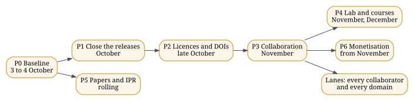

*Figure 12. The plan's phases; the lanes run alongside from P3.*

### Phases

| Phase | Window | Goal | Issues |
|:--|:--|:--|--:|
| P0 Baseline | Weekend of 3 to 4 October 2026 | One measured inventory, the board, tokens with the right scopes, and the list of rulings. | 4 |
| P1 Close the releases | 10 to 25 October 2026 | Everything built is released, and every defect found by execution is fixed. | 19 |
| P2 Licences and DOIs | 24 October to 8 November 2026 | Every repository carries a licence file and correct metadata; minting covers the estate by family. | 5 |
| P3 Collaboration infrastructure | 31 October to 15 November 2026 | A newcomer can go from Rahnuma to a merged pull request in one sitting. | 7 |
| P4 Reference lab and courses | November to December 2026 | The reference lab runs from launch scripts, with GATE-aligned modules and a pilot. | 5 |
| P5 Papers and IPR | Rolling, from October 2026 | Disclosure ledger first, then preprints of the four papers with results. | 7 |
| P6 Monetisation | From November 2026 | Two offers defined and priced, on the dossier standard. | 3 |
| Lanes: every collaborator and every domain | Continuous, from October 2026 | Every collaborator type and every domain family has a visible lane on the board, with an entry point, open work and a way to propose more. | 62 |

#### Collaborator lanes

| Lane | Start here | Contribute | Issues |
|:--|:--|:--|--:|
| School students, 10 to 17 | the Rahnuma view for school students; CHAKRA, PANINI's studio, GENIE and the FAKIR dome | learning paths, translations of plain-words summaries, questions | 1 |
| Undergraduates: BE, BTech, BSc, BS | the GATE view; Running every component | good first issues, component fixes, capstones seeded from FAKIR | 52 |
| Postgraduates and doctoral researchers | the researcher views; Appendices C and D | theses and papers on the open questions, measured results, reviews | 52 |
| Teachers, lecturers and lab builders | the teacher view; the reference lab | course modules, lab sheets, pilots, reviews of plain-words text | 9 |
| Software engineers | the engineer view; the compilers chapter | code, tests, gates, tooling, pull requests | 22 |
| Hardware, embedded and chip engineers | Below the software; zamin, pratik_core_mvp, jugaad28 | SPICE, layouts, firmware, device control, ESP32 work | 8 |
| Linguists, translators and language workers | the linguist view; writing systems and Pāṇini | language tables, corpora, transliteration rules, measurements | 7 |
| Researchers in AI, quantum and cognition | the researcher view; PANINIq; PEDLER | models, experiments, validation, papers | 7 |
| Researchers in the humanities and social sciences | the humanities view; Appendix C | studies of agency, language, knowledge and community | 4 |
| Clinicians, health workers and medical researchers | VIKRAM's health section; CEMb and QNBCI | clinical questions, partnerships, review, health-domain tasks | 3 |
| Community workers, NGOs and village institutions | GramSheel and Project VIKRAM | local needs, pilots, language and field knowledge | 30 |
| Farmers, artisans and local enterprises | FAKIR's domain lanes; VIKRAM's livelihood and agriculture sections | domain knowledge, problems worth solving, field testing | 24 |
| Artists, writers, filmmakers and musicians | the maker view; the cyclers | works made with the cyclers, recorded as method | 3 |
| Makers, roboticists and manufacturers | PANINIphy, pench, transeg | physical realizations, parts, embodiment | 6 |
| Policy makers, administrators and public bodies | Appendices C and E; sovereignty in Chapter 19 | policy questions, adoption, public infrastructure | 5 |
| Lawyers, IPR and standards professionals | provenance and licences; the disclosure ledger | licence review, IPR clearance, standards work | 14 |
| Industry partners and companies | Appendix E's adoption path; the component cards | integration, pilots, paid offers, support | 9 |
| Funders, sponsors and investors | this roadmap and its measures | funding of lanes, labs and pilots | 4 |
| Institutions: colleges, universities and labs | the reference lab and the GATE modules | pilots, courses, joint research | 13 |
| AI agents working under a human | any issue's URL; Chapter 22, how to use any AI | issue work through pull requests, with gate output attached | 65 |

#### Domain families

From FAKIR's lattice: zistgah/fakir data/lattice.json (ISIC Rev.4, ISCO-08, ISCED-F 2013), 1,505 nodes.

| Family | Name | Domains within | Issues |
|:--|:--|--:|--:|
| ISIC A | Agriculture, forestry and fishing | 54 | 1 |
| ISIC B | Mining and quarrying | 29 | 1 |
| ISIC C | Manufacturing | 232 | 4 |
| ISIC D | Electricity, gas, steam and air conditioning supply | 7 | 1 |
| ISIC E | Water supply; sewerage, waste management and remediation activities | 18 | 1 |
| ISIC F | Construction | 22 | 1 |
| ISIC G | Wholesale and retail trade; repair of motor vehicles and motorcycles | 66 | 1 |
| ISIC H | Transportation and storage | 36 | 1 |
| ISIC I | Accommodation and food service activities | 15 | 1 |
| ISIC J | Information and communication | 42 | 22 |
| ISIC K | Financial and insurance activities | 31 | 1 |
| ISIC L | Real estate activities | 5 | 1 |
| ISIC M | Professional, scientific and technical activities | 35 | 11 |
| ISIC N | Administrative and support service activities | 51 | 1 |
| ISIC O | Public administration and defence; compulsory social security | 11 | 1 |
| ISIC P | Education | 14 | 7 |
| ISIC Q | Human health and social work activities | 21 | 1 |
| ISIC R | Arts, entertainment and recreation | 19 | 1 |
| ISIC S | Other service activities | 26 | 1 |
| ISIC T | Activities of households as employers; undifferentiated goods- and services-producing activities of households for own use | 8 | 1 |
| ISIC U | Activities of extraterritorial organizations and bodies | 3 | 1 |
| ISCO 1 | Managers | 46 | 1 |
| ISCO 2 | Professionals | 125 | 1 |
| ISCO 3 | Technicians and Associate Professionals | 109 | 1 |
| ISCO 4 | Clerical Support Workers | 41 | 1 |
| ISCO 5 | Service and Sales Workers | 57 | 1 |
| ISCO 6 | Skilled Agricultural, Forestry and Fishery Workers | 30 | 1 |
| ISCO 7 | Craft and Related Trades Workers | 85 | 1 |
| ISCO 8 | Plant and Machine Operators, and Assemblers | 57 | 1 |
| ISCO 9 | Elementary Occupations | 50 | 1 |
| ISCO 0 | Armed Forces Occupations | 9 | 1 |
| ISCED 00 | Generic programmes and qualifications | 6 | 1 |
| ISCED 01 | Education | 5 | 4 |
| ISCED 02 | Arts and humanities | 13 | 5 |
| ISCED 03 | Social sciences, journalism and information | 8 | 5 |
| ISCED 04 | Business, administration and law | 10 | 7 |
| ISCED 05 | Natural sciences, mathematics and statistics | 13 | 4 |
| ISCED 06 | Information and Communication Technologies (ICTs) | 4 | 16 |
| ISCED 07 | Engineering, manufacturing and construction | 15 | 4 |
| ISCED 08 | Agriculture, forestry, fisheries and veterinary | 9 | 1 |
| ISCED 09 | Health and welfare | 12 | 1 |
| ISCED 10 | Services | 14 | 1 |

The AGI layers are L0 Hardware Definition, L1 Verification, L2 Synthesis/Compilation, L3 Firmware/Embedded, L4 Systems, L5 Parallel, L6 Distributed/Cloud, L7 AI/Deep Learning, L8 Robotics/Embodiment, L9 AGI/ASI. Every domain node, crossed with every layer and every language in ILM's registry, is a possible seed:

$$ |S| = |D| \times |L| \times |\Lambda| = 1{,}505 \times 10 \times 7{,}867 = 118{,}398{,}350. $$

### How a collaborator comes in

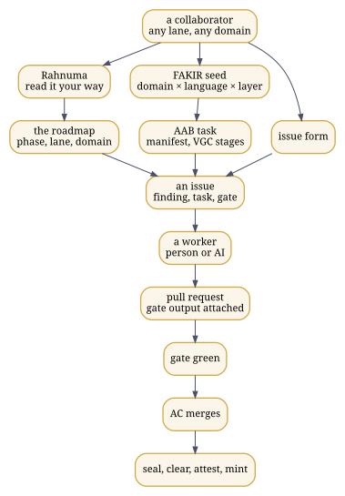

*Figure 13. How any collaborator, in any domain, goes from the guide to a sealed contribution.*

Four issue forms in [zistgah/governance](https://github.com/zistgah/governance) are the ways in: **Join as a collaborator**, with your lane, domains and languages; **Propose a domain task**, seeded the way FAKIR seeds it, with a domain code, an AGI layer, a language, an intent and a gate; **Report a finding**, with the commands run and what they printed; and **Request a ruling**, for the questions only the author can settle. Every issue says which owner class takes it: a Claude Code session, ChatGPT, Gemini or Fable as workers, or the author himself for push, Pages, mint, merges and rulings.

The work flows the same way for everyone. A worker, a person or an AI, opens a pull request with the gate's output attached; the author merges what is green; anything pushed or minted carries its Candor receipt and goes through seal, clear, attest and mint. Each Saturday the status digest shows every issue as closed, ready, or blocked and by what.


<!-- © 1993–2026 Abhishek Choudhary. All rights reserved. AyeAI. -->

## 30. What the work would cost: a model-based estimate {#ch-estimate}

::: {.plain}
**In plain words.** A measured estimate of how much work the estate holds and what it would cost to rebuild, with and without AI.
:::

How much work does the estate represent, and what would it cost a team to rebuild it, with AI in the process or without? The estimate kit in this guide's repository, under `estimate/`, answers with a recognised model rather than an opinion. It counts every tracked file of every repository once, leaving out vendored, generated, minified and third-party material, measures cyclomatic complexity, and applies COCOMO II.2000, then prices the effort with published salary data and the AI scenario with published token prices and the two controlled trials that bound AI's effect on developer speed. Every rate names its source in `estimate/rates.json`.

Demonstration on 38 repositories cloned for Rahnuma, about a fifth of the estate, most without their full history:

| Measure | Value |
|:--|--:|
| Unique source lines, each file counted once | 243,719 |
| Lines repeated across repositories, counted once | 341,227 |
| Words of prose | 368,689 |
| Functions measured; above complexity 10; above 20 | 9,288; 546; 191 |

| Case | Effort, person-months | Schedule, months | Cost, India | Cost, United States |
|:--|--:|--:|--:|--:|
| low | 701 | 27.1 | ₹12.9 crore | $7.5 million |
| likely | 1,239 | 35.3 | ₹41.0 crore | $18.6 million |
| high | 2,279 | 47.3 | ₹130.7 crore | $49.9 million |

| AI in the process | Time ratio | Human effort, person-months | AI usage |
|:--|--:|--:|--:|
| low | 0.44 | 554 | $140 |
| likely | 0.75 | 944 | $578 |
| high | 1.19 | 1,498 | $5,861 |

The AI usage costs a few hundred to a few thousand dollars at list prices; the outcome turns on the time ratio, which the trials put between 0.44 and 1.19.

To run it on the whole estate: `bash estimate/estimate.sh --clone`, which clones every repository with full history, or `bash estimate/estimate.sh --root <folder of clones>`. The report also sets the model against the estate as it was actually built, from the distinct days in its git history, with hours per day and AI spend that the author sets in `rates.json`.

COCOMO prices the construction of what is written down. It does not price the research, the invention and the judgement behind it, so every figure here is a floor, not a valuation.


<!-- © 1993–2026 Abhishek Choudhary. All rights reserved. AyeAI. -->

# Part VI: Status {#part-vi}

## 31. This release and the next {#ch-20}

::: {.plain}
**In plain words.** What this edition contains, what changed in it, and what comes next.
:::

### This release

Rahnuma 2.0.0 is this guide. It opens with four steps that find each reader's part of it, from a school student to an investor, offers a PDF edition for every kind of reader and every field of study, links school and exam syllabi to the chapters that teach the same ideas on the reader's own device, proposes names for the projections and the procedure for raising a component into Humanesque, publishes the estimate of the work, and marks every object with the author's review. Its policy for versions: when a release changes how the guide is entered or organised, it is a new major version; the previous major version moves, unchanged, to `v<N>/` beside it, and is linked from the cover. [Version 1](v1/index.html), the edition for advanced readers and senior professionals, stays there as it was. Rahnuma 1.3.0, dated 3 October 2026, was version 1's last release. It adds fourteen diagrams drawn from the recorded relations, an appendix of formal definitions, and the roadmap, with a lane for every collaborator and every domain family (Chapter 29). Version 1.2.0, of the same date, added appendices for researchers in the humanities and social sciences, in science, technology, engineering and mathematics, and for practitioners, an appendix on reading the architecture without flattening it, and the questions behind GramSheel and VIKRAM as the author put them on Gandhi Jayanti. Version 1.1.0, of the same date, supersedes both printings of 1.0.0, one of 53 pages and one of 67, which carried the same version number. It adds the dependency graph of the estate (Chapter 7), the AyeAI Triad, GramSheel and Project VIKRAM, and Humanesque with its projections and their names, each set apart (Chapter 10), the dated entries for GramSheel's beginning in 1993 and VIKRAM's launch in 2020, the entries for Kitab and Research Kundali, and the rule that a record not yet retrieved is not thereby false. It also runs every component of the estate on a clean machine and reports each one as it ran, with the set-up a README leaves out and the reason when a component does not pass (Chapter 15); it gives every chapter a summary in plain words; and on the site it lets a reader choose a background and an age, and shows a reading path, the components to try first, the depth of text, a larger type and a light or dark page. Version 1.0.0 is deposited at [doi:10.5281/zenodo.23062059](https://doi.org/10.5281/zenodo.23062059). Like 1.0.0, it is this guide, in three forms: the site, the PDF, and one Markdown file for reading or for giving to an AI. It comes with its examples, its build and its gate. Every example shown as executed was executed, and `bash ops/verify.sh` runs them again. That includes Hindawi's C shaili, built with Romenagri from its retrieved sources and run through GCC and GDB in Chapter 21.

### The estate today

Chapter 12 lists every public repository and every DOI a repository records about itself. Most repositories are pushed and public without a DOI of their own. One case is worth naming because it is often asked about: zistgah/jyotish, the offline panchang, is pushed and its site is live, and it has not been minted. A repository already pushed can be minted later with the estate's seeder; minting is the author's decision, taken repository by repository.

### Next

The next release of this package carries the lab launch scripts: one script per lab, the software dockerised and retrieved from the existing repositories, not rebuilt (Chapter 16). The GATE-level courses in computer science and in robotics and automation follow, aligned with the reference lab (Chapter 26).

### The consolidated release

This guide marks a plateau: the estate consolidated in one place, with the mathematics written out and the entry points documented. After it, papers from the work are to appear over the coming weeks and months, and the consolidated body over one to two years. In the author's view, ASI and his laboratory fall within that horizon.

### Taking part

Open an issue or a pull request on any repository, cite the DOIs, fork freely, and build in your own language.

### Colophon

Written and compiled by Abhishek Choudhary, AyeAI, with AI assistance under verification: every example was executed and every statement about the repositories was retrieved from them. ORCID [0009-0002-0684-8320](https://orcid.org/0009-0002-0684-8320). Some address him as Dr; he holds no doctorate. The author is immaterial; the work is what matters.

Typeset in Tiro Devanagari Sanskrit, Noto Serif and its script families, and Noto Sans Mono, all under the SIL Open Font Licence; mathematics rendered by MathJax. Text © 1993–2026 Abhishek Choudhary. All rights reserved. AyeAI. Licensed CC BY-SA 4.0; scripts GPL-3.0-or-later.


<!-- © 1993–2026 Abhishek Choudhary. All rights reserved. AyeAI. -->

# Appendices {#appendices}

## A. The estate's terms, and the nearest common terms {#app-a}


::: {.plain}
**In plain words.** A table matching the special terms used here with the closest common terms.
:::

This table is retrieved from `GLOSSARY.md` in zistgah/paniniq at commit 82a5cf2. The terms are the author's and are kept; the right-hand columns exist so that a reader, or another AI, who knows the market vocabulary can find their footing, and where the two differ the difference is stated.

| His term | What it means here | Nearest common terms | Where they differ |
|---|---|---|---|
| Cycler | An AI-agnostic protocol for human and AI working together: intent, context, a meaningful prompt, any AI answers, the human inspects, the artifacts and responses are kept under configuration management, the next prompt follows, until a final artifact the human authored, carrying its intention. The family is named by what it produces: print (matba), video (khwab), audio (awaz), immersive (tilasm), embodied (pench), memory (yadein), research (genie). | agent loop, agentic workflow, human-in-the-loop harness, prompt chain | A cycler is never the author and never an AI provider. Every prompt must create, verify, execute, measure, falsify or integrate an artifact, and it stays useful if every commercial provider vanishes. |
| Agent, harness | His placement: the cyclers and genie are the agents and harnesses of Act I, AGI completeness. | agent, agent harness, evaluation harness | The market term usually names the software; his names the protocol the software keeps. |
| Configuration management (step 3 of every cycle) | Every prompt, response, human decision and artifact version is identified, hashed and appended; nothing is overwritten; the current state is derived from the record. | configuration management (IEEE 828, ISO 10007), provenance tracking, experiment tracking, audit log | Responses are configuration items in their own right, not chat history. |
| AAB (آب, water) | The paint program for systems: the human paints actors, components, stores, gates, interfaces and environments, wires the flows, and the painting is the manifest every prompt carries. Quests are the eight VGC stages; a node glows verified only with a recorded oracle. Process cyclers, such as building one language layer, run here. | low-code system designer, spec-driven development, model-based systems engineering canvas | Gamification never outruns grounding: no oracle, no glow. |
| VGC | Verification-Gated Human-AI Co-Development: nothing is accepted without an oracle. | eval-gated development, CI gating, test-driven development with AI | Acceptance belongs to an oracle, never to the human or the AI. |
| Oracle | The check that decides acceptance: a test suite, a second implementation, a measurement or a review. | test oracle, acceptance test, conformance suite | |
| Quest | One VGC stage, completed only with typed evidence. | stage gate, milestone with acceptance criteria | |
| PANINI | His language for prompt cycles and his construct compiler: common semantics plus decorators, with many front ends and realization backends. | domain-specific language, orchestration language, compiler toolchain | The construct is primary; syntaxes are views of it. |
| Front end, middleware, realization backend | His layering of 27 Sep 2026: ILM and the language parsers (tajziya) are the front end; PANINI's own front ends and its fine-tuned language are the middleware; the realization backends are where programs meet a substrate, Panini Q among them. | compiler front end, intermediate representation and passes, compiler back end or target | |
| ILM | Integrative Linguistic Multiscript: one language core for all languages, with script, language and standard kept apart. | multilingual NLP, script-agnostic text processing, transliteration, Unicode normalisation | Script, language and standard are separate axes, never conflated. |
| CEM (CEMᵇ, CEMˢ, Eco-CEM) | Cognitive enablement modules, in bioform, synthetiform and ecological families; his Act II, with the accelerators. | AI accelerators, neuromorphic hardware, cognitive architectures, brain-computer interfaces | |
| The three Acts | His note "3 Act ASI ∧ Panini": Act I, AGI complete; Act II, post-AGI to ASI; Act III, post-ASI. PANINI runs through all three. | AGI, superintelligence (ASI) roadmaps | Placement says when a piece matters most, not when work on it starts. |
| Candor, Tok DOI, Misty DOI | Signed intent receipts; atomic timestamps; DOI minting, in the order seal, clear, attest, mint. | in-toto and SLSA attestations, OpenTimestamps, Zenodo DOI deposit | |
| Reference lab | His laboratory pattern for doing most of the research behind high-end AI, robotics and automation papers at modest cost, alongside the courses built on it. | AI research lab, robotics and automation lab | Public name pending his choice. |


<!-- © 1993–2026 Abhishek Choudhary. All rights reserved. AyeAI. -->

## B. Reading the architecture without flattening it {#app-read}


::: {.plain}
**In plain words.** How to read the architecture without squashing it into a straight line: what an arrow can mean, and the loops that run at different scales.
:::

The architecture is dense because what it addresses is dense: language, cognition, knowledge, participation, embodiment, verification, provenance, community capability, identity and continuity. This appendix does not simplify it by removing parts. It shows how to read it so that its structure stays open to questioning. Statements marked † follow the author's working notes and write-ups as supplied on 29 September and 3 October 2026.

### A graph read one route at a time

Any sequence printed on a page, A then B then C, is one route through the graph of Chapter 7, chosen because a sequence is easier to read. Before trusting an arrow, ask which of seven things it means:

| The arrow is | Example in this guide |
|:-------------|:----------------------|
| temporal: one thing came before another | the dated record; PEDLER (2001) before Romenagri (2003) |
| causal: one thing brings about another | an observation changing a knowledge state |
| a dependency: one cannot be built or understood without the other | the cyclers are written in the PANINI language |
| an interface: two things meet at a defined boundary | Romenagri names crossing into the host toolchain |
| a composition: things used together without merging | Mez composing GENIE, Kitab and the cyclers |
| an expository order: the order of explanation only | the reading paths of the reader views |
| an interpretive mapping: a reader's bridge between vocabularies | the nearest analogue in each term entry |

These are not interchangeable. The estate itself keeps three of its orderings apart: the Acts are temporal, the projections are cultural, and the edges of the graph are architectural; none of them is a ladder of maturity.

### Loops at different scales

The architecture has several loops, and they run at different scales; collapsing them into one "AI feedback loop" loses what each is for.

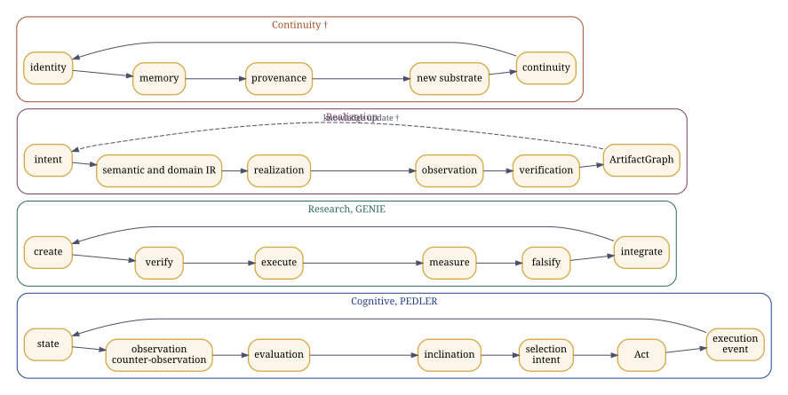

*Figure 14. Loops at four scales: PEDLER's, GENIE's, the realization spine's, and continuity as the write-ups read it (†).*

**The cognitive loop, PEDLER's.** State, observation, counter-observation, evaluation, inclination, selection, intent, Act, execution, event, and a new state. Inclination is a signed directional gradient, not yet an intention; the Act is executable intent; Natural Justice gates the passage from intent to Act.

**The research loop, GENIE's.** Create, verify, execute, measure, falsify, integrate, with nine epistemic tags on every statement and a gate that a simulation cannot pass in place of an experiment.

**The realization loop, PANINI's.** Language, semantic IR, realization requirement, domain resolution, domain IR, then a common layer of geometry, trajectory, animation, observation, verification and an ArtifactGraph. The realization repositories keep desired, predicted, observed and validated results apart, and compilation success, execution success, target satisfaction and validation apart; † the notes extend the separation to desired, designed, predicted, planned, realized, executed, observed, verified and validated.

**The continuity loop.** † The write-ups read a fourth loop at civilisational scale: identity, memory, provenance, transformation, a new substrate or embodiment, continuity. Its components in the record are yadein, which records, TransEg, which continues a constituted identity, and the provenance systems that keep what happened.

In every loop the gates do work in both directions. Verification is not only a last inspection: a failed gate stops the next step. Provenance is not only storage: it fixes what can legitimately be claimed about an artifact. Observation is not only telemetry: it changes the state from which the next action is chosen. VGC states the rule plainly: the gate is a verified artifact, and an AI's report that something passed is not evidence that it passed.

### One component, several cycles

A component is not exhausted by the place it appears in one diagram. ILM belongs to the linguistic line, yet language shapes how knowledge and intent are represented. FAKIR is a knowledge kernel, yet the knowledge it supplies shapes what is done. PEDLER is a cognitive architecture, yet its Act, Inclination and Natural Justice are also the primitives of the constitutional corpus. VGC concerns verification, yet verification decides what may become accepted knowledge. GramSheel is a foundation for villages, yet it touches education, livelihood, health and technology at once. The graph records relations of dependence, interaction and constraint, not modules stacked in a tower.

### Names are interfaces, and analogies are doorways

The density of names cannot be removed without removing distinctions; each name denotes a different object. What helps is a functional handle at first meeting, which the term-by-term chapter and Appendix A give, and an analogy used as a doorway rather than a definition. † In the write-ups' phrase, the analogy opens the door; the formal definition decides what is inside the room.


<!-- © 1993–2026 Abhishek Choudhary. All rights reserved. AyeAI. -->

## C. For researchers in the humanities and social sciences {#app-hum}


::: {.plain}
**In plain words.** A guide for researchers in the humanities and social sciences: the questions each field can ask of this work, and where to find and test the answers.
:::

Each discipline below is given a question the architecture makes concrete, where to look, what can be examined or run, and what must be kept distinct. These are research questions, not claims that any discipline has validated the architecture. The technical components specify relations; the disciplines bring the questions through which those relations can be investigated. Neither vocabulary replaces the other: PEDLER is a computational object that psychologists and philosophers can interrogate as a model of agency, not psychology; GramSheel is an infrastructure that sociologists can interrogate as a model of capability distribution, not a development programme; ILM is a computational object that linguists can interrogate as a model of multilingual representation, not linguistics.

### Political science, law and governance

**The question.** Who holds agency and computational authority, and what counts as admissible evidence when machines take part in decisions? **Where to look.** The Proclamation of Individual Equity and recursive sovereignty (Chapter 4); Humanesque and its projections (Chapter 10); PAT.AL, GramSheel and Project VIKRAM; Natural Justice as a gate in PEDLER; VGC and the provenance order seal, clear, attest, mint (Chapter 25). **What can be examined.** The text of PoIE ([zistgah/poie](https://github.com/zistgah/poie), doi:10.5281/zenodo.21397274); the executable contracts that gate every repository ([zistgah/governance](https://github.com/zistgah/governance)), each a set of clauses a machine checks; the Candor receipts, which record signed intent as in-toto statements. **Keep distinct.** PAT.AL is not democracy, and Humanesque is not political theory; Natural Justice in PEDLER is a gate on the passage from intent to Act, not a general ethics.

### Sociology and development studies

**The question.** Can technological capability be distributed through communities rather than concentrated in distant institutions, and can villages produce knowledge and technology rather than only consume it? **Where to look.** GramSheel and its principles, health, education, justice, livelihood and peace; Project VIKRAM and its thirteen sections; FAKIR's lattice of every lawful economic activity under ISIC, ISCO and ISCED; the reference lab. **What can be examined.** VIKRAM's journal and its section pages ([pvjournal.github.io](https://pvjournal.github.io/)), launched on 3 May 2020; FAKIR's explorer, where each point seeds a task for a domain, a language and a layer; the open contribution model of the repositories, through issues and pull requests. **Keep distinct.** GramSheel is the foundation and its principles; VIKRAM is the technical platform; neither is a market segment or a programme of delivery to passive recipients.

### Psychology and cognitive science

**The question.** How does an agent move from a state and an inclination to an action, and how does a machine's projected authority affect what people accept? **Where to look.** PEDLER's loop and its primitives (Appendix B); COPA and its Authority Projection Index (Chapter 8); the Quantum Neuromorphic BCI programme, with its active research and its directions needing clinical partners. **What can be examined.** The PEDLER engine in PANINIq, with its tests (Chapter 23); COPA's index, which can be computed on any transcript as explanatory tokens before the first empirical action over all tokens. **Keep distinct.** Inclination is not intention, and intention is not an Act; COPA measures projected authority, not accuracy or intent, and a single reading proves nothing about intent.

### Linguistics

**The question.** How are language, script and meaning preserved when linguistic structures become computational representations, and can any language travel in any script? **Where to look.** Writing systems and reversible transliteration (Chapter 19); Pāṇini's grammar as a formal system (Chapter 20); Hindawi and the symbol bridge (Chapter 21); ILM and tajziya. **What can be examined.** Every Romenagri result in this guide can be rerun on your own corpus with the commands of Chapter 15: the Brahmi hub, the round trip, the Urdu projection with and without tashkil. ILM's registry lists 7,867 languages and 226 scripts, and its keyword standards number 13,668, every one a valid ASCII identifier. **Open.** The share of Urdu words whose vowels must come from the language layer, which the author estimates at 15 to 20 per cent, awaits measurement, and the reverse filter into Perso-Arabic script is a first cut. **Keep distinct.** ILM is not linguistics and Romenagri is not romanisation; script, language and standard are three axes.

### Anthropology and cultural studies

**The question.** How do identity, situated knowledge and cultural plurality survive technological transformation? **Where to look.** The three projections, Kaivalyik, Zistgah and Cosmopolis, and the names table (Chapter 10); Jyotish as the Kaivalyik projection of CHAKRA; the second pillar of linguistic equity, any language in any script. **What can be examined.** What the Devanagari hub keeps and loses when Urdu passes through it, printed in Chapter 21; how a component keeps one stem and takes a culturally sensitive name in each projection. **Keep distinct.** A projection is a complete traversal of the whole architecture, not a translation of a master copy; Zistgah's Persian and Islamicate dimension stays explicit.

### Philosophy

**The question.** What constitutes knowledge, action, identity and continuity when the substrate changes? **Where to look.** PEDLER's primitives; VGC; the provenance systems; TransEg; Synthematic Pragmatic Realism; the rule that a record not yet retrieved is not thereby false. **What can be examined.** An applied epistemology already in use: GENIE's nine epistemic tags (definition, axiom, assumption, derivation, conjecture, hypothesis, empirical, open, failed), the four provenance states of a statement (retrieved, inferred, proposed, unresolved), and the status words of this guide (tested, executed, written, mocked, planned). † The write-ups put the underlying problem as an unconstrained system making an epistemic state transition without an admissible reason. **Keep distinct.** SPR is a stated primitive of the architecture; generic metaphysics must not be substituted for it.

### Education

**The question.** Does technology hand out answers, or does it increase human capability? **Where to look.** The reference lab and the GATE chapter (Chapters 16 and 26); the reader views of this guide; the cyclers as recorded, reproducible method; VIDYA, the bridge to AyeAM. **What can be examined.** The component cards of Chapter 15 as laboratory sheets, each with what to type and what you should see. † The write-ups also name AYE Learn and AYE Sum among the educational work.

### History and the history of computing

**The question.** What was built, when, and how can priority be checked without argument? **Where to look.** The dated record (Chapter 5) and its primary sources: the SourceForge and Savannah projects, the announcement of 19 December 2005, and the Zenodo records. For context rather than lineage, Gandhi's *Constructive Programme* (1941) placed village industries, education and the provincial and national languages inside the work of self-rule; Chapter 10 sets out where the estate's questions meet it.

### Economics and political economy

**The question.** Can advanced capability become locally reproducible and sustainable rather than externally concentrated? **Where to look.** FAKIR's ISIC lattice as a map of economic activity; the open licences of the repositories (Chapter 25); the reference lab's cost target. † The notes treat monetisation, through products, services, courses, labs and licensing, as the mechanism that sustains the open work.


<!-- © 1993–2026 Abhishek Choudhary. All rights reserved. AyeAI. -->

## D. For researchers in science, technology, engineering and mathematics {#app-stem}


::: {.plain}
**In plain words.** A guide for researchers in science, technology, engineering and mathematics: what can be read, run and tested now, and what is still open.
:::

Each field below lists what in the estate can be read, run and tested now, and what is open. Status words keep their meaning from Chapter 1: tested, executed, written, mocked, planned.

### Computer science

**Programming languages and compilers.** Hindawi's composed transducers over unmodified host toolchains; the Romenagri symbol bridge through ELF, DWARF and GDB; the PANINI construct model, with 39 constructs in 27 languages and 216 decorators across 8 host languages; the bootstrap and its self-hosting fixed point (Chapters 21 and 6). Executed here. **Open:** `std2hin` doubles every underscore, so vowel-initial names do not round-trip back from C; the guru shaili emits no `#line` directives; the YACC shaili awaits a fresh conformance run.

**Systems.** The hinlin kernel tree and the mass conversion of real C sources, including kernel trace code, into Hindi and back (hindawiai/chintamani, `Romenagri/mass_hindawi`).

**AI and machine learning.** The cyclers and GENIE as AI-agnostic, human-inspected method (Chapter 8); Romenagri as a tokenisation substrate, where bytes fall 1.76 times and the alphabet from 51 to 24 symbols without loss, but token counts did not fall at matched merges, so the predicted gain is still to be shown; COPA's Authority Projection Index as a measurable property of a model's behaviour.

**Software engineering.** Executable contracts and gates in every repository; the provenance chain, Tok DOI, spiguard, Candor and Misty DOI; VGC; the component cards of Chapter 15, each the result of a real run.

**Data.** ILM's registry of 7,867 languages and 226 scripts; 13,668 keyword standards; the corpora in the Romenagri tree.

### Electrical and electronic engineering

The open chip-design flow and the 28 nm tape-out catalogue, jugaad28, with its evidence-gated descriptors (Chapter 22); Zamin's ternary cells in SPICE, whose testbench needs attention on ngspice 42 (Chapter 15); the PRATIK kernel, whose CPU build passes and whose CUDA build needs an NVIDIA toolchain; device control on ESP32, zasab, built but not yet pushed.

### Physics

QEDLER, the event-hypergraph research programme for physics, self-declared as a framework with open problems; oscillator Ising machines and Kuramoto dynamics in PANINIq, with their Lyapunov function (Chapter 23); superconducting qubits and the physics of the cold (Chapter 22).

### Mathematics

Coding theory for reversible transliteration: Kraft and McMillan, and Sardinas and Patterson (Chapter 19); formal languages and rewriting in Pāṇini's grammar, with pratyāhāras as interval classes over an ordered list (Chapter 20); graph theory in the typed hypergraph and in Max-Cut; dynamical systems in the order parameter and in the oscillators' energy; the formal tuples of the CEM kernel, $\mathcal{E} = (E, \mathcal{C}, \Pi, W)$, and of the AyeAI Triad.

### Biology and medicine

PANINIb, the biological realization arm, which lowers intent to sequence IR and claims no wet-laboratory result; CEMb, operated through Interglial Healthcare; the Quantum Neuromorphic BCI programme, with brain-to-text, cognitive prosthetics and intelligent rehabilitation as directions needing clinical collaboration; VIKRAM's Health section and its tools for an accessible virtual hospital; the earlier HMSEI wearable and the Dr Rho telepresence platform.

### Cognitive science and neuroscience

PEDLER's two branches, through LVF and MLCNE to the cognitive enablement modules, and through NI2A2 to ANGEL; its primitives; the brain-computer interface work of Act III.

### Astronomy and the earth and space sciences

CHAKRA, the offline observatory and calendars, whose JavaScript and C99 versions produce byte-identical output; Jyotish, derived from it; the habitats, with a lander embodiment on the Moon and a quadrotor on Mars inside the shared dome.

### Robotics and manufacturing

PANINIphy, the physical realization arm, which compiles physical intent and chooses parts by force, stroke and voltage; pench, the embodied cycler; † the modular self-reconfiguring robots of the notes.


<!-- © 1993–2026 Abhishek Choudhary. All rights reserved. AyeAI. -->

## E. For practitioners: teachers, policy makers, communities, makers and engineers {#app-prac}


::: {.plain}
**In plain words.** A guide for teachers, policy makers, community workers, artists and engineers: where to start and how to take part.
:::

**Teachers and lab builders.** Start from the reference lab, the GATE chapter and the component cards, which double as laboratory sheets: each says what to install, what to type and what a student should see (Chapters 16, 26 and 15). The reader views let each student follow a path suited to their age and background, and remember what they have read.

**Policy makers and administrators.** The questions that matter are in Chapter 10 and Appendix C: sovereignty in its testable technical sense, the ability to rebuild, verify, modify and run (Chapter 21); provenance that makes claims checkable; and infrastructure that leaves capability with communities. The executable contracts of the repositories show what verifiable governance of software looks like in practice.

**Community workers and health practitioners.** Project VIKRAM's sections cover education, health, livelihood, justice, environment and habitat, food and agriculture, and peace; its health section accepts submissions as issues. The Urdu edition and the Brahmi hub show work in people's own scripts; CHAKRA and Jyotish run offline.

**Artists, writers and makers.** The cyclers produce print, film, sound, immersive work, embodied work and the record; matba turns posters into a sealed book; GENIE writes and paints; PANINIphy turns a physical idea into parts. Every cycle is recorded as method, so a piece of work can be repeated, shared and credited.

**Engineers in industry.** Adopt one component at a time: read its card, clone it, run it, read its `CONTRACT.md` and its gate, check its DOI and provenance, then integrate it through its interface. † The notes give the full adoption ladder: the canonical artifact, a one-page explanation, the nearest industry analogue and the exact difference, a working demonstration, the repository, the DOI and timestamp, the interface, a case study, and the commercial route.

**Contributors.** Fork, open an issue, send a pull request. Every repository's gate runs on your change; every claim must point to its evidence; the AI you use is welcome, and its report that something passed is not the evidence that it did.


<!-- © 1993–2026 Abhishek Choudhary. All rights reserved. AyeAI. -->

## F. Formal definitions {#app-math}


::: {.plain}
**In plain words.** The same ideas written as mathematics, for readers who want the formal version.
:::

This appendix states in symbols what the chapters state in words. Where the record gives a formal object, the PEDLER six-tuple, the CEM kernel or the Triad's tuples, it is reproduced as recorded. Where the record gives only words, the formalisation is this guide's reading, and is said to be.

### The estate as a typed graph

The estate is a typed graph
$$ H = (V,\; E,\; \tau_V,\; \tau_E), \qquad E \subseteq V \times V \times R, $$
where $V$ is the set of components, $R$ the set of relations (projects, script layer, realized by, front end, mounts and the rest), $\tau_V : V \to \mathcal{F}$ assigns each component its family, and $\tau_E$ each edge its relation. The core is described as a typed hypergraph, in which one edge may join several components at once: $E \subseteq 2^{V} \times R$. A traversal is a walk $v_0 \xrightarrow{r_1} v_1 \xrightarrow{r_2} \cdots \xrightarrow{r_k} v_k$; every sequence printed in this guide, and every reading path of the reader views, is one.

In this guide's reading, a projection $p \in \{\text{Kaivalyik}, \text{Zistgah}, \text{Cosmopolis}\}$ is a map $\pi_p : H \to H_p$ that keeps every component's stem and every relation and changes names: $\operatorname{stem}(\pi_p(v)) = \operatorname{stem}(v)$ and $(u,v,r) \in E \Rightarrow (\pi_p(u), \pi_p(v), r) \in E_p$. The Acts are a separate, partial labelling $\alpha : V \rightharpoonup \{\mathrm{I}, \mathrm{I|II}, \mathrm{II}, \mathrm{II|III}, \mathrm{III}\}$, with PANINI in every Act.

### Romenagri as a code

Let $\Sigma$ be the Devanagari alphabet and $\Gamma = \{\texttt{a}, \ldots, \texttt{z}, \texttt{\_}\}$, a subset of the alphabet of C identifiers. Romenagri's compiler form is a map
$$ T : W \to \Gamma^{*}, \qquad W \subseteq \Sigma^{*}, $$
injective on well-formed text $W$, with an inverse $T^{-1}$ on $T(W)$. Text outside $W$ is first brought to its canonical form by $c : \Sigma^{*} \to W$, so that for every string
$$ T^{-1}\bigl(T(s)\bigr) = c(s), \qquad c(s) = s \text{ whenever } s \in W . $$
On the 984 words of the Hindi corpus, $T^{-1}T(w) = w$ for 983; the one exception is a misspelling in the corpus.

For a Brahmi script $\sigma$ whose Unicode block follows the ISCII layout from base $b_\sigma$, the hub map is $h_\sigma(x) = x - b_\sigma + \texttt{0x900}$ on the aligned letters, a bijection onto the corresponding Devanagari letters; `flatten_uni_dev` applies it by table. A word in script $\sigma$ therefore has the identity $T(h_\sigma(w))$, and returns by $h_\sigma^{-1}(T^{-1}(\cdot))$.

Urdu meets the hub through $\varphi : \Sigma_{\text{ur}}^{*} \to \Sigma^{*}$, which is many-to-one on unmarked text: the fibre $\varphi^{-1}(w)$ over a hub word can hold several spoken readings, because the short vowels are not written. With tashkil, the restriction of $\varphi$ to marked text distinguishes them: unmarked ہندوی maps to हनदवी, and marked ہِنْدوی to हिन्दवी. In the corpus, 1 word in 794 carries a vowel mark.

### The symbol bridge

For every name $n$ in a program, the toolchain sees $\operatorname{sym}(n) = T(n) \in \Gamma^{*}$. Each stage $t_k$ between source and debugger (compiler, assembler, linker, ELF writer, DWARF writer, debugger) carries identifiers over $\Gamma$ unchanged: $t_k(\operatorname{sym}(n)) = \operatorname{sym}(n)$. Hence
$$ T^{-1}\bigl(t_m \circ \cdots \circ t_1(\operatorname{sym}(n))\bigr) = c(n), $$
which is the name as written. Chapter 21 runs this for every name of a program.

### The construct model

Let $C$ be the constructs (39), $\mathcal{L}$ the languages (27) and $\mathcal{H}$ the host languages (8). Each language $\ell$ has a keyword map $\kappa_\ell : C \to W_\ell$, and each host $h$ a realisation $\rho_h : C \rightharpoonup W_h$, partial because not every host has every construct. Translation from $\ell$ to $h$ is
$$ \tau_{\ell \to h} = \rho_h \circ \kappa_\ell^{-1}, $$
defined when $\kappa_\ell$ is injective, which is the reversibility check ILM runs on every keyword table. Direct pairings of a language with a host would number $|\mathcal{L}| \cdot |\mathcal{H}| = 27 \times 8 = 216$ tables; the construct model needs $|\mathcal{L}| + |\mathcal{H}| = 35$.

### PEDLER, as PANINIq implements it

PANINIq implements PEDLER as the six-tuple
$$ P = (I,\; G,\; U,\; S,\; F,\; \ast), $$
with events $U \subset \mathbb{R}^{3}$, states $S$, a feature map $F : S \to \mathbb{R}^{3}$, and the resolution kernel
$$ G(v, r) = e^{-\gamma \lVert F(v) - r \rVert}. $$
The inclination of a state is its historical prior plus the weighted match, $I(v) = \eta(v) + w\, G(v, r)$. The operator $\ast$ grows and prunes the state set: a new state is spawned when the relaxed network's order parameter falls below a novelty threshold, $R < \theta$. The Act is the transition $A(I, S_t) \to S_{t+1}$. In this guide's reading, Natural Justice is an admissibility predicate on the passage from intent to Act: a transition fires only if $\mathrm{NJ}(\text{intent}, S_t)$ holds.

### Kernels and closures, as recorded

The record gives the CEM kernel and the AyeAI Triad's closure as tuples, and they are reproduced here as given; the expansions of their letters are not part of the retrieved record:
$$ \mathcal{E} = (E,\; \mathcal{C},\; \Pi,\; W), \qquad \text{AyeAM} = \langle S, R, C \rangle, \quad \text{AyeAI} = \langle M, I, G \rangle, \quad \text{AyeCNSe} = \langle T, Ch, \Sigma \rangle . $$

### Gates and evidence

A gate is a function $g : \mathcal{A} \to \{\text{pass}, \text{fail}, \text{unjudged}\}$ on artifacts, computed by running it. An issue is done exactly when
$$ g(a) = \text{pass} \;\wedge\; \text{merged}(a) \;\wedge\; \bigl(\text{published}(a) \Rightarrow \text{receipt}(a)\bigr). $$
VGC's rule is that a worker's report $r(a)$ is not an argument of $g$: the gate is computed from the artifact, never read from the claim.

### Provenance

A repository's manifest is the list $m = \bigl[(p_i, H(f_i))\bigr]_i$ of every tracked path with the SHA-256 of its file. Sealing commits the digest $d = H(m)$ to OpenTimestamps, whose calendars aggregate many digests in a Merkle tree anchored in a Bitcoin block; the proof for one digest among $N$ is a path of length $\lceil \log_2 N \rceil$, and verifying it recomputes the root. The four systems are ordered by implication:
$$ \text{mint}(a) \Rightarrow \text{attest}(a) \Rightarrow \text{clear}(a) \Rightarrow \text{seal}(a). $$

### The seed space and the reading paths

FAKIR seeds a task from a domain node, an AGI layer and a language: $S = D \times L \times \Lambda$, with $|D| = 1{,}505$ nodes across ISIC, ISCO and ISCED, $|L| = 10$ layers and $|\Lambda| = 7{,}867$ languages, so
$$ |S| = 1{,}505 \times 10 \times 7{,}867 = 118{,}398{,}350 . $$
A cross-domain task is seeded from a set of nodes, a subset of $D$, rather than one.

A reader view is a sequence of chapters $(c_1, \ldots, c_k)$, a walk on the chapters. A chapter of $w$ words is estimated at $t(c) = \max\bigl(1, \operatorname{round}(w / 200)\bigr)$ minutes, and a path at $\sum_j t(c_j)$.


<!-- © 1993–2026 Abhishek Choudhary. All rights reserved. AyeAI. -->

## G. Review register {#app-review}


::: {.plain}
**In plain words.** A list of every part of this guide, showing which parts the author has checked by hand.
:::

Every chapter, figure, component card, syllabus module, edition and proposed name in this guide is an object with an identifier, and each carries a mark: reviewed by the author, with the date, or not yet reviewed. The site shows the mark beside each object. The author marks an object with `bash ops/review.sh <identifier> [note]`, and the gate fails if any object is missing from this register.

0 of 188 objects reviewed by the author.

| Object | Kind | Mark |
|:--|:--|:--|
| `ch-01` How to use this guide | chapter | not yet reviewed |
| `ch-02` The work, not the worker | chapter | not yet reviewed |
| `ch-start` Start here: find your way in | chapter | not yet reviewed |
| `ch-hist` Where the work comes from | chapter | not yet reviewed |
| `ch-05` The record, with dates | chapter | not yet reviewed |
| `ch-03` Architecture: core, projections, layers | chapter | not yet reviewed |
| `ch-graph` The dependency graph | chapter | not yet reviewed |
| `ch-onto` The ecosystem, term by term | chapter | not yet reviewed |
| `ch-acts` The three Acts | chapter | not yet reviewed |
| `ch-families` Three families, set apart: the AyeAI Triad, GramSheel and Project VIKRAM, Humanesque and its projections | chapter | not yet reviewed |
| `ch-projections` Projections: names, and raising a component into Humanesque | chapter | not yet reviewed |
| `ch-04` The repositories | chapter | not yet reviewed |
| `ch-06` Choosing a platform | chapter | not yet reviewed |
| `ch-07` The baseline environment and a first run | chapter | not yet reviewed |
| `ch-run` Running every component | chapter | not yet reviewed |
| `ch-08` Labs: containers now, launch scripts next | chapter | not yet reviewed |
| `ch-09` Numbers inside the machine | chapter | not yet reviewed |
| `ch-10` Characters inside the machine | chapter | not yet reviewed |
| `ch-11` Writing systems, sound, and reversible transliteration | chapter | not yet reviewed |
| `ch-12` Pāṇini's grammar as a formal system | chapter | not yet reviewed |
| `ch-13` Compilers, from lexer to microcode | chapter | not yet reviewed |
| `ch-14` Below the software: logic, chips, ternary and qubits | chapter | not yet reviewed |
| `ch-15` Quantum computing and PANINIq, with the mathematics | chapter | not yet reviewed |
| `ch-16` AI, from MYCIN to transformers, and how to use any AI here | chapter | not yet reviewed |
| `ch-17` Open source, provenance and contributing | chapter | not yet reviewed |
| `ch-18` GATE: sit it, whatever your age | chapter | not yet reviewed |
| `ch-syllabus` Syllabus links, and our syllabus | chapter | not yet reviewed |
| `ch-19` Questions that come up, answered technically | chapter | not yet reviewed |
| `ch-roadmap` The roadmap, for every collaborator and every domain | chapter | not yet reviewed |
| `ch-estimate` What the work would cost: a model-based estimate | chapter | not yet reviewed |
| `ch-20` This release and the next | chapter | not yet reviewed |
| `app-a` The estate's terms, and the nearest common terms | chapter | not yet reviewed |
| `app-read` Reading the architecture without flattening it | chapter | not yet reviewed |
| `app-hum` For researchers in the humanities and social sciences | chapter | not yet reviewed |
| `app-stem` For researchers in science, technology, engineering and mathematics | chapter | not yet reviewed |
| `app-prac` For practitioners: teachers, policy makers, communities, makers and engineers | chapter | not yet reviewed |
| `app-math` Formal definitions | chapter | not yet reviewed |
| `app-review` Review register | chapter | not yet reviewed |
| `app-refs` References | chapter | not yet reviewed |
| `fig-stack` The PANINI stack, with Romenagri as the script layer beneath every front end | figure | not yet reviewed |
| `fig-bridge` The symbol bridge: a Hindi program through hincc, GCC and the debugger, its names carried in Romenagri and rendered back | figure | not yet reviewed |
| `fig-hub` One identity across scripts: Brahmi scripts meet Devanagari in one hub; Perso-Arabic meets it at its written, canonical form | figure | not yet reviewed |
| `fig-acts` The three Acts, with their dividers; PANINI runs through all three | figure | not yet reviewed |
| `fig-projections` Humanesque and its projections: parallel cultural traversals, not stages | figure | not yet reviewed |
| `fig-triad` The AyeAI Triad: a triad with AyeAI at the apex, not a loop and not a pipeline | figure | not yet reviewed |
| `fig-pedler` PEDLER's branches: cognition, embodiment, physics and silicon | figure | not yet reviewed |
| `fig-loops` Loops at four scales: PEDLER's, GENIE's, the realization spine's, and continuity as the write-ups read it (†) | figure | not yet reviewed |
| `fig-provenance` Provenance in its fixed order: seal, clear, attest, mint | figure | not yet reviewed |
| `fig-spine` The realization spine the realization arms share | figure | not yet reviewed |
| `fig-collab` How any collaborator, in any domain, goes from the guide to a sealed contribution | figure | not yet reviewed |
| `fig-cyclers` The cyclers: one engine, configured in PANINI, and the protocol every cycle follows | figure | not yet reviewed |
| `fig-vikram` GramSheel and Project VIKRAM, with VIKRAM's sections as its own pages name them | figure | not yet reviewed |
| `fig-plan` The plan's phases; the lanes run alongside from P3 | figure | not yet reviewed |
| `dependency-graph` The dependency graph | figure | not yet reviewed |
| `c-hindawi` Hindawi and Romenagri | component card | not yet reviewed |
| `c-urdu` The Urdu edition | component card | not yet reviewed |
| `c-tajziya` tajziya | component card | not yet reviewed |
| `c-panini` PANINI, the prompt-cycle language | component card | not yet reviewed |
| `c-panini_by_claude` PANINI, parser and interpreter | component card | not yet reviewed |
| `c-panini_by_grok` PANINI, the stage-0 bootstrap | component card | not yet reviewed |
| `c-humanesque` The Humanesque merged release | component card | not yet reviewed |
| `c-paniniq` PANINIq | component card | not yet reviewed |
| `c-paninib` PANINIb, biological realization | component card | not yet reviewed |
| `c-paniniphy` PANINIphy, physical realization | component card | not yet reviewed |
| `c-matba` matba, the press | component card | not yet reviewed |
| `c-khwab` khwab, the cutting room | component card | not yet reviewed |
| `c-awaz` awaz, the listening room | component card | not yet reviewed |
| `c-studios` tilasm, pench and yadein | component card | not yet reviewed |
| `c-genie` GENIE | component card | not yet reviewed |
| `c-alam` alam | component card | not yet reviewed |
| `c-mez` Mez, the Cognitive Workbench | component card | not yet reviewed |
| `c-fakir` FAKIR | component card | not yet reviewed |
| `c-dhancha` Dhancha | component card | not yet reviewed |
| `c-ertabat` ertabat | component card | not yet reviewed |
| `c-jugaad28` jugaad28 | component card | not yet reviewed |
| `c-transeg` TransEg | component card | not yet reviewed |
| `c-idgov` TransEg identity governance | component card | not yet reviewed |
| `c-chakra` CHAKRA | component card | not yet reviewed |
| `c-jyotish` Jyotish | component card | not yet reviewed |
| `c-pratik` PRATIK kernel | component card | not yet reviewed |
| `c-zamin` Zamin | component card | not yet reviewed |
| `c-qedler` QEDLER | component card | not yet reviewed |
| `c-misty` Misty DOI | component card | not yet reviewed |
| `c-kundali` Research Kundali | component card | not yet reviewed |
| `c-labs` The linguistics lab | component card | not yet reviewed |
| `c-rahnuma` This guide | component card | not yet reviewed |
| `mod-F1` Numbers inside the machine | syllabus module | not yet reviewed |
| `mod-F2` Letters, scripts and your language | syllabus module | not yet reviewed |
| `mod-F3` The sky and the calendar | syllabus module | not yet reviewed |
| `mod-F4` Making with a cycler, safely | syllabus module | not yet reviewed |
| `mod-S1` Binary, logic and circuits | syllabus module | not yet reviewed |
| `mod-S2` Encoding and reversible transliteration | syllabus module | not yet reviewed |
| `mod-S3` Programming in your own language | syllabus module | not yet reviewed |
| `mod-S4` Using AI and checking it | syllabus module | not yet reviewed |
| `mod-H1` Grammar as a formal system | syllabus module | not yet reviewed |
| `mod-H2` From source code to machine | syllabus module | not yet reviewed |
| `mod-H3` Open source, provenance and contributing | syllabus module | not yet reviewed |
| `mod-H4` A project seeded from FAKIR | syllabus module | not yet reviewed |
| `mod-U1` Theory of computation and compilers | syllabus module | not yet reviewed |
| `mod-U2` Digital logic and architecture | syllabus module | not yet reviewed |
| `mod-U3` Quantum and physical computing | syllabus module | not yet reviewed |
| `mod-P1` Research on the open questions | syllabus module | not yet reviewed |
| `mod-Q1` Adopting a component | syllabus module | not yet reviewed |
| `board-gate-cs` GATE 2027, Computer Science and Information Technology | syllabus link | not yet reviewed |
| `board-gate-ra` GATE 2027, Robotics and Automation | syllabus link | not yet reviewed |
| `board-gate-in` GATE 2027, Instrumentation Engineering | syllabus link | not yet reviewed |
| `board-gate-ga` GATE 2027, General Aptitude | syllabus link | not yet reviewed |
| `board-gate` GATE 2027, every paper | syllabus link | not yet reviewed |
| `board-cbse` CBSE, classes 9 to 12 | syllabus link | not yet reviewed |
| `board-ncert` NCERT textbooks | syllabus link | not yet reviewed |
| `board-icse` ICSE, class 10 | syllabus link | not yet reviewed |
| `board-isc` ISC, class 12 | syllabus link | not yet reviewed |
| `board-nios` NIOS | syllabus link | not yet reviewed |
| `board-igcse` Cambridge IGCSE | syllabus link | not yet reviewed |
| `board-alevel` Cambridge International AS and A Level | syllabus link | not yet reviewed |
| `board-ib-dp` IB Diploma Programme | syllabus link | not yet reviewed |
| `board-ib-myp` IB Middle Years Programme | syllabus link | not yet reviewed |
| `board-ap` Advanced Placement courses | syllabus link | not yet reviewed |
| `board-ccss` Common Core State Standards | syllabus link | not yet reviewed |
| `board-aqa` AQA GCSE and A level | syllabus link | not yet reviewed |
| `board-edexcel` Pearson Edexcel qualifications | syllabus link | not yet reviewed |
| `board-ocr` OCR qualifications | syllabus link | not yet reviewed |
| `board-acara` Australian Curriculum, version 9 | syllabus link | not yet reviewed |
| `board-seab` Singapore national examinations | syllabus link | not yet reviewed |
| `board-ts` Telangana Board of Secondary Education | syllabus link | not yet reviewed |
| `board-ap-bse` Andhra Pradesh Board of Secondary Education | syllabus link | not yet reviewed |
| `board-mh` Maharashtra State Board | syllabus link | not yet reviewed |
| `board-ka` Karnataka School Examination and Assessment Board | syllabus link | not yet reviewed |
| `board-tn` Tamil Nadu Directorate of Government Examinations | syllabus link | not yet reviewed |
| `board-kl` Kerala SCERT | syllabus link | not yet reviewed |
| `board-wb` West Bengal Board of Secondary Education | syllabus link | not yet reviewed |
| `board-up` Uttar Pradesh Madhyamik Shiksha Parishad | syllabus link | not yet reviewed |
| `board-rj` Board of Secondary Education, Rajasthan | syllabus link | not yet reviewed |
| `board-gj` Gujarat Secondary and Higher Secondary Education Board | syllabus link | not yet reviewed |
| `board-pb` Punjab School Education Board | syllabus link | not yet reviewed |
| `ed-role-school` Rahnuma, the edition for: School student | edition | not yet reviewed |
| `ed-role-college` Rahnuma, the edition for: College student | edition | not yet reviewed |
| `ed-role-pg` Rahnuma, the edition for: Postgraduate or doctoral researcher | edition | not yet reviewed |
| `ed-role-teacher` Rahnuma, the edition for: Teacher or lecturer | edition | not yet reviewed |
| `ed-role-researcher` Rahnuma, the edition for: Academic researcher | edition | not yet reviewed |
| `ed-role-professional` Rahnuma, the edition for: Working professional or engineer | edition | not yet reviewed |
| `ed-role-public` Rahnuma, the edition for: Public service, policy or law | edition | not yet reviewed |
| `ed-role-community` Rahnuma, the edition for: Community, NGO or village work | edition | not yet reviewed |
| `ed-role-creator` Rahnuma, the edition for: Artist, writer or maker | edition | not yet reviewed |
| `ed-role-industry` Rahnuma, the edition for: Industry partner, investor or funder | edition | not yet reviewed |
| `ed-field-00` Rahnuma, the edition for the field: Generic programmes and qualifications | edition | not yet reviewed |
| `ed-field-01` Rahnuma, the edition for the field: Education | edition | not yet reviewed |
| `ed-field-02` Rahnuma, the edition for the field: Arts and humanities | edition | not yet reviewed |
| `ed-field-03` Rahnuma, the edition for the field: Social sciences, journalism and information | edition | not yet reviewed |
| `ed-field-04` Rahnuma, the edition for the field: Business, administration and law | edition | not yet reviewed |
| `ed-field-05` Rahnuma, the edition for the field: Natural sciences, mathematics and statistics | edition | not yet reviewed |
| `ed-field-06` Rahnuma, the edition for the field: Information and Communication Technologies (ICTs) | edition | not yet reviewed |
| `ed-field-07` Rahnuma, the edition for the field: Engineering, manufacturing and construction | edition | not yet reviewed |
| `ed-field-08` Rahnuma, the edition for the field: Agriculture, forestry, fisheries and veterinary | edition | not yet reviewed |
| `ed-field-09` Rahnuma, the edition for the field: Health and welfare | edition | not yet reviewed |
| `ed-field-10` Rahnuma, the edition for the field: Services | edition | not yet reviewed |
| `name-kaivalyik-the-ground` The ground: Bhūmi, भूमि | proposed name | not yet reviewed |
| `name-cosmopolis-the-ground` The ground: Gaia, Γαῖα | proposed name | not yet reviewed |
| `name-datong-the-ground` The ground: 地 (dì, chi, ji 지, địa) | proposed name | not yet reviewed |
| `name-vaka-the-ground` The ground: Whenua (Māori), Honua (Hawaiian) | proposed name | not yet reviewed |
| `name-kaivalyik-the-water` The water: Jala, जल | proposed name | not yet reviewed |
| `name-cosmopolis-the-water` The water: Hydōr, ὕδωρ | proposed name | not yet reviewed |
| `name-datong-the-water` The water: 水 (shuǐ, sui, su 수, thủy) | proposed name | not yet reviewed |
| `name-vaka-the-water` The water: Wai | proposed name | not yet reviewed |
| `name-kaivalyik-the-air` The air: Vāyu, वायु | proposed name | not yet reviewed |
| `name-cosmopolis-the-air` The air: Aēr, ἀήρ | proposed name | not yet reviewed |
| `name-datong-the-air` The air: 風 (fēng, fū, pung 풍, phong) | proposed name | not yet reviewed |
| `name-vaka-the-air` The air: Hau (Māori), Makani (Hawaiian) | proposed name | not yet reviewed |
| `name-kaivalyik-the-sky-and-its-calendars` The sky and its calendars: Jyotish, ज्योतिष (established) | proposed name | not yet reviewed |
| `name-cosmopolis-the-sky-and-its-calendars` The sky and its calendars: Ouranos, Οὐρανός | proposed name | not yet reviewed |
| `name-datong-the-sky-and-its-calendars` The sky and its calendars: 天 (tiān, ten, cheon 천, thiên) | proposed name | not yet reviewed |
| `name-vaka-the-sky-and-its-calendars` The sky and its calendars: Rangi (Māori), Lani (Hawaiian) | proposed name | not yet reviewed |
| `name-kaivalyik-the-desk` The desk: Pīṭha, पीठ | proposed name | not yet reviewed |
| `name-cosmopolis-the-desk` The desk: Trapeza, τράπεζα | proposed name | not yet reviewed |
| `name-datong-the-desk` The desk: 卓 (zhuō, taku, tak 탁, trác) | proposed name | not yet reviewed |
| `name-vaka-the-desk` The desk: Papa | proposed name | not yet reviewed |
| `name-kaivalyik-the-press` The press: Mudraṇa, मुद्रण | proposed name | not yet reviewed |
| `name-cosmopolis-the-press` The press: Typographeion, τυπογραφεῖον | proposed name | not yet reviewed |
| `name-datong-the-press` The press: 印 (yìn, in, in 인, ấn) | proposed name | not yet reviewed |
| `name-vaka-the-press` The press: Tā (Māori) | proposed name | not yet reviewed |
| `name-kaivalyik-the-guide` The guide: Mārgadarśaka, मार्गदर्शक | proposed name | not yet reviewed |
| `name-cosmopolis-the-guide` The guide: Periēgētēs, περιηγητής | proposed name | not yet reviewed |
| `name-datong-the-guide` The guide: 導 (dǎo, dō, do 도, đạo) | proposed name | not yet reviewed |
| `name-vaka-the-guide` The guide: Kaiārahi (Māori) | proposed name | not yet reviewed |
| `name-kaivalyik-the-record` The record: Smṛti, स्मृति | proposed name | not yet reviewed |
| `name-cosmopolis-the-record` The record: Mnēmē, μνήμη | proposed name | not yet reviewed |
| `name-datong-the-record` The record: 記 (jì, ki, gi 기, ký) | proposed name | not yet reviewed |
| `name-vaka-the-record` The record: Mahara (Māori) | proposed name | not yet reviewed |


<!-- © 1993–2026 Abhishek Choudhary. All rights reserved. AyeAI. -->
## H. References {#app-refs}


::: {.plain}
**In plain words.** The books and papers this guide draws on.
:::

- Aho, A. V., Lam, M. S., Sethi, R. and Ullman, J. D. (2006). *Compilers: Principles, Techniques, and Tools*, 2nd edition. Addison-Wesley.
- Bureau of Indian Standards (1991). IS 13194:1991, Indian Script Code for Information Interchange (ISCII).
- Cardona, G. (1997). *Pāṇini: His Work and its Traditions*, volume 1, 2nd edition. Motilal Banarsidass.
- Chaitin, G. J. (1982). Register allocation and spilling via graph coloring. *Proceedings of the SIGPLAN Symposium on Compiler Construction*, 98 to 105.
- Cusumano, M. A. (1991). *Japan's Software Factories: A Challenge to U.S. Management*. Oxford University Press.
- Cytron, R., Ferrante, J., Rosen, B. K., Wegman, M. N. and Zadeck, F. K. (1991). Efficiently computing static single assignment form and the control dependence graph. *ACM Transactions on Programming Languages and Systems* 13(4), 451 to 490.
- Farhi, E. and Gutmann, S. (1998). Quantum computation and decision trees. *Physical Review A* 58, 915.
- Farhi, E., Goldstone, J. and Gutmann, S. (2014). A quantum approximate optimization algorithm. arXiv:1411.4028.
- Gandhi, M. K. (1909). *Hind Swaraj, or Indian Home Rule*. Navajivan Publishing House, Ahmedabad.
- Gandhi, M. K. (1941). *Constructive Programme: Its Meaning and Place*. Navajivan Publishing House, Ahmedabad.
- Goemans, M. X. and Williamson, D. P. (1995). Improved approximation algorithms for maximum cut and satisfiability problems using semidefinite programming. *Journal of the ACM* 42(6), 1115 to 1145.
- Ingerman, P. Z. (1967). "Pāṇini-Backus Form" suggested. *Communications of the ACM* 10(3), 137.
- Katre, S. M. (1987). *Aṣṭādhyāyī of Pāṇini*. University of Texas Press.
- Kiparsky, P. (1991). Economy and the construction of the Śivasūtras. In M. M. Deshpande and S. Bhate (eds.), *Pāṇinian Studies*. University of Michigan.
- Koch, J. and colleagues (2007). Charge-insensitive qubit design derived from the Cooper pair box. *Physical Review A* 76, 042319.
- Kuramoto, Y. (1984). *Chemical Oscillations, Waves, and Turbulence*. Springer.
- McIlroy, M. D. (1969). "Mass produced software components". In P. Naur and B. Randell (eds.), *Software Engineering: Report of a conference sponsored by the NATO Science Committee, Garmisch, 1968*, 138 to 155.
- McMillan, B. (1956). Two inequalities implied by unique decipherability. *IRE Transactions on Information Theory* 2(4), 115 to 116.
- Nielsen, M. A. and Chuang, I. L. (2010). *Quantum Computation and Quantum Information*, 10th anniversary edition. Cambridge University Press.
- Petersen, W. (2004). A mathematical analysis of Pāṇini's Śivasūtras. *Journal of Logic, Language and Information* 13, 471 to 489.
- Sardinas, A. A. and Patterson, G. W. (1953). A necessary and sufficient condition for the unique decomposition of coded messages. *IRE International Convention Record* 8, 104 to 108.
- Shortliffe, E. H. (1976). *Computer-Based Medical Consultations: MYCIN*. Elsevier.
- Strogatz, S. H. (2000). From Kuramoto to Crawford: exploring the onset of synchronization in populations of coupled oscillators. *Physica D* 143, 1 to 20.
- Thompson, K. (1984). Reflections on trusting trust. *Communications of the ACM* 27(8), 761 to 763.
- Unicode Consortium. *The Unicode Standard*; Unicode Standard Annex #29, Unicode Text Segmentation; #31, Unicode Identifiers and Syntax; Unicode Technical Standard #39, Unicode Security Mechanisms.
- Vaswani, A. and colleagues (2017). Attention is all you need. *Advances in Neural Information Processing Systems* 30.
- Wang, T. and Roychowdhury, J. (2019). OIM: oscillator-based Ising machines for solving combinatorial optimisation problems. *Unconventional Computation and Natural Computation*, Lecture Notes in Computer Science 11493, 232 to 256.
- Wheeler, D. A. (2009). *Fully Countering Trusting Trust through Diverse Double-Compiling*. PhD dissertation, George Mason University.

